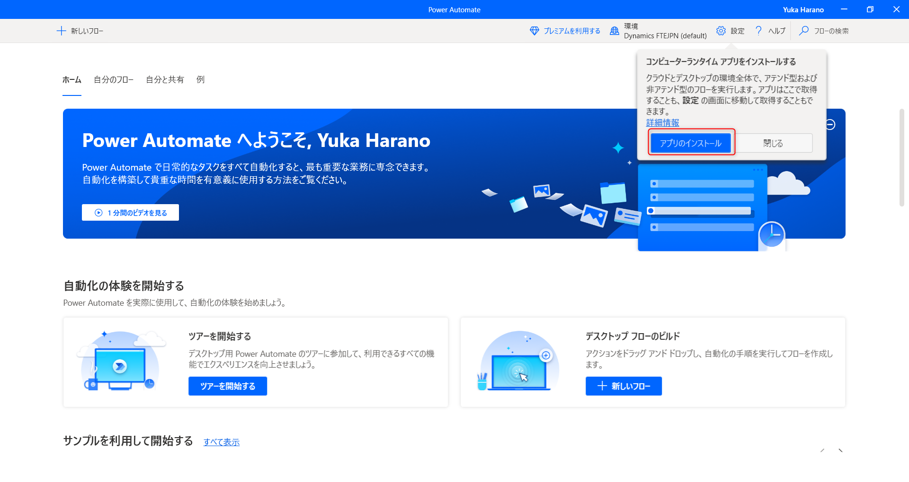
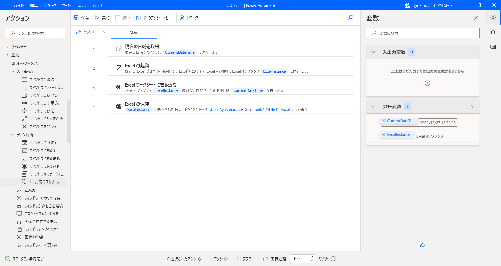
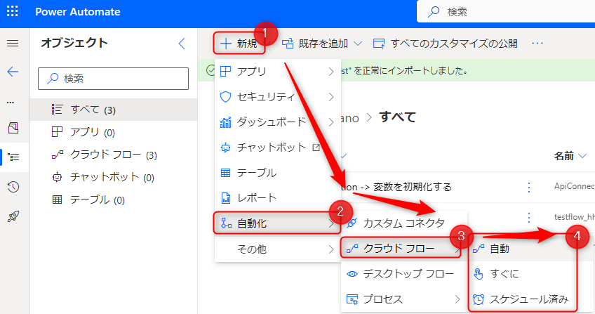
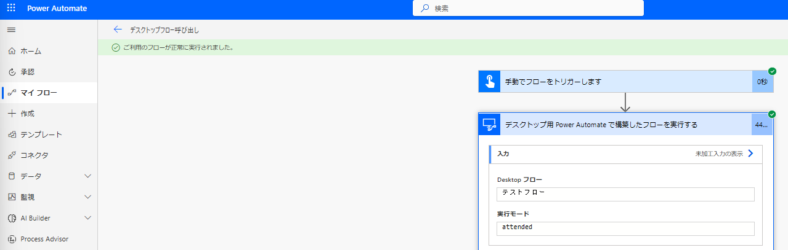

こんにちは。Power Platform サポートの原野です。  
本記事では Power Automate for desktop で作成したデスクトップ フロークラウドフローから呼び出して、アテンド型(有人)でフローを実行する方法についてご案内いたします。  

<!-- more -->
# 目次

1. [概要](#anchor-intro)
1. [有人実行(アテンド型)と無人実行(非アテンド型)の違い](#anchor-how-to-collect)
1. [有人実行に必要なライセンスについて](#anchor-licence-for-attended-automation)
1. [デスクトップ フローを有人実行する方法](#anchor-attended-automation)
    1. [端末の登録方法](#anchor-register-computers)
    1. [クラウド フローからデスクトップ フローを呼び出す方法](#call-desktopflow-from-cloudflow)
    1. [実行結果](#result-of-attended-automation-flow)

# 概要

クラウド フローから Power Automate for desktop を呼び出して、デスクトップ フローを有人実行する方法についてご案内いたします。  

# 有人実行(アテンド型)と無人実行(非アテンド型)の違い
クラウド フローから Power Automate for desktop を呼び出す方法として以下の２種類がございます。  
* 有人実行(アテンド型)：  
  ユーザーが端末にサインインしている状態でデスクトップ フローを実行します。デスクトップ フローの実行時に画面をリアルタイムで確認することができます。  
* 無人実行(非アテンド型)：  
  ユーザーが端末からサインアウトしている状態でデスクトップ フローを実行します。  

有人実行と無人実行の違いについて、公開情報もございますのでご確認いただけますと幸いです。  
[プロセス自動化のための有人および無人のシナリオ - Power Automate | Microsoft Learn](https://learn.microsoft.com/ja-jp/power-automate/guidance/planning/attended-unattended)

# 有人実行に必要なライセンスについて
クラウド フローからデスクトップ フローを有人実行で呼び出す際には、下記のいずれかの Power Automate 有償ライセンスが必要になります。  
* 有人RPAを含む Power Automate per user プラン  
* 従量課金制  

# デスクトップ フローを有人実行する方法
以下の方法について、順にご案内いたします。  
* 端末の登録方法  
* クラウド フローからデスクトップ フローを呼び出す方法  

## 端末の登録方法
Power Automate コンピュータ ランタイムアプリを使用して、該当の環境にデスクトップ フローを実行する端末を登録を行います。  

1. 事前準備  
    * セキュリティロール  
    コンピュータ登録には「環境作成者」または「デスクトップ フローコンピュータ所有者」のロールが必要となります。   
    そのため、登録したい環境において、コンピュータ登録を実行しているアカウントに「環境作成者」または「デスクトップ フロー コンピュータ所有者」のロールが付与されているかご確認ください。  

    * 必要なエンドポイント  
    コンピュータを登録する際のネットワーク要件として、「ランタイムに必要なデスクトップ フロー サービス」がございます。  
    以下の公開情報をご確認いただき、グローバル エンドポイントと公開エンドポイントに接続できる状態となっているかご確認いただけますと幸いです。   
    [IP アドレスの構成 - Power Automate | Microsoft Learn](https://learn.microsoft.com/ja-jp/power-automate/ip-address-configuration#desktop-flows-services-required-for-runtime)  

1. Power Automate コンピュータ ランタイム アプリケーションをインストールする  
    * Power Automate for desktop をまだインストールしていない場合  
    　Power Automate for desktop のインストール時に「Power Automate コンピュータ ランタイム アプリをインストールして、Power Automate クラウド ポータルに接続する 」にチェックを入れます。  
    * 既にPower Automate for desktop インストールしている場合  
    　設定 > コンピューターの設定を開く > アプリのインストールを選択します。  
      

1. Power Automate コンピュータ ランタイム アプリケーションを起動すると端末が自動的に現在の環境に登録されます。  
  
上記の手順について公開情報にも記載がございますので、ご参照いただけますと幸いでございます。  
[コンピュータの管理 - Power Automate | Microsoft Learn](https://learn.microsoft.com/ja-jp/power-automate/desktop-flows/manage-machines#register-a-new-machine)  

## クラウド フローからデスクトップ フローを呼び出す方法
デスクトップ フローをクラウド フローから有人実行で呼び出す方法についてご案内いたします。  

1. デスクトップ フローを作成します。  
既にデスクトップ フローを作成済みの場合は手順2にお進みください。  
  

1. デスクトップ フローを呼び出すためのクラウド フローを作成します。  
   マイ フローに作成するかソリューション内に作成するかで、クラウド フローの作成方法が異なります。  
    * マイ フローに作成する場合：
      マイ フロー > + 新しいフロー > 一から独自に構築する > ご希望のトリガーを選択します。  
       

    * ソリューション内に作成する場合:
      ソリューション > ご希望のソリューションを選択 > + 新規 > 自動化 > クラウド フロー > ご希望のトリガーを選択します。  
       

1. フロー名を指定し、トリガーを選択して、「作成」を選択します。  今回は手動トリガーを選択しています。  
   

1. 新しいステップ > 「Desktop flows」コネクタの「デスクトップ用 Power Automate で構築したフローを実行する」アクションを選択します。  
  

1. デスクトップ フローへの接続を設定します。  
  
    * 接続：コンピューターに直接送信をご指定ください。  
    * コンピューターまたはコンピューター グループ：登録済みの端末をご指定ください。  
    * ドメインとユーザー名：ドメインとユーザー名をご指定ください。  現在端末ログオンしているユーザーのドメインとユーザーの名はwhoamiコマンドから確認いただけます。  
    * パスワード：上記で指定したユーザーのパスワードをご指定ください。  

    whoami コマンドについて、公開情報に詳細な記載がございますのでご確認いただけますと幸いです。  
    [whoami | Microsoft Learn](https://learn.microsoft.com/ja-jp/windows-server/administration/windows-commands/whoami)  
    また接続の作成方法についても、公開情報に詳細な記載がございますのでご確認いただけますと幸いです。  
    [コンピュータの管理 - Power Automate | Microsoft Learn](https://learn.microsoft.com/ja-jp/power-automate/desktop-flows/manage-machines#trigger-a-desktop-flow-to-run-on-your-machine)  

1. 「デスクトップ用 Power Automate で構築したフローを実行する」アクションで呼び出したいデスクトップ フローと実行モードを選択します。  
  
    * Desktop フロー：呼び出したいデスクトップ フローをご指定ください。  
    * 実行モード：アテンド型をご指定ください。  

## 実行結果  
Power Automate for desktop で作成したデスクトップ フローをクラウド フローからアテンド型(有人)で呼び出して実行することができました。  
  

---

## 補足

本手順は執筆時点でのユーザー インターフェイスを基に紹介しています。  バージョンアップによって若干の UI の遷移など異なる場合があります。  その場合は画面の指示に従って進めてください。  

---
