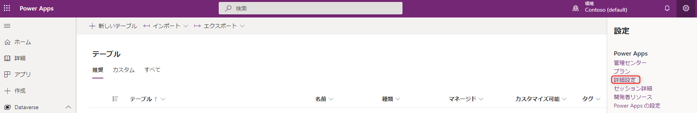
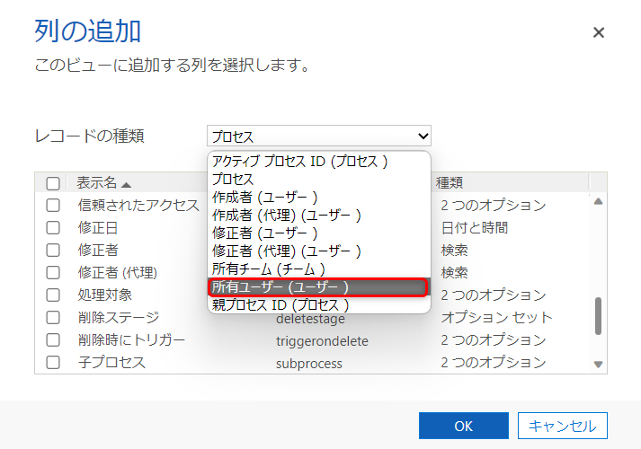
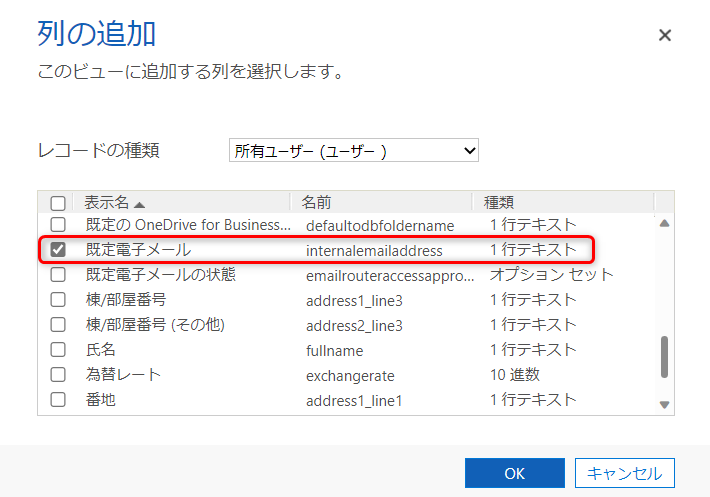

こんにちは。Power Platform サポートの原野です。  

今回は、Power Automate for desktop で作成した環境内のデスクトップ フローの所有者、作成日、修正日などの基礎情報を確認する方法についてご紹介します。  
なお、ご案内する方法は「環境」ごとの確認になりますので、予めご了承いただけますと幸いです。

デスクトップ フローに関しても、所有者、作成日、修正日などの基礎情報を環境単位で簡単に確認できます。
  
お試しいただけましたら幸いです。

<!-- more -->

## はじめに
環境の管理者権限のあるユーザーの場合、デスクトップ フローの所有者等の基礎情報を確認する方法は大きく分けて 2 つあります。

## a. Power Automate ポータル画面から確認する
環境の管理者は、環境内の全てのデスクトップ フローの共同所有者となります。  
そのため、有償ライセンスをお持ちの場合「マイ フロー > デスクトップ フロー」から環境内の全てのフローの情報を確認いただけます。

有償ライセンスについては以下をご確認ください。  
[Premium RPA 機能 - Power Automate | Microsoft Learn](https://learn.microsoft.com/ja-jp/power-automate/desktop-flows/premium-features#plans-that-provide-entitlements-for-the-premium-rpa-features)

また、Power Automate ポータル画面からデスクトップ フローを確認する方法については以下に記載されています。  
[デスクトップ フローの共有と管理 - Power Automate | Microsoft Learn](https://learn.microsoft.com/ja-jp/power-automate/desktop-flows/manage#list-of-desktop-flows)

## b. Dataverse 内のテーブルから確認する
デスクトップ フローの所有者等の情報は、Dataverse のプロセス テーブルに格納されています。  
環境の管理者権限のあるユーザーが以下の手順を行うことで、環境ごとのデスクトップ フローの基礎情報を一括で取得いただけます。  
取得した情報は Excel ファイルにエクスポートすることが可能です。

### 1. Power Apps の画面に遷移します
Power Automate 画面より「データ > テーブル」からメニューを選択することで Power Apps の画面に遷移します。

 
 
### 2. 「詳細設定」を選択します
まず、今回確認したい環境を選択します。
その上で、表示された Power Apps 画面の右上のギアアイコンより「詳細設定」を選択します。

 
 
### 3. フィルタアイコンを選択します
表示された Dynamics 365 画面右上のフィルタアイコンを選択します。

 
 
### 4. 「プロセス」を選択した上で、条件をクリアします
表示された「高度な検索」の「検索」画面で、「プロセス」を選択した上で、赤枠の 「クリア」で条件をクリアします。

 
 
### 5. 条件を設定し、リボンの 「結果」をクリックします
検索条件として、カテゴリから「デスクトップ フロー」を選択下さい。  
また、「列の編集 > 列の追加」から作成日、修正日など追加で表示する列を選択できます。

 
 

※列の追加方法の具体的な手順について  
例えば、作成者のメールアドレスの列を追加で表示させたい場合、以下の方法で追加できます。
#### 5-1.「列の編集」を選択します

 
 
#### 5-2.「列の追加」を選択します

 
 
#### 5-3.「レコードの種類」を「所有ユーザー (ユーザー)」に変更します

 
 
#### 5-4. 表示させたい項目を選択し、「OK」を 2 回押してメイン画面に戻ります

 
 

### 6. デスクトップ フローの基礎情報が一覧表示されます  
表示された検索結果は 「プロセスのエクスポート」から Excel にエクスポートすることが可能です。

 
 
## おわりに

環境内のデスクトップ フローの所有者、作成日、修正日などの基礎情報を確認する方法についてご紹介しました。  
少しでもお役に立つ情報がございましたら幸いです。

---
