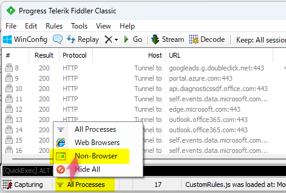
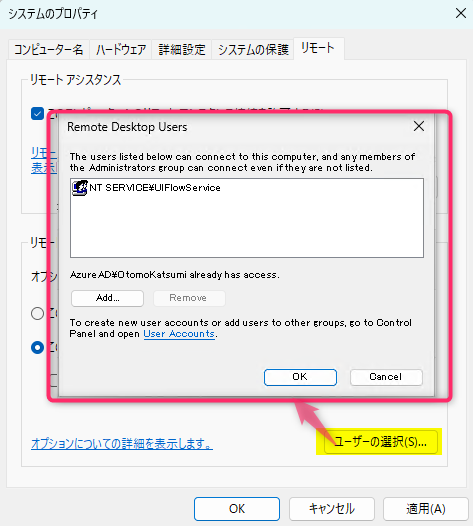
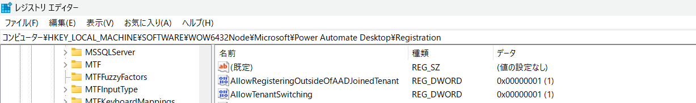
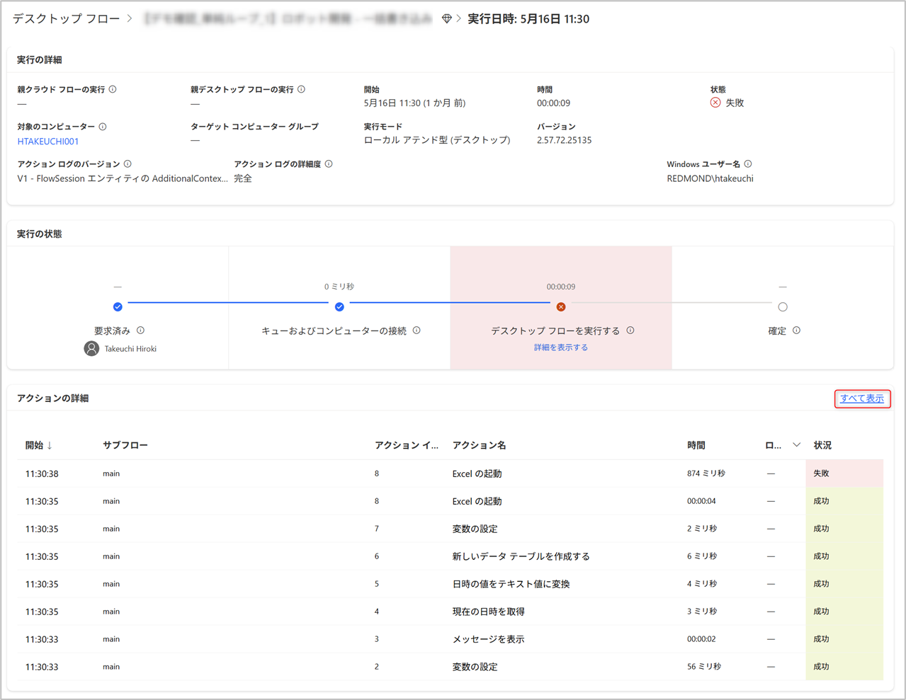
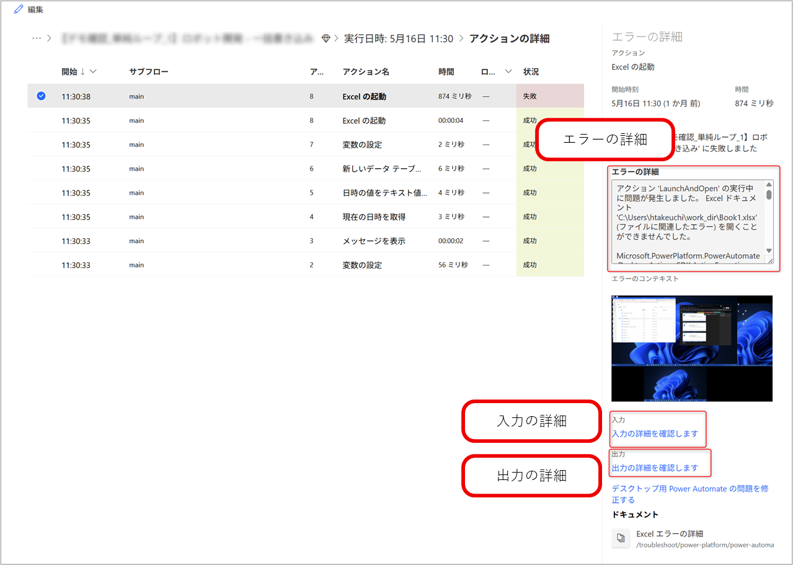

# はじめに

こんにちは。Power Platform サポートの大友です。  
本記事では Power Automate for desktop 関連のお問い合わせの際の、情報取得手順についてご案内いたします。

<!-- more -->
# 目次

1. [概要](#anchor-intro)
1. [情報取得手順詳細](#anchor-how-to-collect)
   1. [Power Automate for desktop のバージョン](#anchor-pad-version)
   1. [OS のバージョン](#anchor-os-version)
   1. [コンピューター ログ](#anchor-computer-log)
   1. [Fiddler ログ](#anchor-fiddler-log)
   1. [マシン登録の情報](#anchor-machine-information)
   1. [リモートデスクトップ設定](#anchor-remote-desktop-setting)
   1. [レジストリの設定](#anchor-registry-setting)
   1. [Power Automate for desktop のフロー](#anchor-desktopflow)
   1. [デスクトップ フローの実行履歴 URL](#anchor-desktopflow-url)
   1. [デスクトップ フローの実行履歴の画面キャプチャ](#anchor-desktopflow-runhistory-screenshot)
   1. [デスクトップ フローの実行履歴のエラー・入力・出力の詳細](#anchor-desktopflow-runhistory-error-input-output)
   1. [クラウド フローの実行履歴 CSV (クラウドフローから呼び出している場合)](#anchor-cloudflow-run-history-csv)
   1. [クラウド フローのアクションの未加工入力・出力 (クラウドフローから呼び出している場合)](#anchor-cloudflow-raw-input-output)

# 概要
Power Automate for desktop に関するサポートサービスのお問い合わせの際の、情報取得手順についてご案内致します。

# 情報取得手順詳細

## 1. Power Automate for desktop のバージョン
Power Automate for desktop のバージョンが確認できる画面キャプチャをご提供ください。
1. Power Automate for desktop > ヘルプ > バージョン情報 を選択します。  

1. コピーの詳細を選択し、テキストエディターに貼り付け`Ctrl+V`したファイルをご提供ください。   

  

## 2. OS のバージョン
OS のバージョンが確認できる以下の画面キャプチャを取得しご提供ください。
* システム > バージョン情報  
  

## 3. コンピューター ログ
Power Automate コンピューター ランタイムをご利用いただいている場合は **a‐1** の方法から、ご利用いただけない場合は **a‐2** の方法からログを取得してご提供ください。  

デスクトップフロー実行時にエラーが発生する場合は、RunDefinition.json ファイルと Actions.log ファイルを保持するレジストリを登録いただき、**b** のログも併せてご提供ください。  

### a) Power Automate for desktop 動作ログ
   1. Power Automate コンピュータ ランタイムからログを収集
フロー実行後のログの出力に関して、過去 3 日間のログが Power Automate コンピューター ランタイムから出力いただけます。  
Power Automate コンピュータ ランタイムからエクスポートした zip ファイルをご提供ください。  
Power Automate コンピュータ ランタイム > トラブルシューティング > ログのエクスポート を選択します。    
  
> [!NOTE]
> 公開情報にも手順の記載がございますので、ご参照いただけますと幸いです。  
> [デスクトップ フローのトラブルシューティング - Power Automate | Microsoft Learn](https://learn.microsoft.com/ja-jp/power-automate/desktop-flows/troubleshoot#collect-machine-logs)
   1. 管理者権限のあるアカウントでフォルダからログを収集  
管理者権限のあるアカウントで以下のフォルダ内にあるファイルを zip ファイルにまとめてご提供ください。  
フォルダ：`%ProgramData%\Microsoft\Power Automate\Logs`

### b) デスクトップフロー実行詳細ログおよびアクション詳細ログ
以下のレジストリを登録いただきマシンを再起動した上で、以下でご案内するフォルダに格納されているファイルを取得してご提供ください。
   1. 以下の公開情報を参考に、必要となるレジストリを登録いただきマシンを再起動致します。  

> [!NOTE]
> 公開情報にも手順の記載がございますので、ご参照いただけますと幸いです。  
> [Power Automate でのガバナンス - Power Automate | Microsoft Learn](https://learn.microsoft.com/ja-jp/power-automate/desktop-flows/governance#configure-power-automate-for-desktop-to-keep-the-flow-run-details)

> [!WARNING]
> こちらのレジストリを有効にした状態のままご運用頂くと端末のストレージを逼迫させる場合があります。
> 情報ご取得後はレジストリの無効化をお勧め致します。

   2. 事象を再現致します。
   3. ファイルをご取得ください。
以下のフォルダに格納されているファイルを取得し、ご提供ください。  
`%localappdata%\Microsoft\Power Automate Desktop\Scripts\{scriptid}\Runs\{runid}`  
`{ScriptId}` にはデスクトップ フローの ID を、`{RunId}` にはフローの実行 ID を挿入します。
      * RunDefinition.json：デスクトップ フローの実行詳細が記録されたログです。
      * Actions.log：デスクトップ フローに設定された各アクションの実行詳細が記録されたログです。

   > [!NOTE]
   > デスクトップフローの ID とフローの実行 ID はPower Automateポータルのデスクトップ フローの実行履歴のURLより確認いただけます。  
   > 

## 4. Fiddler ログ
以下の採取手順をご確認の上でログファイルをご提供ください。  
[Fiddler ログの採取手順 (microsoft.com)](https://learn.microsoft.com/ja-jp/power-query/web-connection-fiddler)

なお、情報取得の際はキャプチャ対象を **Non-Browser** に変更いただくようお願いいたします。  

## 5. マシン登録の情報
Power Automate ポータルの画面 > 監視 > マシン  
該当のコンピューターの詳細画面の画面キャプチャをご提供ください。  

  

## 6. リモート デスクトップ設定
実行される端末の以下リモート デスクトップの設定の画面キャプチャをご提供ください。
* 実行される端末 > システムのプロパティ > リモートデスクトップ  

* 実行される端末 > システムのプロパティ > リモートデスクトップ > ユーザーの選択  

## 7. レジストリの設定
* レジストリ内容
レジストリエディタを起動し、以下のキーおよびその配下のレジストリの設定が確認できる画面キャプチャ、またはキーをエクスポートしたファイルをご提供ください。  
キーが存在しない場合は、その旨をお知らせください。  
`コンピューター\HKEY_LOCAL_MACHINE\SOFTWARE\Microsoft\Power Automate Desktop`  
`コンピューター\HKEY_LOCAL_MACHINE\SOFTWARE\WOW6432Node\Microsoft\Power Automate Desktop`  
  

* サービスアカウントをご利用の場合
上記に加えてレジストリの以下キーのセキュリティ画面キャプチャもご提供ください。  
`コンピューター\HKEY_LOCAL_MACHINE\SOFTWARE\WOW6432Node\Microsoft\Power Automate Desktop\Registration` > Registration キーを右クリック > アクセス許可 > 詳細設定  
  

## 8. Power Automate for desktop のフロー  
デスクトップフロー本体をソリューションに追加し、エクスポート頂いたファイルをご提供下さい。
弊社環境にインポート出来るよう、依存関係のあるコンポーネント含めご提供をお願い致します。

> [!NOTE]
> ソリューションのエクスポート手順は、以下記事に手順がございますのでご参照いただけますと幸いです。      
> [Power Automate お問い合わせの際の情報取得手順 | Japan Dynamics CRM & Power Platform Support Blog (jpdynamicscrm.github.io)](https://jpdynamicscrm.github.io/blog/powerautomate/helpful-information-for-powerautomate-sr/#anchor-flowpackage-in-solution)  

ソリューションでのご提供が難しい場合、テキストファイルでのご提供をお願いいたします。

デスクトップ フローのデスクトップフローの編集画面から、エディタ領域をクリックしたのちアクションを全選択`Ctrl+A`し、コピー`Ctrl+C`し、テキストエディターに貼り付け`Ctrl+V`したファイルをご提供ください。 
  
一度にコピーできるフローは 1 つだけであるため、フロー内に複数のサブフローがある場合は、サブフローごとに上記の手順を繰り返し、アクションを個別のテキスト ファイルに保存した上でご提供ください。  

> [!WARNING]
> テキストでのご提供手順では入出力変数の定義やフロー内のアクションで使用していない UI 要素など一部の情報が含まれません。  
> エラーが発生しているアクションで入出力変数を使用している場合や、デスクトップ フロー全体の容量等を確認する必要がある場合は、弊社のサポートエンジニアからソリューションでの提供のご検討をお願いする場合がございます。

 
## 9. デスクトップ フローの実行履歴 URL  
1. マイ フロー>デスクトップ フローから該当のフローを選択します。実行履歴から該当の日時を選択します。    
  
1. URLをコピーしてご提供ください。
エラー時にフローが実行されず実行履歴に残っていない場合は、1 の画面のURLをコピーしてご提供下さい。

## 10. デスクトップ フローの実行履歴の画面キャプチャ
1. 「9. デスクトップ フローの実行履歴 URL」と同じ手順で実行履歴の画面を表示します。
    1. マイ フロー > デスクトップ フローから該当のフローを選択します。
    1. 実行履歴から該当の日時を選択します。
1. ページ全体の画面キャプチャをご提供ください。     

## 11. デスクトップ フローの実行履歴のエラー・入力・出力の詳細
1. 「9. デスクトップ フローの実行履歴 URL」と同じ手順で実行履歴の画面を表示します。
    1. マイ フロー > デスクトップ フローから該当のフローを選択します。
    1. 実行履歴から該当の日時を選択します。
1. 「アクションの詳細」パネルで、該当のアクションの「開始」列のリンクを押下します。

【エラーの詳細】
1. 「エラーの詳細」のテキストをコピーし、テキスト ファイルへ保存します。
1. 「エラーのコンテキスト」の画像を右クリック > 名前を付けて画像を保存を押下します。
1. 保存したテキスト ファイル、画像ファイルをご提供ください。

【入力の詳細】
1. 「入力の詳細を確認します」のリンクを押下します。
1. 表示された入力の内容をコピーし、テキスト ファイルへ保存します。
1. 保存したテキスト ファイルをご提供ください。

【出力の詳細】
1. 「出力の詳細を確認します」のリンクを押下します。
1. 表示された出力の内容をコピーし、テキスト ファイルへ保存します。
1. 保存したテキスト ファイルをご提供ください。

## 12. クラウド フローの実行履歴 CSV (クラウドフローから呼び出している場合)
デスクトップフローをクラウドフローから呼び出している場合は、クラウドフローの実行履歴もご提供ください。
1. デスクトップ フローを呼び出したクラウドフローの詳細画面を開き、「28 日間の実行履歴」から「すべての実行」を選択します。  

1. 「.csv ファイルを取得」を選択し、取得した CSV ファイルをご提供ください。  

> [!NOTE]
> クラウド フローの実行履歴 CSV の取得方法は、以下記事にも手順が掲載されております。  
> [Power Automate お問い合わせの際の情報取得手順 | Japan Dynamics CRM & Power Platform Support Blog (jpdynamicscrm.github.io)](https://jpdynamicscrm.github.io/blog/powerautomate/helpful-information-for-powerautomate-sr/#anchor-flowrunhistory-csv)

## 13. クラウド フローのアクションの未加工入力・出力 (クラウドフローから呼び出している場合)
デスクトップフローをクラウドフローから呼び出している場合は、クラウドフローのアクションの未加工入力・未加工出力もご提供ください。
実行履歴から「デスクトップ用 Power Automate で構築したフローを実行する」アクション等のデスクトップ フローを呼び出すアクションを展開します。  
未加工入力および未加工出力として表示されるテキストをコピーし、ご提供ください。  
  

> [!NOTE]
> クラウド フローのアクションの未加工入力・出力の取得方法は、以下記事にも手順が掲載されております。  
> [Power Automate お問い合わせの際の情報取得手順 | Japan Dynamics CRM & Power Platform Support Blog (jpdynamicscrm.github.io)](https://jpdynamicscrm.github.io/blog/powerautomate/helpful-information-for-powerautomate-sr/#anchor-raw-input-output)

---

## 補足
本手順は執筆時点でのユーザー インターフェイスを基に紹介しています。バージョンアップによって若干の UI の遷移など異なる場合があります。その場合は画面の指示に従って進めてください。

---
