こんにちは。Power Platform サポートの原野です。  
本記事では Power Automate for desktop 関連のお問い合わせの際の、情報取得手順についてご案内いたします。

<!-- more -->
# 目次

1. [概要](#anchor-intro)
1. [情報取得手順詳細](#anchor-how-to-collect)
      1. [Power Automate for desktopのバージョン](#anchor-pad-version)
      1. [OSのバージョン](#anchor-os-version)
      1. [コンピューター ログ](#anchor-computer-log)
      1. [Fiddler ログ](#anchor-fiddler-log)
      1. [マシン登録の情報](#anchor-machine-information)
      1. [リモートデスクトップ設定](#anchor-remote-desktop-setting)
      1. [Power Automate for desktopのフロー](#anchor-desktopflow)
      1. [デスクトップフローの実行履歴URL](#anchor-desktopflow-url)
      1. [クラウドフローの実行履歴CSV](#anchor-cloudflow-run-history-csv)
      1. [クラウドフローのアクションの未加工入力と未加工出力](#anchor-cloudflow-run-history-csv)

# 概要

Power Automate for desktop に関するサポートサービスのお問い合わせの際の、情報取得手順についてご案内致します。

# 情報取得手順詳細

## 1. Power Automate for desktopのバージョン
Power Automate for desktopのバージョンが確認できる画面キャプチャをご提供ください。
1. Power Automate for desktop > ヘルプ > バージョン情報 を選択します。
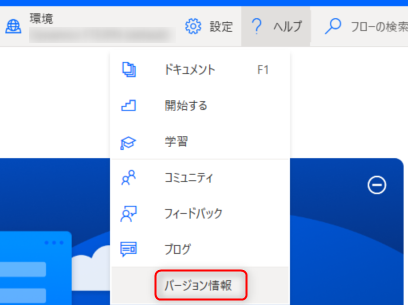 
1. 以下の画面キャプチャを取得してご提供ください。
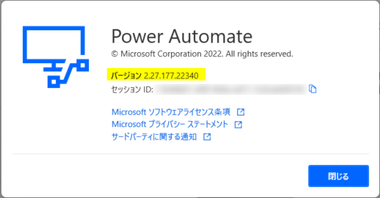 

## 2. OSのバージョン
OSのバージョンが確認できる以下の画面キャプチャをご提供ください。
* システム > バージョン情報 を開き以下の画面キャプチャを取得します。
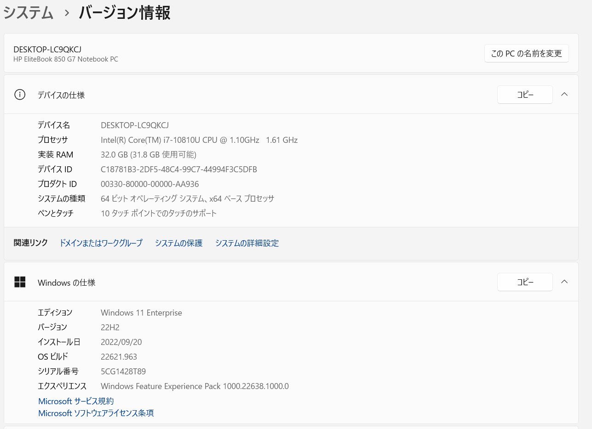  

## 3. コンピューター ログ
コンピューター ログの取得方法は大きく分けて３つございます。
Power Automate コンピューターランタイムをご利用いただいている場合はa)の方法から、ご利用いただけない場合はb)の方法からログを取得してご提供ください。  

また、RunDefinition.jsonファイルとActions.logファイルを保持するレジストリを登録いただいている場合は、c)の方法で取得できるログも併せてご提供ください。

### a) Power Automate コンピュータ ランタイムからログを収集する
フロー実行後のログの出力に関して、過去３日間のログがPower Automate コンピューターランタイムから出力いただけます。
Power Automate コンピュータ ランタイムからエクスポートしたzipファイルをご提供ください。
* Power Automate コンピュータ ランタイム > トラブルシューティング > ログのエクスポート を選択します。
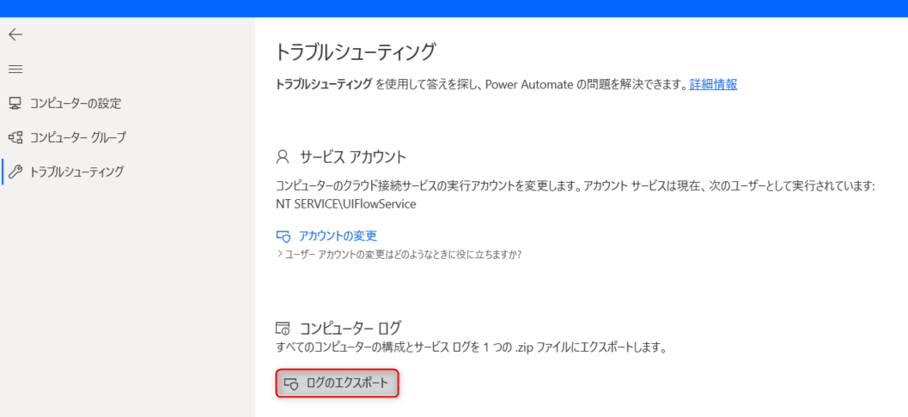

公開情報にも手順の記載がございますので、ご参照いただけますと幸いです。
[デスクトップ フローのトラブルシューティング - Power Automate | Microsoft Learn](https://learn.microsoft.com/ja-jp/power-automate/desktop-flows/troubleshoot#collect-machine-logs)

### b) 管理者権限のあるアカウントでフォルダからログを収集する
管理者権限のあるアカウントで以下のフォルダ内にあるファイルをzipファイルにまとめてご提供ください。
フォルダ：%ProgramData%\Microsoft\Power Automate\Logs

### c) レジストリを設定いただいている場合に収集できるログ
以下のレジストリを登録いただきマシンを再起動した上で、以下でご案内するフォルダに格納されているファイルを取得してご提供ください。

* 必要となるレジストリ
以下の公開情報を参考に、必要となるレジストリが登録されていることをご確認ください。
公開情報にも手順の記載がございますので、ご参照いただけますと幸いです。
[Power Automate でのガバナンス - Power Automate | Microsoft Learn](https://learn.microsoft.com/ja-jp/power-automate/desktop-flows/governance#configure-power-automate-for-desktop-to-keep-the-flow-run-details)
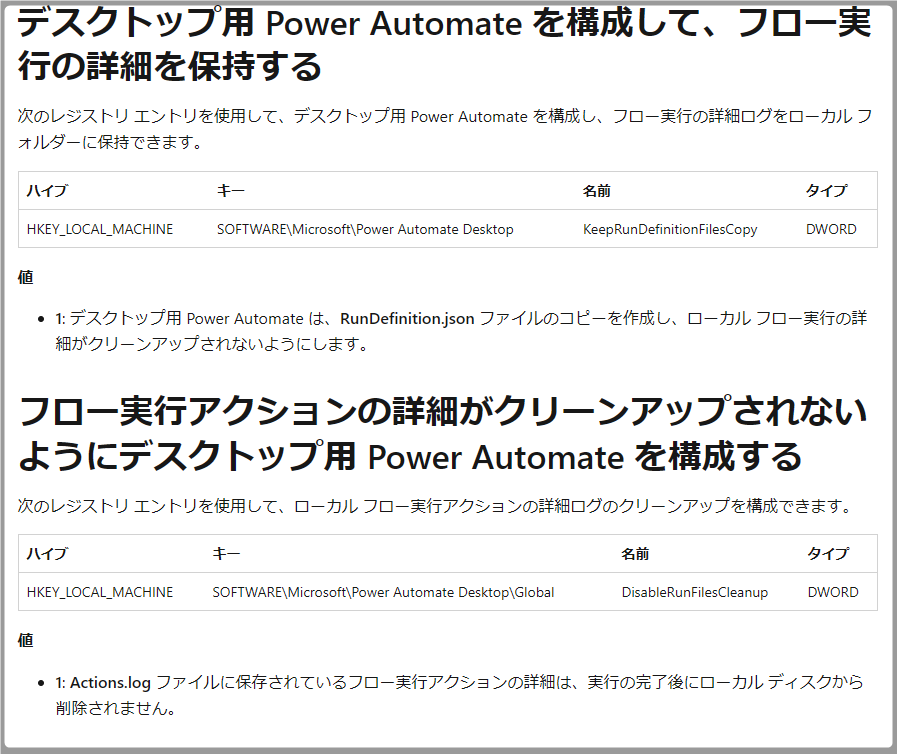

	
* 提供いただきたいファイル
以下のフォルダに格納されているファイルを取得し、ご提供ください。
フォルダ：%localappdata%\Microsoft\Power Automate Desktop\Scripts\{scriptid}\Runs\{runid}
・Actions.log：デスクトップフローに設定された各アクションの実行結果が記載されたログです。
・RunDefinition.json：デスクトップフローの実行開始日、実行終了日、フローの実行結果(成功、失敗)が記載されたログです。

{ScriptId} にはデスクトップフローのIDを、{RunId} にはフローの実行IDを挿入します。

* 有償版の場合
Power Automateポータルのデスクトップフローの実行履歴からデスクトップフローのIDとフローの実行IDを確認いただけます。
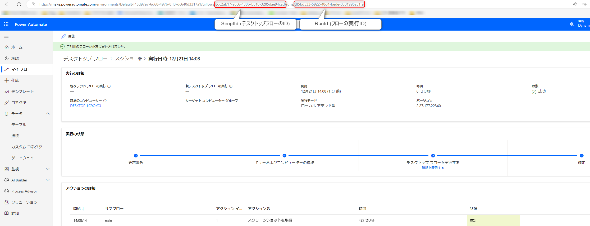

* 無償版の場合
デスクトップフローのIDは以下の手順で取得します。
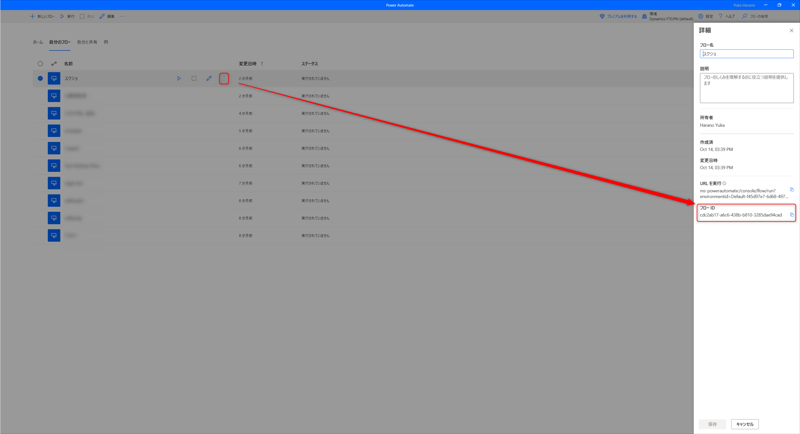
フローの実行IDに関しましては、Windowsのエクスプローラーの更新日時からどの実行かをご判断いただけますと幸いでございます。

## 4. Fiddler ログ
以下の採取手順をご確認の上でログファイルをご提供ください。
[Fiddler ログの採取手順 (microsoft.com)](https://social.technet.microsoft.com/Forums/ja-JP/fe5f977a-2992-44c3-b643-38ad570a3d18/fiddler-12525124641239825505214622516338918?forum=DCRMSupport)

## 5. マシン登録の情報
該当のマシンの登録情報が確認できる画面キャプチャをご提供ください。

1. Power Automate ポータルの画面 > 監視 > マシン
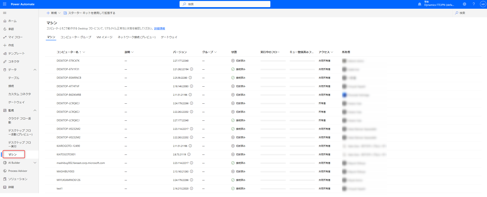
1. マシンまたはコンピューター グループから該当のコンピューターの詳細が分かる画面キャプチャをご提供ください。

  

## 6. リモートデスクトップ設定 
実行される端末のリモートデスクトップの設定の画面キャプチャをご提供ください。 
* 実行される端末 > システムのプロパティ > リモートデスクトップ 
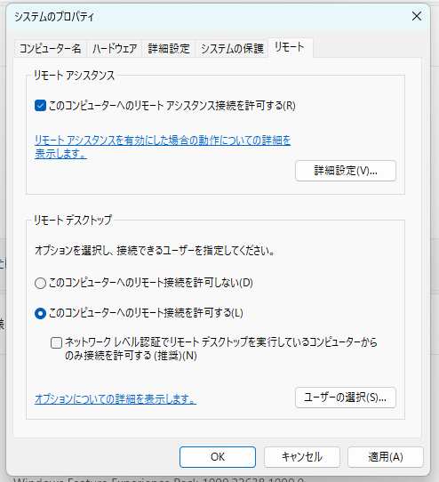  

## 7. Power Automate for desktopのフロー
デスクトップ フローの編集画面から、フロー内のアクション (Ctrl + C) をコピーし、テキスト エディター (Ctrl + V) に貼り付けてご提供ください。
一度にコピーできるフローは 1 つだけであるため、フロー内に複数のサブフローがある場合は、サブフローごとに上記の手順を繰り返し、アクションを個別のテキスト ファイルに保存した上でご提供ください。  
  

## 8. デスクトップフローの実行履歴URL  
1. マイフロー>デスクトップフローから該当のフローを選択します。実行履歴から該当の日時を選択します。  
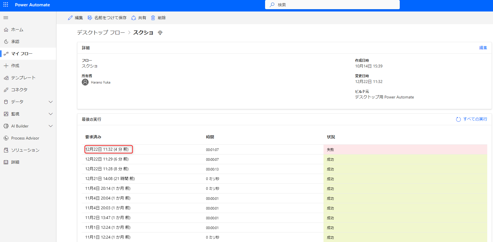  
1. URLをコピーしてご提供ください。
エラー時にフローが実行されず実行履歴に残っていない場合は、１の画面のURLをコピーしてご提供いただけますと幸いです。

## 9. クラウドフローの実行履歴CSV
1. デスクトップフローを呼び出したクラウドフローの詳細画面を開き、「28 日間の実行履歴」から「すべての実行」を選択します。
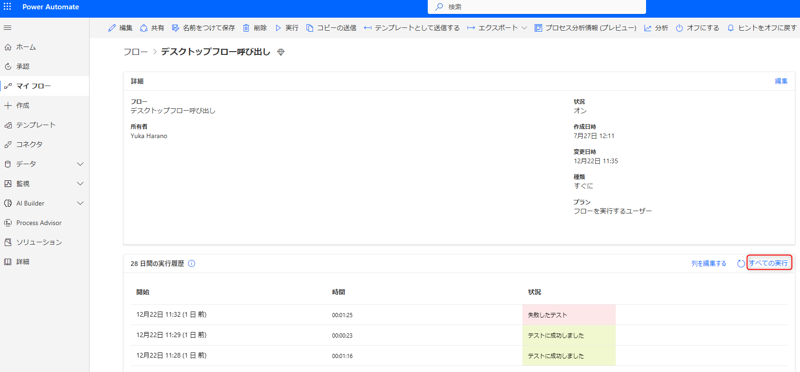
2. 「.csv ファイルを取得」を選択し、取得した CSV ファイルをご提供ください。
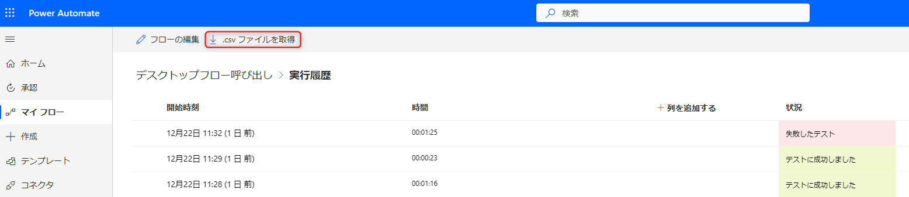

クラウドフローの実行履歴CSVの取得方法の詳細に関して、以下に記載がございますのでご参照いただけますと幸いです。
[Power Automate お問い合わせの際の情報取得手順 | Japan Dynamics CRM & Power Platform Support Blog (jpdynamicscrm.github.io)](https://jpdynamicscrm.github.io/blog/powerautomate/helpful-information-for-powerautomate-sr/#anchor-flowrunhistory-csv)

## 10. クラウドフローのアクションの未加工入力と未加工出力

実行履歴から「デスクトップ用 Power Automate で構築したフローを実行する」アクション等のデスクトップフローを呼び出すアクションを展開します。
未加工入力および未加工出力として表示されるテキストをコピーし、ご提供ください。
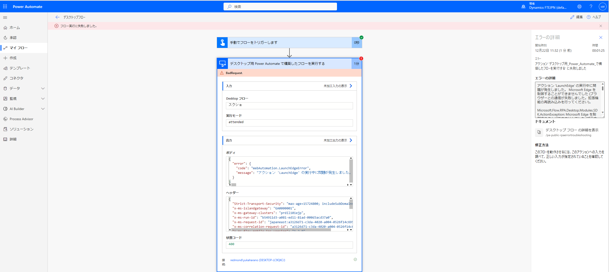  

クラウドフローのアクションの未加工入力と未加工出力の取得方法の詳細に関して、以下にも記載がございますのでご参照いただけますと幸いです。
[Power Automate お問い合わせの際の情報取得手順 | Japan Dynamics CRM & Power Platform Support Blog (jpdynamicscrm.github.io)](https://jpdynamicscrm.github.io/blog/powerautomate/helpful-information-for-powerautomate-sr/#%E3%82%A2%E3%82%AF%E3%82%B7%E3%83%A7%E3%83%B3%E3%81%AE%E6%9C%AA%E5%8A%A0%E5%B7%A5%E5%85%A5%E5%8A%9B%E3%80%81%E6%9C%AA%E5%8A%A0%E5%B7%A5%E5%87%BA%E5%8A%9B)

---

## 補足

本手順は執筆時点でのユーザー インターフェイスを基に紹介しています。バージョンアップによって若干の UI の遷移など異なる場合があります。その場合は画面の指示に従って進めてください。

---
