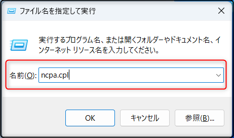

こんにちは。Power Platform サポートの櫻井です。  
本記事では Power Automate for desktop のインストール後に LAN が繋がらない場合の対応方法についてご案内いたします。

<!-- more -->
# 目次

1. [はじめに](#anchor-intro)
1. [原因](#anchor-reason) 
1. [対応方法](#anchor-measure)
   1. [端末ごとの証明書フィルタリング設定 (無線 LAN の場合)](#anchor-measure-wireless-lan)
   1. [端末ごとの証明書フィルタリング設定 (有線 LAN の場合)](#anchor-measure-wired-lan)
   1. [グループ ポリシーによる証明書フィルタリング設定](#anchor-measure-gpo)
  

## はじめに
---
「Power Automate for desktop をインストール後、社内 LAN に繋がらなくなってしまった」  
というお問い合わせをいただくことがございます。  
この記事では、本事象の原因と対応方法についてご案内いたします。  
  

## 原因
---
Power Automate for desktop をインストールすると、Power Automate for desktop 用の証明書がインストールされます。  
一方、Windows の証明書のフィルタリング機能を利用していない場合、Windows にて実装されているコンピューター証明書の自動選択基準に従い、  
LAN 接続時の証明書が選択される動作となります。  

そのため、Power Automate for desktop のインストール後、自動選択基準で LAN 接続時の証明書が選択される際、 
従来使用されていた LAN の証明書ではなく、Power Automate for desktop の証明書が選択される可能性があります。  
その結果、LAN 接続時に必要な証明書が選択されず、社内 LAN に繋がらない事象が発生する可能性があります。  

証明書の自動選択基準についてはこちらの Windows サポートブログにてご説明しておりますので、ご参照いただけますと幸いです。  
[無線 LAN 接続に利用されるコンピューター証明書の選択基準について](https://jpwinsup.github.io/blog/2021/02/02/WirelessNetwork/Wi-Fi/Selection-criteria-for-certificates-used-for-wireless-LAN-connections/)
  

## 対応方法
---
端末ごとに証明書フィルタリング設定をすることで、ネットワークに繋がらない事象を防ぐことができます。  
また、証明書フィルタリング設定を管理者にてグループ ポリシーとして設定できます。  
 

### 1. 端末ごとの証明書フィルタリング設定 (無線 LAN の場合)
無線 LAN 接続に利用されるフィルタリング機能の設定手順については、こちらの Windows サポートブログをご参照ください。  
[無線 LAN 接続に利用される証明書のフィルタリングについて](https://jpwinsup.github.io/blog/2021/02/02/WirelessNetwork/Wi-Fi/Filtering-of-certificates-used-for-wireless-LAN-connections/)
 

### 2. 端末ごとの証明書フィルタリング設定 (有線 LAN の場合)
  1.  [Win] キー + [R] キー を押し、[ファイル名を指定して実行] のダイアログボックスを開きます。  
  1. `ncpa.cpl` と入力し、[Ctrl] キー + [Shift] キー + [Enter] キーを押します。  
     

  1. 認証設定されている有線アダプタを右クリックして [プロパティ] をクリックします。  

  1. [ネットワークの認証方法の選択] のコンボボックスの表示を確認して、以下の操作を行います。  

     * コンボボックスの隣の [設定] をクリックします。  
       

     * [スマートカードまたはその他の証明書] の隣に表示されている [構成] をクリックします。  
     

  1. 以下の [詳細設定] ボタンをクリックします。  
  

  1. [証明書発行者] のチェックボックスを入れて、社内ネットワークで利用したい証明書の「ルート証明機関」のチェックを入れます。  
    (※ 以下は、社内 NW で利用する証明書のルート証明機関が "Microsoft Root Certificate Authority" の場合の設定例です。)  
  

  1. [OK] ボタンですべてのプロパティ画面を閉じます。  
 

### 3. グループ ポリシーによる証明書フィルタリング設定 
グループ ポリシーにて無線 LAN / 有線 LAN プロファイルを配布されている場合、ドメイン コントローラー上の [グループポリシーの管理] 機能から設定を変更することで、管理者は証明書フィルタリング設定を一元管理できます。  
なお、今回の設定は、Windows 8 以降で実装されたものであるため、ここでは、Windows Server 2012 以上のドメイン コントローラーを利用すると仮定します。  

#### 手順
1. グループ ポリシーの管理を開き、以下のグループ ポリシー オブジェクトを編集します。  
   * 無線 LAN の場合：  
     [コンピューターの構成] - [Windows の設定] - [セキュリティの設定] - [ワイヤレス ネットワーク (IEEE 802.11) ポリシー] を選択し、[<ポリシー名>] をダブルクリックします。  

   * 有線 LAN の場合：  
     [コンピューターの構成] - [Windows の設定] - [セキュリティの設定] - [ ワイヤードポリシー] を選択し、[<ポリシー名>] をダブルクリックします。  

1. [全般] タブより、該当のプロファイルを選択し、[編集] ボタンをクリックします。  

1. [セキュリティ] タブを選択します。ここでは、お客様が設定されている認証方式により、いずれかをご選択ください。
   * [スマート カードまたはその他の証明書] が選択されている場合：  
     [プロパティ] をクリックします。  
   
   * [保護された EAP (PEAP)] が選択されている場合：  
     [プロパティ] をクリックし、次の画面で、さらに [スマート カードまたはその他の証明書] の右側の [構成] ボタンをクリックします。  

1. "スマートカードまたはその他の証明書のプロパティ" が表示されますので、[詳細設定] をクリックします。  

1. 当項目が Windows 8 以降より実装された機能となります。[証明書発行者] にチェックを入れて、証明書の発行元のルート証明書を選択ください。  
   (※ ルート証明書は、ローカル コンピューターの [信頼された証明機関] ストアを参照しておりますので、予めインストールを実施ください。)

1. クライアント側にて `gpupdate /force` を実施します。  

なお、設定される項目に関しては、こちらの Windows サポートブログをご参照いただけますと幸いです。  
[無線 LAN 接続に利用される証明書のフィルタリングについて](https://jpwinsup.github.io/blog/2021/02/02/WirelessNetwork/Wi-Fi/Filtering-of-certificates-used-for-wireless-LAN-connections/)

---

## 補足

本手順は執筆時点でのユーザー インターフェイスを基に紹介しています。バージョンアップによって若干の UI の遷移など異なる場合があります。その場合は画面の指示に従って進めてください。

---
