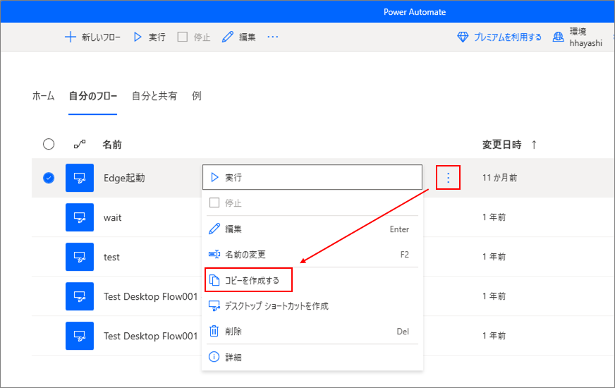
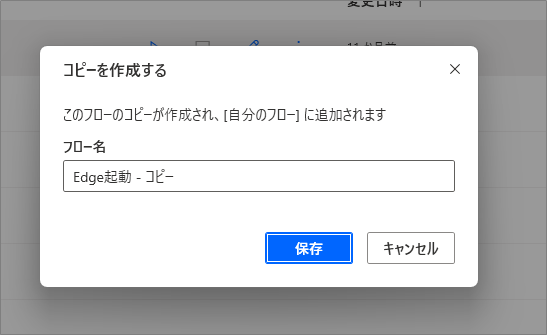
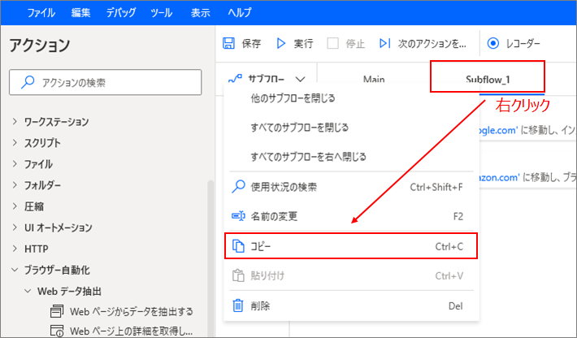
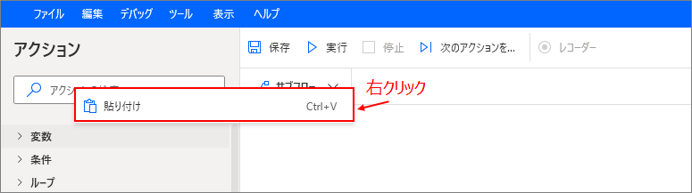
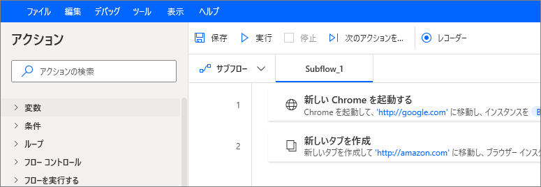
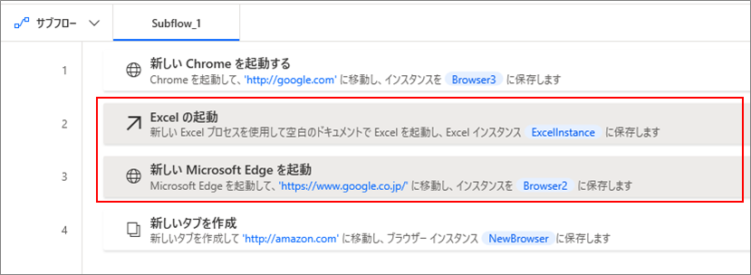
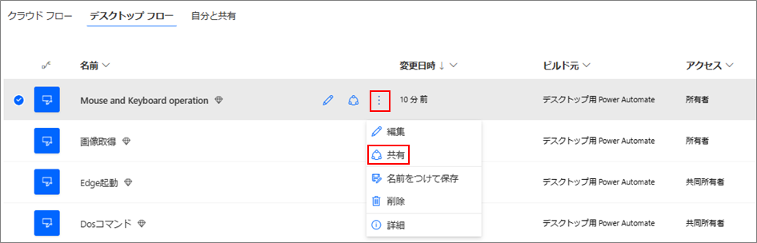
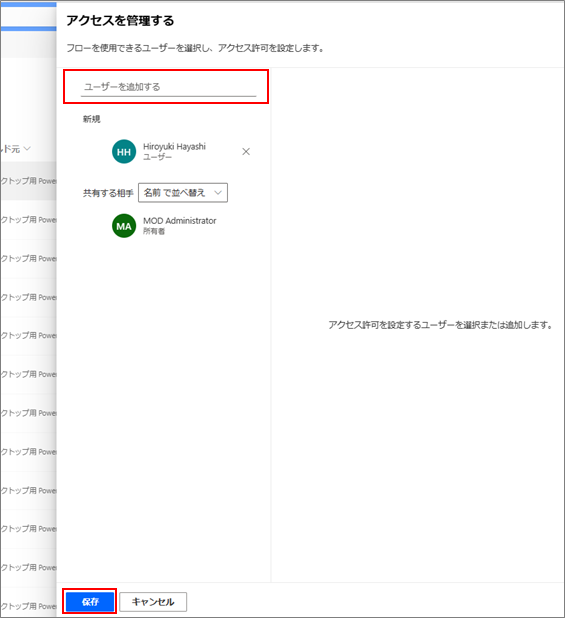
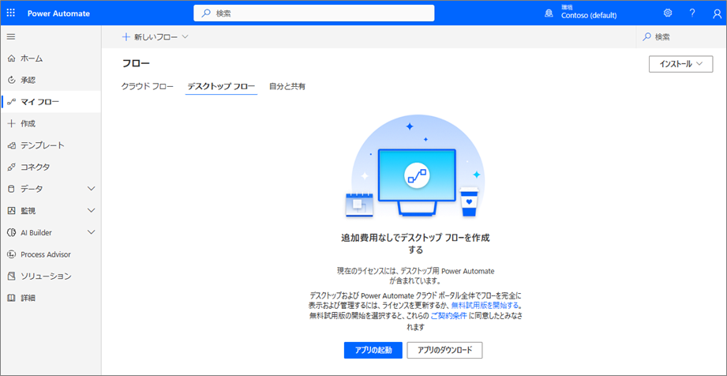

こんにちは、Power Platform サポートの林です。  
Power Automate for desktop で作成したデスクトップ フローを複製したり、他の方にも利用していただくため共有する方法についてご案内いたします。積極的に作業の自動化を推進して、業務の効率化を図りましょう。  

<!-- more -->
 
## はじめに  
 
作成したデスクトップ フローを複製・共有する方法として、Power Automate for desktopから実行可能な方法とPower Automateポータルから実行可能な方法があります。一覧にすると以下の通りです。  
 
 
|手法|複製機能|共同編集機能|別環境への移行可|要有償ライセンス※1|
|---|:---:|:---:|:---:|:---:|
|**Power Automate for desktopから実行可能**|||||
|1. デスクトップ フローのコピー|〇||||
|2. フロー デザイナーでのコピー|〇※2||〇||
|**Power Automateポータルから実行可能**|||||
|3. デスクトップ フローの共有||〇||〇|
|4. ソリューションでの移行|〇※2||〇||

※1 Power Automate Premium  
※2 複製結果を所有者以外のユーザーと共有することが可能  

各手法について以降で詳細にご説明させていただきます。  

## 1. デスクトップ フローのコピー  

Power Automate for desktopのデスクトップ フローの一覧画面から "コピーを作成する" を選択することで、簡単にデスクトップ フローを同じ環境に複製することができます。  

複製したデスクトップフローは任意の名前を付けることができます。  

## 2. フロー デザイナーでのコピー  

デスクトップ フローのフロー デザイナー（編集画面）から、フロー内のアクションをコピーすることができます。  
コピーする方法は２つございます。いずれもコピーした内容はクリップ ボードに記録されるため、テキスト ファイルに保存し、他の方と共有することができます。また、デスクトップ フローの履歴やバックアップとしても保存することもできます。  

#### サブフロー単位でコピーする  

1. コピーしたいサブ フロー上で右クリックでメニューを開き、"コピー" を選択します。  

1. サブ フローを張り付けたいデスクトップ フローを開き、右クリックから "貼り付け" を選択します。  

1. 張り付けることでサブ フロー名も含めてデスクトップ フローの内容をコピーすることができます。  

#### アクション単位でコピーする  

1. コピーしたいアクションを選択し（複数選択可）、コピーします。  

1. 張り付け先のデスクトップ フローを開き、張り付けたい箇所の次のアクションを選択します。  

1. 張り付けることでアクション単位でコピーすることができます。上記2でアクションを選択しない場合、一番下にコピーしたアクションが追加されます。  

#### 補足事項  
* コピー対象はデスクトップ フローのステップ情報です。そのため、入出力変数の定義やフロー内のアクションで使用していない UI 要素など一部の情報はコピーの対象外となります。  

## 3. デスクトップ フローの共有  

Power Automate ポータルからデスクトップ フローを共有することができます。デスクトップ フローの共有となるため、デスクトップ フローを修正すると共有先全てに反映される動作となります。  

1. Power Automate ポータル  > マイフロー >  にアクセスします。  

2. 共有したいデスクトップ フローを選択し、 "共有" を押下します。  

3. 共有したいユーザーを選択し、 "保存" を押下します。  

公開情報にも手順の記載がございますので、ご参照いただけますと幸いです。   
[デスクトップ フローの管理 - Power Automate | Microsoft Learn](https://learn.microsoft.com/ja-jp/power-automate/desktop-flows/manage#share-desktop-flows)  

#### 補足事項  
* デスクトップ フローの共有操作をするためには有償ライセンスが必要となり、有償ライセンスがない場合は以下の画面となり操作できません。  

* 共有時点では共有先ユーザーに有償ライセンスは不要ですが、実際にデスクトップ フローを利用する時点で必要となりますのでご注意ください。有償ライセンスがない場合、共有されたデスクトップ フローを参照することができません。  

## 4. ソリューションでの移行  

ソリューションにデスクトップ フローを追加することで、ソリューション単位でエクスポート、インポートによりデスクトップ フローを別環境に移行することができます。ソリューションの概要や操作方法については以下の公開情報をご確認下さい。  

[Power Apps のソリューション - Power Apps | Microsoft Learn](https://learn.microsoft.com/ja-jp/power-apps/maker/data-platform/solutions-overview)  
[Power Apps でソリューションを作成する - Power Apps | Microsoft Learn](https://learn.microsoft.com/ja-jp/power-apps/maker/data-platform/create-solution)  
[ソリューションのエクスポート - Power Apps | Microsoft Learn](https://learn.microsoft.com/ja-jp/power-apps/maker/data-platform/export-solutions)  
[ソリューションのインポート - Power Apps | Microsoft Learn](https://learn.microsoft.com/ja-jp/power-apps/maker/data-platform/import-update-export-solutions)  

---
