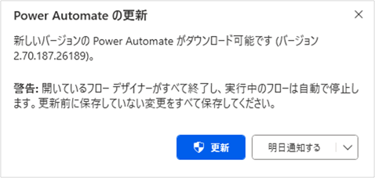
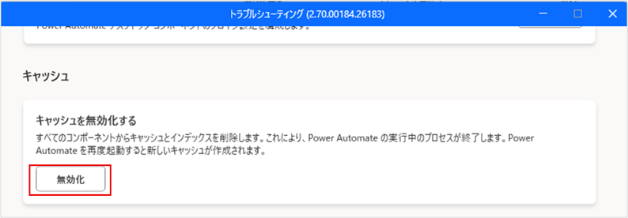
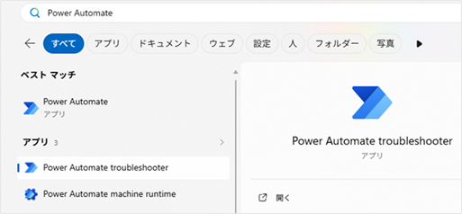
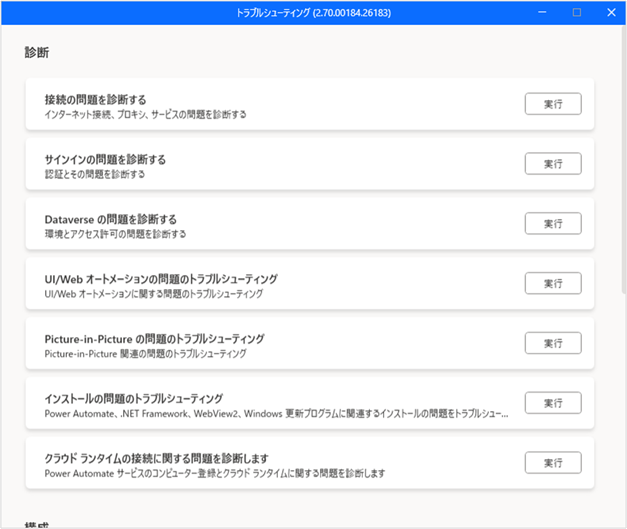

# はじめに

こんにちは。Power Platform サポートの林です。  
本記事では Power Automate for desktop で問題が発生した際にユーザー側で問題を解消するためのトラブルシューティングについてご案内いたします。  

<!-- more -->
# 目次

1. [バージョンアップ](#anchor-version-up)
1. [キャッシュクリア](#anchor-cacheclear)
1. [通信設定の確認](#anchor-connection)
1. [トラブルシューティングの実行](#anchor-troubleshooting)

# 1. バージョンアップ  
Power Automate for desktop は定期的にバージョンアップをしています。  
過去の不具合はバージョンアップによって修正されており、発生した問題も解消する可能性があります。また、テクニカルサポートにお問い合せいただいた場合でも、バージョンアップにて事象が解消するかの確認をお願いする場合もございます。そのため、テクニカルサポートにお問合せいただく前に、可能な限り最新バージョンにアップデートいただき、事象が解消するかご確認いただけますと幸いです。  

**[実施方法]**  
バージョンアップは Power Automate for desktop 起動後のポップアップ の更新を押下することで可能です。
  

また、以下からインストーラーを取得し、実行することでも可能です。※事前のアンインストールは不要です。  
[Power Automate のインストール](https://learn.microsoft.com/ja-jp/power-automate/desktop-flows/install)   

> [!NOTE]
> ストア版をご利用いただいている場合は、自動でバージョンアップが実行されます。  

# 2. キャッシュクリア  
Power Automate for desktop は認証情報や実行するデスクトップフローの情報を一部キャッシュ情報としてローカル端末に保持します。  
このキャッシュの影響で過去に本来実行できる操作がエラーとなる事例やデスクトップフローの編集画面が正しく表示されない事例が発生しております。これらの事象はキャッシュクリアによって問題が解消します。  

**[実施方法]**  
キャッシュクリアは ヘルプ > トラブルシューティング の キャッシュ の「キャッシュを無効化する」から実行できます。  
本操作により 起動している Power Automate for desktop が終了しますので、実行するデスクトップフローがない場合に実施ください。  
  

# 3. 通信設定の確認  
Power Automate for desktop をご利用される際、クラウドサービスとの通信が発生します。  
通信可能なドメインに通信できない場合、Power Automate for desktop 起動時、もしくは、デスクトップフロー実行時にエラーが発生します。  

**[実施方法]**  
以下のページを参照いただき、端末から各ドメインが通信できる状態となっているかご確認ください。  
[Power Automate の IP アドレス構成](https://learn.microsoft.com/ja-jp/power-automate/ip-address-configuration)   

「Power Automate の IP アドレス構成」の 2026 年 8 月時点で通信が必要となる設定セクション
- Power Automate Web ポータルを使用する  
- デスクトップ フロー ランタイムのグローバル エンドポイント ※1  
- デスクトップ用 Power Automate MSI インストーラーのグローバル エンドポイント ※2  
- デスクトップ フロー ランタイムのパブリック エンドポイント ※1  
- ホスト型コンピューターとホスト型コンピューター グループのパブリック エンドポイント ※3

※1 デスクトップ フロー ランタイム アプリ利用時  
※2 MSI インストーラー利用時  
※3 ホスト型コンピューターご利用時

> [!NOTE]
> 後述のトラブルシューティングを実行することでも、問題の通信を特定することができますので併せてご確認ください。  

# 4. トラブルシューティングの実行
Power Automate for desktop での一般的な問題に対して原因を特定する機能として、トラブルシューティングがあります。  
診断したいセクションが分かれており、診断対象の実行を押下することで問題を特定することができます。

**[実施方法]**  
ヘルプ > トラブルシューティング から起動できます。  
また、Windows のメニューからも起動することができるため、Power Automate for desktop が起動できない場合は、メニューから直接起動ください。  
  

| セクション | 診断内容 |
|--|--|
| 接続の問題を診断する | インターネット接続、プロキシ、サービスの問題を診断する |
| サインインの問題を診断する| 認証とその問題を診断する |
| Dataverse の問題を診断する| 環境とアクセス許可の問題を診断する| 
| UI/Web オートメーションの問題のトラプルシューティング|UI/Web オートメーションに関する問題のトラブルシューティング| 
| Picture-in-Picture の問題のトラブルシューティング| Picture-in-Picture 関連の問題のトラブルシューティング| 
| インストールの問題のトラブルシューティング| Power Automate、.NET Framework、WebView2、Windows更新プログラムに関連するインストールの問題のトラブルシューティング|
| クラウドランタイムの接続に関する問題を診断します | Power Automate サービスのコンピューター登録とクラウドランタイムに関する問題を診断します |  

  

---

## 補足
本手順は執筆時点でのユーザー インターフェイスを基に紹介しています。バージョンアップによって若干の UI の遷移など異なる場合があります。その場合は画面の指示に従って進めてください。

---
