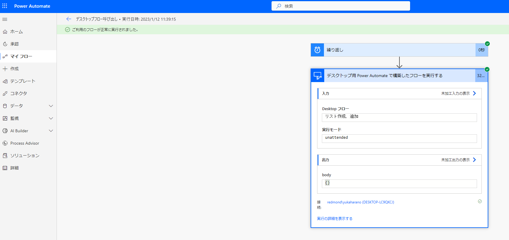

こんにちは。Power Platform サポートの原野です。  
本記事では Power Automate for desktop で作成したデスクトップ フローをクラウドフローから呼び出して、非アテンド型 (無人) でフローを実行する方法についてご案内いたします。  

有人実行と無人実行の違いや、アテンド型 (有人) でフローを実行する方法については以下のブログに記載がございますので、ご確認ください。  
[Power Automate for desktop で作成したデスクトップ フローをクラウド フローから実行する方法 (有人実行) | Japan Dynamics CRM & Power Platform Support Blog (jpdynamicscrm.github.io)](https://jpdynamicscrm.github.io/blog/powerautomate/power-automate-desktop-attand-automation/)  

<!-- more -->
# 目次

1. [概要](#anchor-intro)
1. [無人実行に必要なライセンスについて](#anchor-licence-for-unattended-automation)
1. [デスクトップ フローを無人実行する方法](#anchor-unattended-automation)
    1. [無人 RPA アドオンの割り当て方](#anchor-unattended-add-on)
    1. [端末の登録方法](#anchor-register-computers)
    1. [クラウド フローからデスクトップ フローを呼び出す方法](#anchor-call-desktopflow-from-cloudflow)
    1. [無人実行の際の注意事項について](#anchor-notes-on-unattended-automation)
    1. [実行結果](#anchor-result-of-unattended-automation-flow)

# 概要

クラウド フローから Power Automate for desktop を呼び出して、デスクトップ フローを無人実行する方法についてご案内いたします。  
無人実行では、ユーザーが端末からサインアウトしている状態でデスクトップ フローが実行できます。  

ユーザーが端末にサインインしている状態でデスクトップ フローを実行する有人実行の方法については以下のブログでご案内していますのでご確認いただけますと幸いです。  
[Power Automate for desktop で作成したデスクトップ フローをクラウド フローから実行する方法 (有人実行) | Japan Dynamics CRM & Power Platform Support Blog (jpdynamicscrm.github.io)](https://jpdynamicscrm.github.io/blog/powerautomate/power-automate-desktop-attand-automation/)  

# 無人実行に必要なライセンスについて
1. 必要なライセンス  
    クラウド フローからデスクトップ フローを 無人実行で呼び出す際には、下記のいずれかの Power Automate 有償ライセンスが必要になります。  
    * 有人RPAを含む Power Automate per user プラン ＋ Power Automate 無人 RPA アドオン
    * Power Automate per flow プラン＋ Power Automate 無人 RPA アドオン
    * 従量課金制  

    なお、デスクトップ フローを無人実行する際に Office 製品を利用する場合、Office 365 無人ライセンス (E3 unattended License) を購入し、ユーザーに割り当てる必要がございます。  

1. 無人アドオンの必要な個数  
    1 つの環境内で同時間帯に並行でデスクトップ フローを実行したい場合は、並行で実行したいフローの数だけ、無人 RPA アドオンを環境に割り当ててご利用ください。  
複数のデスクトップ フローを同時に実行する必要がない場合は、 1 つの無人 RPA アドオンを環境に割り当てることでフローを実行いただけます。

# デスクトップ フローを無人実行する方法
以下の方法について、順にご案内いたします。  
* 無人 RPA アドオンの割り当て方
* 端末の登録方法  
* クラウド フローからデスクトップ フローを呼び出す方法  

## 無人 RPA アドオンの割り当て方
無人 RPA アドオンを購入して、環境に割り当てる方法についてご案内いたします。  
* 無人 RPA アドオンを購入する  
  [Microsoft 365 管理センター](https://admin.microsoft.com/)から無人 RPA アドオンを購入する方法については以下の公開情報でご案内していますのでご確認ください。  
  [Power Automate ライセンスを購入する - Power Platform | Microsoft Learn](https://learn.microsoft.com/ja-jp/power-platform/admin/power-automate-licensing/buy-licenses#buy-unattended-add-on))](https://learn.microsoft.com/ja-jp/power-platform/admin/power-automate-licensing/buy-licenses#buy-unattended-add-on)  
* 無人 RPA アドオンを環境に割り当てる    
  上記で購入したアドオンを環境に割り当てる方法については以下の公開情報でご案内していますのでご確認ください。 
  [Power Automate ライセンスを購入する - Power Platform | Microsoft Learn](https://learn.microsoft.com/ja-jp/power-platform/admin/power-automate-licensing/buy-licenses#assign-unattended-add-ons-to-an-environment)
    

## 端末の事前準備
1. 端末の登録方法
  Power Automate コンピュータ ランタイムアプリを使用して、該当の環境にデスクトップ フローを実行する端末を登録を行います。  
  以下の記事をご参照の上でご指定ください。  
  [端末の登録方法 (有人実行) | Japan Dynamics CRM & Power Platform Support Blog (jpdynamicscrm.github.io)](https://jpdynamicscrm.github.io/blog/powerautomate/power-automate-desktop-attand-automation/#anchor-register-computers)  
  
1. リモート デスクトップの設定  
  実行する端末 > システムのプロパティ > リモート デスクトップにて、以下のように設定します。  
    
     * 「このコンピューターへのリモート接続を許可する」を選択する  
     * 「ネットワークレベル認証でのリモート デスクトップを実行しているコンピューターからのみ接続を許可する」のチェックを外す  

## クラウド フローからデスクトップ フローを呼び出す方法
以下の記事の手順 6 で実行モードを非アテンド型に変更することで、デスクトップ フローを無人実行で呼び出すことができます。   
[クラウド フローからデスクトップ フローを呼び出す方法 | Japan Dynamics CRM & Power Platform Support Blog (jpdynamicscrm.github.io)](https://jpdynamicscrm.github.io/blog/powerautomate/power-automate-desktop-attand-automation/#anchor-call-desktopflow-from-cloudflow)

  
  * Desktop フロー：呼び出したいデスクトップ フローをご指定ください。  
  * 実行モード：非アテンド型をご指定ください。  

## 無人実行の際の注意事項について
無人実行でデスクトップ フローを呼び出す際は、フローを問題なく実行するために以下の点をご確認いただけますと幸いです。  
1. 端末からサインアウトしていること：フローを実行する際に端末からサインアウトしているかどうかご確認ください。   
     * 端末からサインアウトしていない場合のエラー例：  
    >デスクトップ フローを実行できるコンピューターが見つかりません。実行を中止しています。コンピューターに接続する際にエラーが発生しました: ターゲット コンピューターにユーザー セッションが存在します。デスクトップ フローを非アテンド型で実行できません。  
  
1. リモート デスクトップの設定が適切に行われていること：本記事内の「端末の登録方法」の章の記載にしたがって設定されているかどうかご確認ください。  
     * 「このコンピューターへのリモート接続を許可する」が選択されていない場合のエラー例 ：  
    >デスクトップ フローを非アテンド型で実行するセッションを作成できません。デスクトップ フローを非アテンド型で実行するには、お使いコンピューターでリモート デスクトップを有効にする必要があります。  
     
     * 「ネットワークレベル認証でのリモート デスクトップを実行しているコンピューターからのみ接続を許可する」のチェックが外れてない場合のエラー例：  
    >これらの資格情報では非アテンド型セッションを作成できませんでした。AAD 資格情報を使用している場合は、リモート設定でネットワーク レベル認証 (NLA) が無効になっていることをご確認ください  
     

## 実行結果  
クラウド フローからデスクトップ フローを呼び出して無人実行することができました。  
  

---

## 補足

本手順は執筆時点でのユーザー インターフェイスを基に紹介しています。バージョンアップによって若干の UI の遷移など異なる場合があります。その場合は画面の指示に従って進めてください。

---
