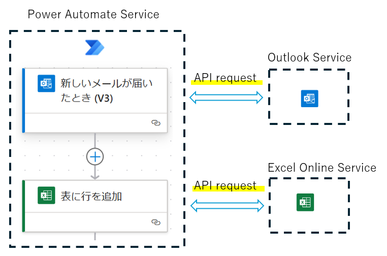
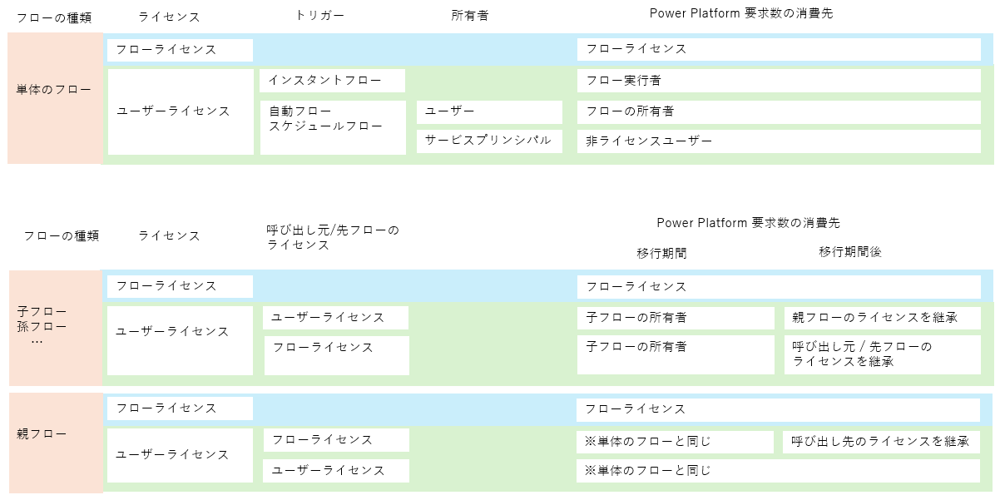
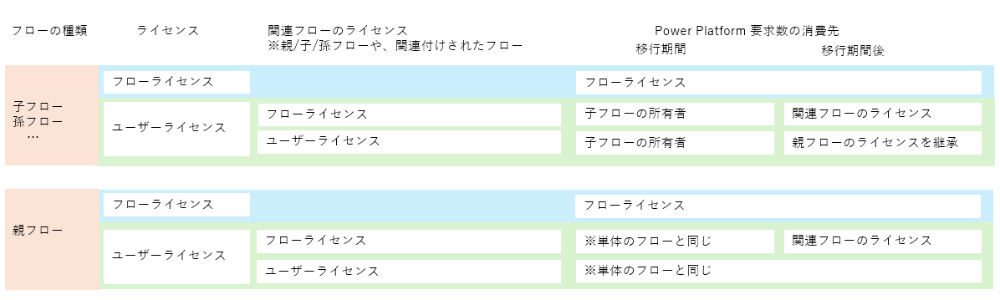
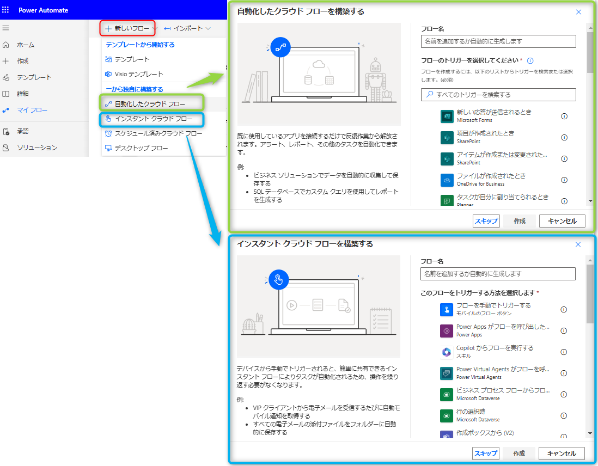

# Power Automate / Power Platform 要求数制限

こんにちは、Power Platform サポートチームの網野です。  
今回は Power Automate における Power Platform 要求数の制限についてご案内いたします。

> [!IMPORTANT]
> [公開情報](https://learn.microsoft.com/ja-jp/power-platform/admin/online-requirements) が正となりますので、ライセンスをご用意する際は必ず最新の公開情報を確認してください。

<!-- more -->

## Power Platform 要求数とは
Power Automate ではコネクタのアクションを組み合わせることで、複数の製品をまたいだ処理を自動化することができます。  
アクションやトリガーでは、Power Platform 内部で実行するアクションを含め、API でデータのやり取りを行っており、Power Automate ではその API リクエストを Power Platform 要求数と呼びます。

もう少し詳しくイメージをつかむために、単純なフローを用いて説明します。  
指定のメールフォルダにメールが届いたときにメールの内容をエクセルに転記するフローを作成するとします。  
このフローを実行すると、「新しいメールが届いたとき(V3)」トリガーと「表に行を追加」アクションでそれぞれ 1 回ずつ、合計 2 回分 Power Platform 要求数を消費します。

## Power Platform 要求数の制限とは
フローは上記のように、内部的に Power Platform 要求数を消費して実行されます。
Power Platform 要求数はライセンスごとに上限値が決まっており、上限値を超えて利用するとフローが低速化する動作となります。  
一例をあげますと、通常 1 分程度で完了するフローが完了まで 2 時間程度かかるというような動作になります。  
この制限のことを Power Platform 要求数の制限と呼びます。

◆ 関連公開情報
* [フローが制限を超過している場合はどうすればよいですか?](https://learn.microsoft.com/ja-jp/power-platform/admin/power-automate-licensing/faqs#what-can-i-do-if-my-flow-is-above-limits)
* [低速フローのトラブル シューティング](https://jpdynamicscrm.github.io/blog/powerautomate/troubleshoot-throttling-flow/)

フローは 24 時間あたりの Power Platform 要求数を随時監視しており、要求数がライセンスの制限値を上回りますと内部的にアクションが待機状態になります。待機状態になったアクションは、24 時間あたりの Power Platform 要求数がライセンスの制限値を下回りますと再び動き出します。  
判定はスライディングウィンドウ方式で行われており、先に実行しているアクションが完了していくことで過去 24 時間の要求数が制限値を下回るようになり、待機状態のアクションが順次実行されていきます。

## ライセンスごとの API リクエスト数

ライセンスごとの Power Platform 要求数は以下のとおりです。  
2024 年 12 月現在は、「24時間あたりのリクエスト数（移行期間）」列に記載された制限が適用されています。  
移行期間の終了日は決まっていませんが、移行期間後の制限に合わせてライセンスをご用意いただきますようお願いをしています。

| ライセンス | 24時間あたりのリクエスト数 （移行期間<b>後</b>） | 24時間あたりのリクエスト数 （移行期間）|
| :- | -: | -: |
| Power Automate Premium| ユーザーあたり 40,000 | クラウドフローあたり 200,000|
| Power Automate Process| ライセンスあたり 250,000 | ライセンスあたり 500,000|
| Power Automate per user (レガシー)| ユーザーあたり 40,000 | クラウドフローあたり 200,000|
| Power Automate per flow (レガシー)| ライセンスあたり 250,000 | ライセンスあたり  500,000|
| Power Automate free| ユーザーあたり 6,000 | クラウドフローあたり 10,000|
| Power Automate 試用版| ユーザーあたり 6,000 | クラウドフローあたり 10,000|
| Microsoft/Office 365 | ユーザーあたり 6,000 | クラウドフローあたり 10,000|
| Power Apps Premium | ユーザーあたり 40,000 | クラウドフローあたり 200,000|
| Dynamics 365 Professional | ユーザーあたり 40,000 | クラウドフローあたり 200,000|
| Dynamics 365 エンタープライズアプリケーション| ユーザーあたり 40,000 | クラウドフローあたり 200,000|
| Dynamics 365 Team Members| ユーザーあたり 6,000 | クラウドフローあたり 10,000|

なお、2024 年 12 月現在は Power Automate にのみ制限がかかっていますが、移行期間後は Power Apps / Copilot Studio / Dataverse にも Power Platform 要求数の制限が適用される予定です。  
そのため、表の移行期間後の「ユーザーあたり」の制限値は<u> 4 製品合算での制限値</u>になります。  
決まっている内容につきましては、[要求の制限と割り当て](https://learn.microsoft.com/ja-jp/power-platform/admin/api-request-limits-allocations#what-is-a-microsoft-power-platform-request) に記載していますのでご参照ください。

> [!IMPORTANT]  
> 移行期間中の手動トリガーはクラウドフローあたり 20 万アクションの制限が適用されます。 
> 手動トリガーの Power Platform 要求数はライセンスのアップグレード等により増やすことができます。  

> [!IMPORTANT]  
> 移行期間中のみ、上記に加えて 1 日あたりユーザーごとに 100 万アクションの制限があります。 
> また、移行期間終了前後に関わらず、5 分あたり 10 万アクションの制限があります。 
> 上記制限はライセンス等で拡張することはできません。

◆ 関連公開情報

* [Power Automate の要求の制限](https://learn.microsoft.com/ja-jp/power-platform/admin/api-request-limits-allocations#request-limits-in-power-automate)
* [パフォーマンス プロファイルとは何ですか?](https://learn.microsoft.com/ja-jp/power-platform/admin/power-automate-licensing/faqs#what-are-performance-profiles-and-how-do-i-know-which-performance-profile-my-cloud-flow-uses)

### ユーザーライセンスを複数持っているときの考え方
ユーザーライセンスを複数持っている場合、利用可能な Power Platform 要求数の計算は移行期間前後で異なります。

<b>移行期間中</b> ・・　Power Platform 要求数はお持ちのユーザーライセンスの中で最も要求数の多いライセンスに準じます。  
<b>移行期間後</b> ・・　ユーザーライセンスごとの Power Platform 要求数を合算した要求数を利用できます。

◆ 関連公開情報

* [その他の詳細](https://learn.microsoft.com/ja-jp/power-platform/admin/api-request-limits-allocations#other-details)

## テナント内の Power Platform 要求数を確認する方法

### 管理者

以下の３つのレポートから確認できます。  
詳細はリンク先の公開情報をご参照ください。  
* [フローごとのレポート](https://learn.microsoft.com/ja-jp/power-platform/admin/api-request-limits-allocations#per-flow-report) ・・フローごとのライセンスの Power Platform 要求数の消費状況を確認できます。
* [ライセンスユーザーレポート](https://learn.microsoft.com/ja-jp/power-platform/admin/api-request-limits-allocations#licensed-user-report) ・・ユーザーごとの Power Platform 要求数の消費状況を確認できます
* [非ライセンスユーザーレポート](https://learn.microsoft.com/ja-jp/power-platform/admin/api-request-limits-allocations#non-licensed-user-report)・・サービスプリンシパルが所有者のフローなど、テナントプールの Power Platform 要求数の消費状況を確認できます

> [!NOTE]
> Power Platform 要求数のレポート機能は 2024 年 12 月現在、プレビュー機能として提供しています。

◆ 関連公開情報

* [管理者が環境の使用状況を分析するためのどのようなツールがありますか?](https://learn.microsoft.com/ja-jp/power-platform/admin/power-automate-licensing/faqs#as-an-admin-what-tools-do-i-have-to-analyze-my-environments-usage)

### フロー作成者、共同所有者

恐れ入りますが、フロー作成者や共同所有者が Power Platform 要求数の消費状況を確認する方法は現時点ではご用意がございません。  
フロー単位で消費された Power Platform 要求数は [フローのアクション要求数を数えてみる](https://jpdynamicscrm.github.io/blog/powerautomate/troubleshoot-throttling-flow/#%E3%83%95%E3%83%AD%E3%83%BC%E3%81%AE%E3%82%A2%E3%82%AF%E3%82%B7%E3%83%A7%E3%83%B3%E8%A6%81%E6%B1%82%E6%95%B0%E3%82%92%E6%95%B0%E3%81%88%E3%81%A6%E3%81%BF%E3%82%8B) に記載の方法で確認できます。

◆ 関連公開情報

* [作成者が使用状況を分析するためのどんなツールがありますか?](https://learn.microsoft.com/ja-jp/power-platform/admin/power-automate-licensing/faqs#as-a-maker-what-tools-do-i-have-to-analyze-my-usage)

## Power Platform 要求数のカウント方法

### Power Platform 要求数を消費するケース

* フロー内のすべてのトリガー / アクション  
   「変数の初期化」や「スコープ」アクションも Power Platform 要求数を 1 消費します。
* 1 回のアクション実行で複数のレコードを操作するアクション  
   Power Platform 要求数を 1 消費します。更新対象のレコード数ではなく、Power Automate から実行する API の数がカウントされます。
* アクション実行時に行われたリトライ  
   コネクタから API を実行してリトライ可能なエラーコードが返ってきた場合、コネクタは各アクションの設定に応じてリトライ処理を行います。リトライの回数分 Power Platform 要求数を消費します。
* 失敗したアクション  
   アクションがエラーとなった場合も Power Platform 要求数を消費します。
* ループ内のアクション  
   ループアクションがある場合、ループ内のアクションは実行された回数分の Power Platform 要求数を消費します。例えば、「Apply to each」の中に アクションが 3 つあり、3 回ループした場合、「3（アクション） × 3（ループ回数）+ 1 (Apply to each) = 10」と計算されます。
* ページング  
   アクションで取得する行数によっては内部的に複数回 API を実行してデータを取得する場合があります。見た目上のアクションは 1 つでも内部で実際に実行された数がカウントされます。  
   なお、1 度の API 実行で取得可能な行数は接続先の API の制限に依存するため、アクションによって異なります。

### Power Platform 要求数を消費しないケース

* スキップされたアクション  
   スキップされて実行されなかったアクションは Power Platform 要求数を消費しません。  
   例えば、更新を定期的に監視するポーリングトリガーのフローでは、データの更新があったときのみトリガーの Power Platform 要求数が消費されます。

◆ 関連公開情報

* [何が Power Platform 要求と見なされますか?](https://learn.microsoft.com/ja-jp/power-platform/admin/power-automate-licensing/faqs#what-counts-as-power-platform-request)

## Power Platform 要求数の消費先

Power Platform 要求数の消費先は以下の条件によって決まります。  
* ライセンス
* トリガー
* フローの所有者

詳細は下図を参照してください。

なお、親子フローの場合は単体のフローよりも複雑になります。  
関連するフローのいずれかにフローライセンスが付与されていれば、フローライセンスが使用されます。  
ユーザーライセンスで動作する場合は、単体のフローと同じルールで消費先が決まります。  
留意点として、子フローのみ移行期間中は子フローの所有者のライセンスが利用されます。

詳細は下図を参照してください。

◆ 関連公開情報

* [クラウド フロー で使用されるリクエスト制限は誰のものですか?](https://learn.microsoft.com/ja-jp/power-platform/admin/power-automate-licensing/faqs#whose-power-platform-request-limits-are-used-by-the-cloud-flow)
* [サービス プリンシパルが所有するフローのサポート](https://learn.microsoft.com/ja-jp/power-automate/service-principal-support#power-platform-request-limits)

### 自動フローとインスタントフローの見分け方
「＋新しいフロー」から確認することができます。

## Power Platform 要求数の制限に抵触した時
Power Automate において Power Platform 要求数の制限に抵触したときは以下の対応をご検討ください。
1. フローの構成を見直し、呼び出すアクション数を減らす方法 [サポートブログ](https://jpdynamicscrm.github.io/blog/powerautomate/troubleshoot-throttling-flow/#%E6%94%B9%E5%96%84%E7%AD%96) に改善策を記載していますのでご参照ください。
1. [Power Platform 要求数を多く含むライセンス]()を購入する方法  
   なお、Power Automate Process ライセンスは 1 つのフローに複数付与することで Power Platform 要求数を増やすことができるようになる予定です。
1. 環境を[従量課金制](https://learn.microsoft.com/ja-jp/power-platform/admin/pay-as-you-go-overview)にする方法
1. [Power Platform 要求数のアドオン](https://learn.microsoft.com/ja-jp/power-platform/admin/api-request-limits-allocations#power-platform-request-capacity-add-on)を購入し、サポートリクエストを通じて割り当てを行う方法  
   以下の情報を添えてマイクロソフトサポートまでご連絡ください。
   * [フロー識別子](https://jpdynamicscrm.github.io/blog/powerautomate/helpful-information-for-powerautomate-sr/#anchor-flowid)
   * 購入したライセンスの名称と型番(例. SEW-00001)
   * 付与したい数

> [!NOTE]
> 2024 年 12 月現在、Power Platform 要求数のアドオンを割り当てる機能がリリースされていません。
> Power Platform 要求数のアドオンをサポートリクエストを通じて割り当てる場合、上限値の引き上げには有効期限がございます。有効期限を延長する場合はお手数ではございますが再度お問い合わせをお願いいたします。  
> 有効期限はお問い合わせいただいた際にお伝えいたします。

## よくある質問
### アクションの接続をフロー所有者と別のユーザーに変更していますが、Power Platform 要求数の消費先も変わりますか
いいえ、変わりません。  
Power Platform 要求数の消費先は、アクションの接続先に依存しません。

### 制限値を超えたら追加請求が発生しますか。
いいえ、追加請求は発生しません。  

### 制限値を超えたら即時フローが低速化しますか
いいえ、多少の超過は許可していますので、即時低速化する動作にはなりません。
しかしながら、制限値を大きく超えた場合や、継続的に超えている場合はフローの動作が低速化します。

### フローの低速化が解消されるのは何時間後かわかりますか
恐れ入りますが、明示的に解消される時間帯をご案内することができません。  
フローのアクション数が制限値を下回ったときに解消されます。

### 移行期間はいつまでですか
移行期間終了日につきましては現時点で未定です。  
Power Platform 要求数のレポート機能が一般公開されてから、最低でも 6 カ月の猶予をもって移行期間を終了する予定です。  
移行期間の終了日が決まりしたら、メッセージセンターやブログ等にて通知を行う予定です。  

### Power Platform 要求数のレポートの一般公開はいつですか。
現時点で未定です。  
実際の利用状況や利用ユーザーからのお問い合わせの状況等を踏まえて一般公開の日にちを決めていく予定です。

### Power Platform 要求数は使われなかった分を翌日や翌月に繰り越すことができますか。
いいえ、繰り越すことはできません。

### ユーザーライセンスに付与されている Power Platform 要求数を別のユーザーに振り分けることはできますか。
いいえ、ユーザーライセンスに付与されている Power Platform 要求数を他のユーザーに振り分けることはできません。  
フローの所有者のライセンスを消費するフローの場合は、フローの所有者を変更することで Power Platform 要求数の消費先を変えることができます。

◆ 関連公開情報

* [Power Platform 要求数の消費先](#power-platform-要求数の消費先)
* [フロー作成者 (所有者) を変更したい場合はどうしたらいいか？](https://jpdynamicscrm.github.io/blog/powerautomate/change-flow-owner/#anchor-change-flow-owner)

### ユーザーライセンスレポートを見ると、想定している値よりも 2,000 Power Platform 要求数分多く表示されています。なぜでしょうか。

Common Data Service for Teams ライセンスをお持ちの場合、 2,000 Power Platform 要求が追加されます。

### 制限に抵触した時に影響を受けるのは誰ですか

フローのライセンスで動作しているフローの場合は、そのフローのライセンスで動作しているフローのみ影響をうけます。他のフローには影響しません。
ユーザーライセンスで動作しているフローの場合は、そのユーザーのみ影響をうけます。他のユーザーは影響をうけません。  

なお、移行期間終了前は 100 万アクションを超えない限りはフロー単位でのみ影響をうけます。

◆ 関連公開情報

* [Power Automate の要求の制限](https://learn.microsoft.com/ja-jp/power-platform/admin/api-request-limits-allocations#request-limits-in-power-automate)

### フローの実行回数に制限はありますか

フローの実行回数には制限はありません。

----
