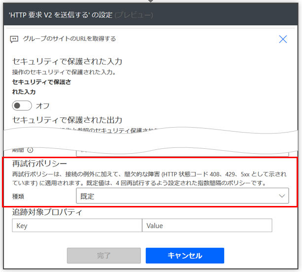
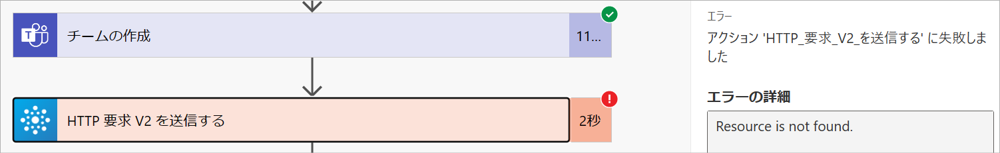
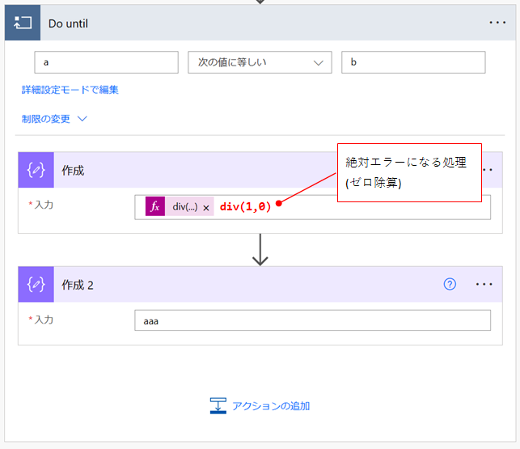
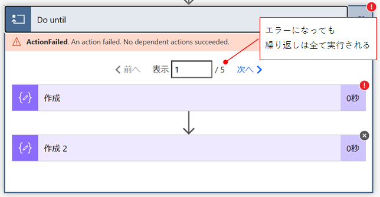
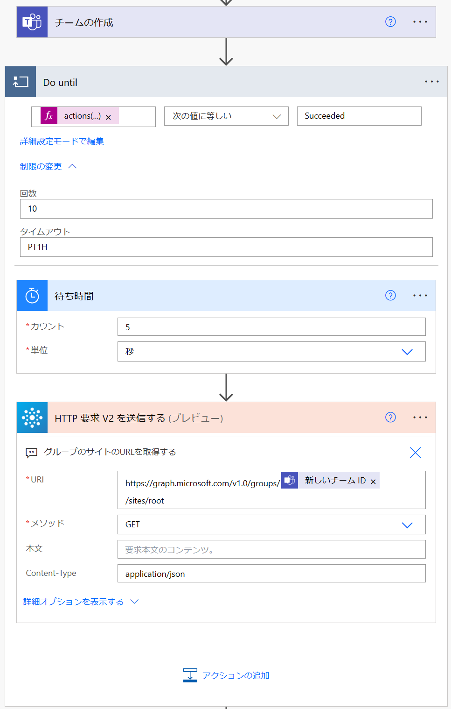
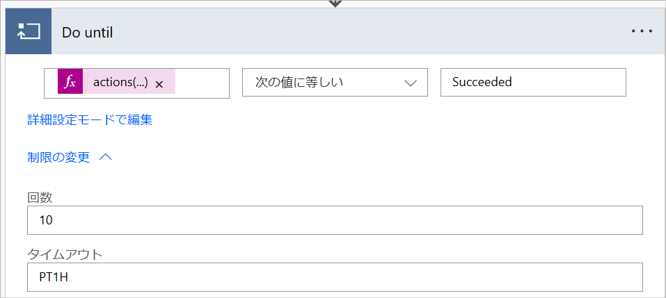
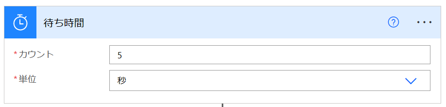

# Do Until で再試行を繰り返す (リトライループ)

こんにちは、Power Platform サポートの瀬戸です。
今回は、Power Automate で出来る再試行のやり方の 1 つをご紹介します。

<!-- more -->

Power Automate のアクションには、再試行ポリシーという仕組みがあります。
再試行ポリシーとは、そのアクションが一時的な不具合等でエラーになったときに、アクションをもう一度実行してくれるものです。対象の レスポンス コードは 408 (Request Timeout)、429 (Too Many Requests)、5xx (サーバーエラー) です。

再試行ポリシーは便利な機能ですが、実行する API によっては、上記以外のレスポンス コードを返す「ことがある」ものがあります。
例えば Microsoft Teams コネクタの「チームの作成」アクションは、API の処理が完了しても実際にチームを使うための準備が整っていないことがあります。そのため、「チームの作成」アクション直後に関連する処理を実行すると、レスポンス コード 404 (Not Found) のエラーになることがあります。

チーム作成の後すぐにサイト URL を取得しようとしてエラーになる例：  

404 は再試行ポリシーの対象外です。
こういう時は何秒か待機した後に次の処理をすればよいのですが、どれくらい待てばよいのかはその都度異なるため、「5秒待って1回やってみる、だめだったらまた5秒待ってもう1回…」といった再試行と待機を繰り返したくなります。
Power Automate でこうした再試行と待機を繰り返すときは、Do Until アクションをご活用いただけます。

Do Until アクションは、アクションの内側のアクションが失敗しても、繰り返しを中断しません。
この特徴が、再試行に有用に働きます。

エラーになる処理の繰り返し：  

上記の実行結果：  

## 再試行の例
以下に、Do Until を使った再試行の例を記載します。各アクションの詳しい説明は後述します。

### (1) Do Until

再試行したいアクション「HTTP 要求 V2 を送信する」のステータスが「成功」になるまで、を繰り返しの終了条件にします。

|パラメータ|値|
|---|---|
|条件式-左辺|以下を式として入力： `actions('HTTP_要求_V2_を送信する')?['Status']`　※1|
|条件式-比較演算子|`次の値に等しい`|
|条件式-右辺|`Succeeded`|
|詳細モード-回数|再試行したい最大回数を指定します。|
|詳細モード-タイムアウト|以下を考慮した時間を設定します。 再試行したい最大回数 × (再試行 1 回ごとに待機する時間 ＋ 再試行したい処理にかかる時間)|

※1 `HTTP_要求_V2_を送信する` は、再試行したいアクションのアクション名です。半角スペースは半角アンダーバーへ置き換えます。

### (2) 待ち時間
「スケジュール」コネクタの「待機」アクションを使い、再試行1回ごとの待機を行います。

### Do Until の後
Do Until が終わった後は、再試行したアクションの後の処理を続けます。

## 終わりに
以上、Do Until を使った再試行の例をご案内いたしました。
Power Automate で出来ることの幅が少しでも広がりましたら幸いです。
