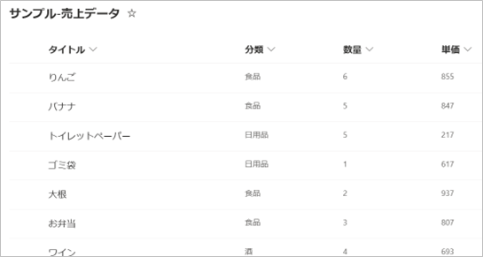
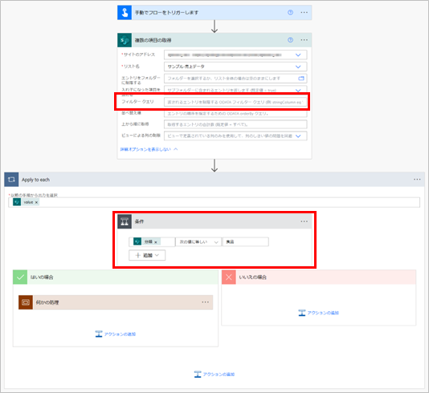
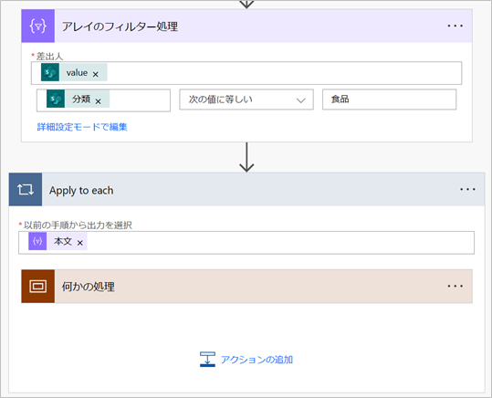
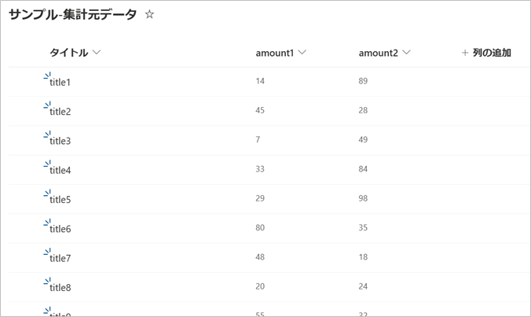

# タイトル

こんにちは、Power Platform サポートの瀬戸です。
今回は、「クラウド フローの処理がいつまで経っても終わらない」ときに試していただける改善策をご案内いたします。

<!-- more -->

## はじめに
時間がかかるようなアクションは使っていないはずなのに、
今まではすぐに処理が完了していたのに、
クラウド フローが何日経っても完了しなくなった。

そんなときは、フローが Power Automate の制限に抵触した可能性が考えられます。

フローが制限に抵触すると、そのフローは実行中でも低速の状態になります。
低速の状態になってしまうと、数日たってもフローが実行中…ということがよくあります。
そのため、低速の状態は何としても避けたいところです。

そこで今回は、フローが低速状態となることを避けるために実施いただける改善策をご案内いたします。

1. [Power Automate の制限](#power-automate-の制限)

## Power Automate の制限
Power Automate には、サービスを皆さまへ安定的に提供するために、様々な制限が設けられています。

参考：[制限と構成 - Power Automate | Microsoft Learn](https://learn.microsoft.com/ja-jp/power-automate/limits-and-config)

中でも、抵触することが特に多いと感じる制限に「24 時間あたりのアクション要求数」の制限が挙げられます。

「アクション要求数」とは、大まかに言うと「実行できるアクションの数」です。
詳しい数え方については、下記公開情報をご参照ください。
(アクション要求数と Power Platform 要求数は数え方が同じです)  
[「何が Power Platform 要求と見なされますか?」](https://learn.microsoft.com/ja-jp/power-platform/admin/power-automate-licensing/types#what-counts-as-power-platform-request)

「24 時間あたりのアクション要求数」の制限値は、パフォーマンス プロファイルが「低」の場合「10,000」です。
一見それほど厳しい制限に見えませんが、大量の SharePoint リスト、Dataverse のデータ、CSV ファイルなどをフローで扱うとあっという間に抵触してしまいます。
例えば、1000 行の CSV ファイルを読み込み、Apply to each で行ごとに処理をする場合、Apply to each の内側のアクションが 10 個あるだけで、実行されるアクション要求数が 10,000 を超えます。

## フローを含めた業務の設計段階での考慮
アクション要求数の制限値は、低くて 10,000、高くても 500,000 です (従量課金をご利用の場合は例外です)。
つまり、Power Automate は、小さい処理を時々行うのは得意ですが、大量な処理を 1 度に行うのは苦手です。

少しシステム開発者寄りの表現をすると、
大量のトランザクションデータをバッチで処理をするのに向いていません。
トランザクション発生の都度、フローが起動するような設計の方が向いています。

1度に 1,000 行の CSV ファイルを読み込ませるのではなく、
10 行程度の CSV ファイルを 1 時間に 1 回読み込むよう設計する必要があります。

## ファイルはJSON形式にする
Power Automate はCSVファイルを1発で読み込めない。
JSONなら「JSONの解析」で1発なので、そっちの方がいい。それかExcel。

## 繰り返し処理の回数を減らす

### フィルター クエリを使って取得件数を絞る
SharePoint コネクタの「複数の項目の取得」アクションなど、フィルター クエリを指定できるアクションでは、できる限りフィルタークエリを使用して、不要なデータを取得しないようにしましょう。

例えば、下図のような SharePoint リストがあるとします。  

リストの総行数は 12行 で、そのうち「分類」が「食品」の行は 4 行あります。

「分類」が「食品」の行に対して何か処理を行いたい場合、「複数の項目の取得」アクションでひとまず全件取得してから、「条件」アクションで「食品」の行を判定できます。

この場合、「複数の項目の取得」アクションでは 12 行が取得されるので、Apply to each も 10 回繰り返されます。その結果、アクション要求数は下記の通りになります。

|合計：|アクション要求数|19|
|---|---|---:|
|内訳：|トリガー|1|
||複数の項目の取得|1|
||Apply to each|1|
||条件 × 総行数|1 × 12|
||何かの処理 × 「食品」の行数| 1 × 4|

それに対し、フィルタークエリで「複数の項目の取得」アクションの行数を絞った場合、条件アクションは不要になります。

Apply to each が繰り返される回数も 4 回に減ります。

|合計：|アクション要求数|7|
|---|---|---:|
|内訳：|トリガー|1|
||複数の項目の取得|1|
||Apply to each|1|
||何かの処理 × 「食品」の行数| 1 × 4|

12 行のみの処理量でも、差が意外とあることが分かると思います。

パラメータにフィルタークエリが無い場合は、代わりに「アレイのフィルター処理」アクションを活用できます。

## filterを使ってループ件数を予め減らす

## 列を絞ってデータ量を減らす。

## 集計に XPath を活用する
例えば、下図のように、数値の列を持つ SharePoint リストがあるとします。

この amount1、amount2 の列の合計を求めたい場合、素直に考えると Apply to each で数を集計することを考えます。
しかしこの方法では、集計するだけで少なくとも リストの行数 × 集計したい列の数 の回数アクションが実行されます。

※ Apply to each を使った集計の例

残念ながら Power Automate には配列を1度で集計するようなアクションや関数はご提供がありません。
それでもなるべく少ないアクション数で集計をしたい場合は、XPath の関数の機能を活用いただけます。

XPath は XML という形式のデータの位置を指定できる言語です。関数も用意されていて、集計 (sum) や個数のカウント (count) ができます。
Power Automate 上のデータは基本的に JSON 形式で扱われます。
ですが、Power Automate には、JSON 形式を XML 形式へ変換する関数と、XPath の処理を行える関数がありますので、それらを使って集計を求められます。

以下に、XML と XPath を使って、先ほどの SharePoint リストを集計するサンプルを記載いたします。
Apply to each を使用しないので、行数が増えても実行されるアクション数が増えません。

※フロー全体図

(1) 複数の項目の取得  
SharePoint コネクタの「複数の項目の取得」アクションを使用し、リストを取得します。

|パラメータ名|値|
|---|---|
|サイトのアドレス|リストがあるサイトを選択します。|
|リスト名|リストの名前を選択します。|

(2) 選択
データ操作コネクタの「選択」アクションを使用し、集計に必要な列のみの配列を作成します。

|パラメータ名|値|
|---|---|
|開始|「(1) 複数の項目の取得」アクションの出力「value」|
|マップ|集計に必要な列の列名と値を指定します。|

この例では amount1 列と amount2 列を集計したいので、その2つを指定します。
	amount1	「(1) 複数の項目の取得」アクションの出力「amount1」
	amount2	「(1) 複数の項目の取得」アクションの出力「amount2」

(3) 作成1
データ操作コネクタの「作成」アクションを使用し、配列をXML へ変換できる形へ整形します。

|パラメータ名|値|
|---|---|
|入力|`{"root": {"numbers":「(2) 選択」アクションの出力  }}`|

(4) 作成2
データ操作コネクタの「作成」アクションを使用し、先のアクションの出力を XML へ変換します。

|パラメータ名|値|
|---|---|
|入力|以下を式として入力： `xml(outputs('作成1'))`　※1|

※1 「作成1」は「(3) 作成1」アクションのアクション名です。

参考 (xml 関数)：https://learn.microsoft.com/ja-jp/azure/logic-apps/workflow-definition-language-functions-reference#xml

(5) 作成-amount1
データ操作コネクタの「作成」アクションを使用し、XML へ変換した内容と XPath を使用して amount1 列の集計を求めます。
|パラメータ名|値|
|---|---|
|入力|以下を式として入力： `xpath(outputs('作成2'), 'sum(/root/numbers/amount1)')`　※1|

※1 「作成2」は「(4) 作成2」アクションのアクション名です。

参考 (xpath 関数)：https://learn.microsoft.com/ja-jp/azure/logic-apps/workflow-definition-language-functions-reference#xpath

(6) 作成-amount2
データ操作コネクタの「作成」アクションを使用し、amount1 と同じく amount2 の集計を求めます。
|パラメータ名|値|
|---|---|
|入力|以下を式として入力： `xpath(outputs('作成2'), 'sum(/root/numbers/amount2)')`　※1|

※1 「作成2」は「(4) 作成2」アクションのアクション名です。

実行結果：

## 待機を入れて実行を遅くする。
　→スケジュールトリガー(1時間に1回など)や自動トリガーが高頻度で起動する場合は効果が薄そう）
　→コネクタの制限とか、短時間あたりの制限を避けるには効果がある。

## 最後に