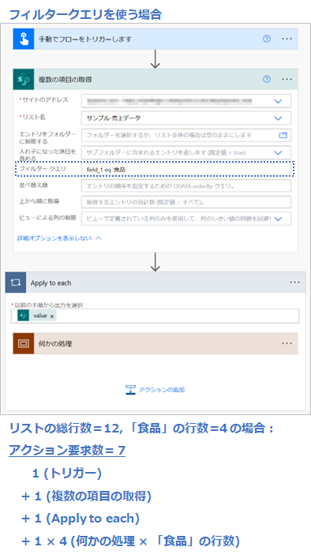
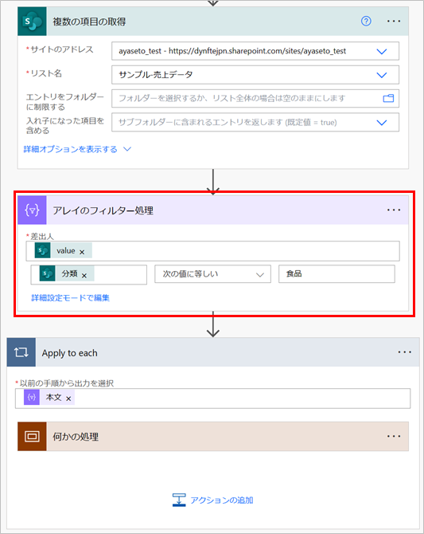
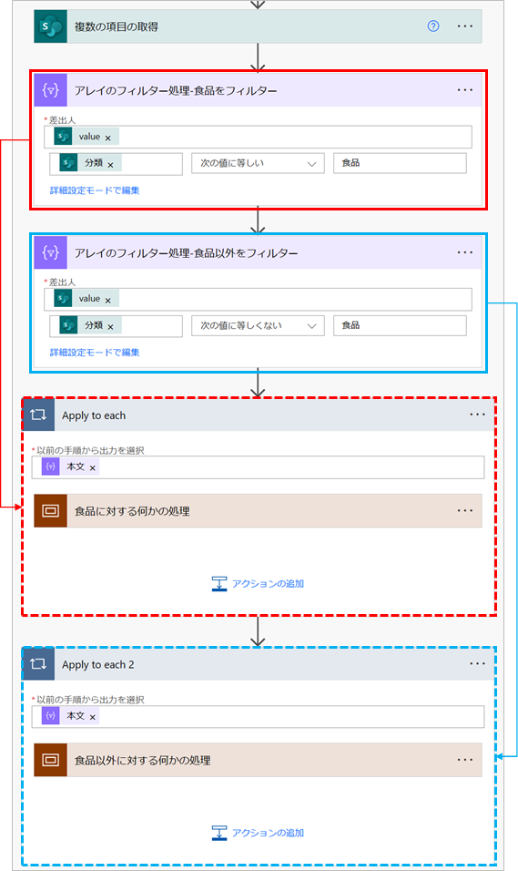
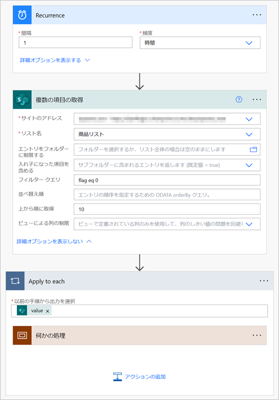
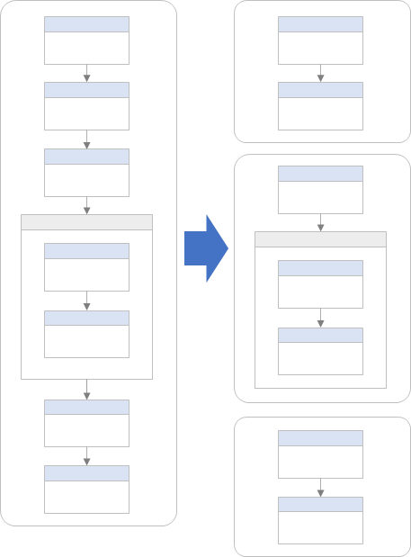

# 低速フローのトラブル シューティング

こんにちは、Power Platform サポートの瀬戸です。
今回は、「クラウド フローの処理がいつまで経っても終わらない」ときに試していただける改善策をご案内いたします。

<!-- more -->

「時間がかかるようなアクションは使っていないはずなのに、今まではすぐに処理が完了していたのに、クラウド フローが何日経っても完了しない」

そんなときは、フローが Power Automate の制限に抵触した可能性が考えられます。フローが制限に抵触すると、そのフローは実行中でも低速の状態になります。制限を超えないような速度で実行されるようになるので、数日たってもフローが実行中…ということがよくあります。

そこで今回は、フローの低速状態を避けるための改善策をご案内いたします。

＜目次＞

1. [Power Automate の制限](#Power-Automate-の制限)
    1. [フローのアクション要求数を数えてみる](#フローのアクション要求数を数えてみる)
1. [改善策](#改善策)
    1. [フローの実行回数を減らす](#フローの実行回数を減らす)
    1. [繰り返しの回数を減らす](#繰り返しの回数を減らす)
        1. [フィルター クエリを使う](#フィルター-クエリを使う)
        1. [アレイのフィルター処理を使う](#アレイのフィルター処理を使う)
        1. [1 度に繰り返す回数を減らす](#1-度に繰り返す回数を減らす)
        1. [集計に XPath を活用する](#集計に-XPath-を活用する)
    1. [CSV ファイルの利用を避ける](#CSV-ファイルの利用を避ける)
    1. [フローを分割する](#フローを分割する)
    1. [ライセンスを購入する](#ライセンスを購入する)
1. [最後に](#最後に)

## Power Automate の制限
改善策の前に、Power Automate の制限についてご案内いたします。
Power Automate には、サービスを皆さまへ安定的に提供するために、様々な制限が設けられています。

参考：[制限と構成 - Power Automate | Microsoft Learn](https://learn.microsoft.com/ja-jp/power-automate/limits-and-config)

特にフローの実行速度に影響を与えるのは、以下 3 点のスループットの制限です。

* [アクション要求数の制限](https://learn.microsoft.com/ja-jp/power-automate/limits-and-config#action-request-limits)
* [ランタイム エンドポイント要求の制限](https://learn.microsoft.com/ja-jp/power-automate/limits-and-config#runtime-endpoint-request-limits)
* [コンテンツ スループットの制限](https://learn.microsoft.com/ja-jp/power-automate/limits-and-config#content-throughput-limits)

### アクション要求数の制限
中でも、抵触することが多い制限として「24 時間あたりのアクション要求数」が挙げられます。今回の記事では、この「24 時間あたりのアクション要求数」の制限と、それに抵触しないようにする改善策に焦点を当てます。

2023 年 4 月時点での「24 時間あたりのアクション要求数」の制限は下記の通りです。

|ライセンス|パフォーマンス プロファイル|フローごとの 24 時間あたりのアクション要求数|
|---|---|---|
|Power Automate Free Office 365 に含まれる使用権　など|低|10,000|
|Power Automate per user など|中|100,000|
|Power Automate per flow|高|500,000|

パフォーマンス プロファイルが「低」の場合、制限値は「10,000」です。
例えば、1,000 行の CSV ファイルを読み込み、Apply to each で行ごとに処理をする場合、Apply to each の内側のアクションが 10 個あるだけで、実行されるアクション要求数が 10,000 を超えてしまいます。

### フローのアクション要求数を数えてみる
「アクション要求数」は、大まかに言うと「アクションの数」です。詳しい数え方は、下記公開情報をご参照ください。(アクション要求数と Power Platform 要求数は数え方が同じです)  
[「何が Power Platform 要求と見なされますか?」](https://learn.microsoft.com/ja-jp/power-platform/admin/power-automate-licensing/types#what-counts-as-power-platform-request)

フローのアクション要求数が求められたら、以下の式で 24 時間あたりのアクション要求数が分かります。

式： `フローのアクション要求数 × 24 時間あたりのフロー実行回数 ＝ 24時間あたりのアクション要求数`

実際のアクション要求数は再試行やページングで増えますが、この時点でフローの制限値を超えている場合は、対策が必要です。

## 改善策
### フローの実行回数を減らす
例えば、1 時間に 1 回起動するスケジュールトリガーを、2 時間に 1 回起動するよう変更します。

1 番簡単に実施できて最も効果がありますので、実行頻度の削減はぜひご検討ください。

### 繰り返しの回数を減らす
Apply to each や Do until で処理するデータが数百件、数千件に及ぶ場合は、その繰り返し回数を減らすことをご検討ください。以下に、繰り返し回数を減らすための案をご紹介いたします。

#### フィルター クエリを使う
繰り返しを行う前に対象のデータ件数を減らしておけば、繰り返しの回数を減らせます。
SharePoint コネクタの「複数の項目の取得」アクションなど、フィルター クエリを指定できるアクションでは、できる限りフィルター クエリを使用して不要なデータを取得しないようにしましょう。

※ フィルター クエリを使った例  

参考：

* SharePoint
  * [フィルター クエリの例](https://learn.microsoft.com/ja-jp/sharepoint/dev/business-apps/power-automate/guidance/working-with-get-items-and-get-files#filter-queries)
  * [SharePoint REST サービスでサポートされる OData クエリ演算子](https://learn.microsoft.com/ja-jp/sharepoint/dev/sp-add-ins/use-odata-query-operations-in-sharepoint-rest-requests#odata-query-operators-supported-in-the-sharepoint-rest-service)
* Excel
  * [「フィルタリング機能」の行に、サポートされる OData クエリの記載があります](https://learn.microsoft.com/ja-jp/connectors/excelonlinebusiness/#known-issues-and-limitations-with-actions)
* Dataverse
  * [行を一覧にする アクションの使用例](https://learn.microsoft.com/ja-jp/power-automate/dataverse/list-rows#filter-rows)
  * [Web API の観点での OData クエリの例](https://learn.microsoft.com/ja-jp/power-apps/developer/data-platform/webapi/query-data-web-api#%E7%B5%90%E6%9E%9C%E3%81%AE%E3%83%95%E3%82%A3%E3%83%AB%E3%82%BF%E3%83%BC)

#### アレイのフィルター処理を使う
フィルター クエリを使えない場合は、代わりに「データ操作」コネクタの「アレイのフィルター処理」アクションを使って、繰り返しを行う前にデータ件数を減らすことができます。

    注意点：  
    繰り返しで実行されるアクション要求数の削減には役に立ちますが、データ件数や列数が多い場合は、コンテンツ スループットの制限に抵触してしまう可能性があります。

※ アレイのフィルター処理を使った例  

「アレイのフィルター処理」アクションは、この他にも、処理が異なるリストをあらかじめ 2 つに分けておく、といった活用もできます。繰り返し処理内の「条件」アクションが必要なくなるので、アクション要求数の削減になります。

※ 処理が異なるリストを分けておく例  

参考：[Power Automate でデータ操作を使用する (ビデオを含む) - Power Automate | Microsoft Learn](https://learn.microsoft.com/ja-jp/power-automate/data-operations#use-the-filter-array-action)

#### 1 度に繰り返す回数を減らす
例えば、1 度に 全件処理するのではなく、10 件の データを 1 時間に 1 回処理するよう設計します。

フローが制限に抵触しないよう、意図的に処理をゆっくりにする考え方です。フィルター クエリと合わせて使用し、未処理のデータだけを取得する必要があります。

※ 10 件だけ処理する例

#### 集計に XPath を活用する
例えば SharePoint リストの特定の列の合計を求めたい場合、Power Automate には配列を 1 度に集計するようなアクションや関数が無いため、繰り返し処理で集計する必要があります。しかし、Power Automate の関数、xml と xpath を活用すると繰り返し処理無しで集計ができます。つまりアクション要求数の削減になります。
詳しい実現方法は以下の記事で解説しておりますので、ご参照ください。

[XPath を活用した集計 | Japan Dynamics CRM & Power Platform Support Blog](/blog/powerautomate/aggregation-using-xpath/)

### CSV ファイルの利用を避ける
アクション要求数を削減する観点では、フローでの CSV ファイルの読み込みは避けることをお勧めいたします。Power Automate には CSV ファイルを 1 つのアクションで読み込むような機能はご用意がございません。そのため、CSV ファイルを読み込む処理を作りこむ必要があります。

参考：[Power Automate で CSV ファイルを取り込む | Japan Dynamics CRM & Power Platform Support Blog](/blog/powerautomate/Import-Csv-With-Standard-Connectors/)

上記記事の例からも分かる通り、変数を用意して…条件分岐して…とやっているだけでアクション要求数を消費してしまうので、アクション要求数を削減したい場合は、できるかぎり SharePoint リスト、Dataverse をはじめとしたデータベース、Excel ファイルなどの利用をお勧めします。

### フローを分割する
現在 (記事執筆時点) の Power Automate の制限は、**フローごと**の制限となっています。1 つの長いフローが制限に抵触しているのであれば、それをいくつかに分割して順番に実行させることで制限を回避できる可能性があります。

※ イメージ図  

注意点としては、非ソリューションフローの場合は子フローの実行などができないため、
それぞれのフローの最後で、次のフローの起動トリガーとなるような処理をしてあげる必要があります。
例えば、1番目のフローの最後に SharePoint リストへの「項目の作成」アクションを実行し、2番目のフローの「項目が作成されたとき」トリガーでその SharePoint リストを指定すれば、フローをつなげて実行する仕組みになります。

### ライセンスを購入する
最初にご案内したように、制限値はパフォーマンス プロファイルによって決まり、パフォーマンス プロファイルはライセンスによって決まります。
もしパフォーマンス プロファイル「低」で制限に抵触しているのであれば、パフォーマンスプロファイル「中」や「高」に該当するライセンスの利用をご検討ください。

## 最後に
制限に抵触するほど Power Automate を活用いただいているのは嬉しい限りではありますが、サービスの特性を理解して上手く付き合っていただけますと、より嬉しく思います。
この記事が皆様の Power Automate の運用にお役に立ちましたら幸いです。