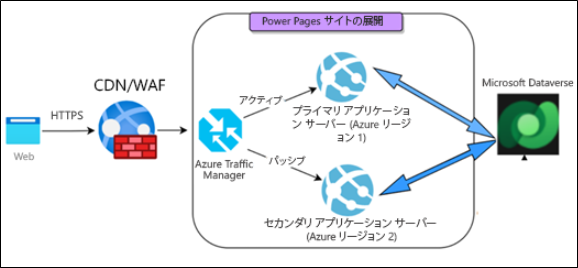
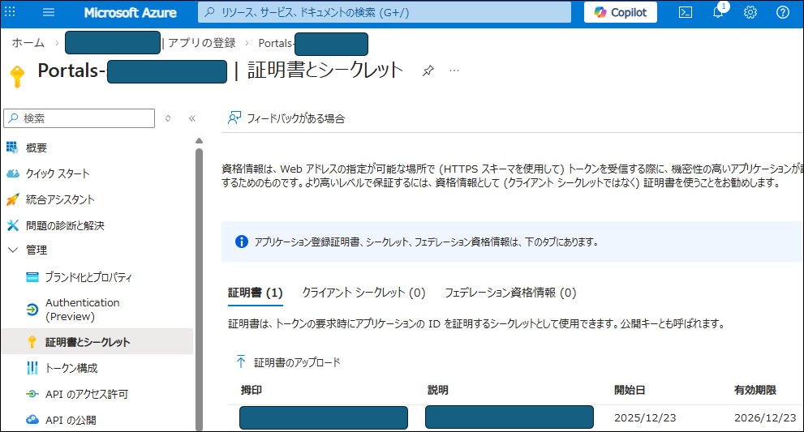

# Power Pages 認証キーの更新ガイド ～有効期限切れを防ぐ方法～

こんにちは、Power Platformサポートチームの吉永です。

本記事では Power Pages 認証キーに関するご説明を行わせて頂きます。

Power Pages 認証キーは作成頂いた Web サイトをユーザー様で定期的に更新作業を実施する必要のある項目となっており、この認証キーが持つ有効期限が切れてしまった場合、Web サイトにアクセスできないといった大きな影響が生じます。

このため、Power Pages の Web サイトを作成する上で、Power Pages 認証キーをどのように管理いただくかは非常に重要なポイントとなります。

本記事では Power Pages 認証キーの管理について、以下の Q1〜Q4 の質問に回答する形でご説明させていただきます。

- [Q1: Power Pages の認証キーとは何ですか？なぜ更新が必要なのですか？](#auth-key-overview)
- [Q2: 認証キーの有効期限が切れるとどうなりますか？](#expiration-impact)
- [Q3: どうやってキーを更新すればいいですか？](#renewal-steps)
- [Q4: 認証キーはどのように管理すればいいですか？](#auth-key-management)

### この記事でわかること
- Power Pages が Dataverse (データ置き場) に接続するための「鍵」の仕組み
- 1 年に 1 回の更新を忘れた場合のリスク
- Power Platform 管理センターを使った簡単な更新手順
- 更新作業に伴うサイトの一時的な再起動について

## 目次
- [Power Pages の認証キーとは何ですか？なぜ更新が必要なのですか？](#auth-key-overview)
- [認証キーの有効期限が切れるとどうなりますか？](#expiration-impact)
- [どうやってキーを更新すればいいですか？](#renewal-steps)
- [認証キーはどのように管理すればいいですか？](#auth-key-management)

<h2 id="auth-key-overview">Power Pages の認証キーとは何ですか？なぜ更新が必要なのですか？ (Q1)</h2>

Power Pages 認証キーは Power Pages で作成された Web サイトを表示するために必要な Dataverse へのアクセスを行うための認証キーとなります。

前提として、Power Page で作られた Web サイトは、Azure 上に自動で用意されるアプリケーションを使い、Dataverse 上のデータを取得することで動作する仕組みとなっております。

＜参考資料＞
- [Power Pages アーキテクチャ (Docs)](https://learn.microsoft.com/ja-jp/power-pages/admin/architecture)

このため、Power Pages の Web サイトが機能するためには、Power Pages (Web サイト) が Dataverse に接続可能な状態である必要があります。
この接続にはセキュリティ上の観点から「認証キー」を用いた接続が利用されておりますが、この「認証キー」には 1 年間という有効期限がございます。

この「認証キー」の有効期限は自動では更新されないことから、ユーザー様にて定期的に「認証キー」を更新していただく必要がございます。
Web サイト認証キーの管理

【補足 : 認証キーの実体】
先述させて頂きましたように、 Power Pages では Azure 上に自動で用意されるアプリケーションを使い、Dataverse 上のデータを取得することで動作する仕組みとなっております。

このため、Power Pages の Web サイトを作成した場合、対象の Web サイトに紐づくアプリケーションが Azure 上に自動で作成される仕組みとなっております。
このことから、Power Pages 認証キーの実体は Azrure から確認出来るアプリケーションに紐づく「証明書」と同様となります。

なお、Azure 上に登録されている Power Pages 関連のアプリケーションについては、基本的に「Portals-」から始まる名称で登録されています。

<h2 id="expiration-impact">認証キーの有効期限が切れるとどうなりますか？ (Q2)</h2>
「認証キー」の有効期限が切れた場合、Web サイトは Dataverse にアクセスできなくなります。
Power Pages の Web サイトは Dataverse 上に保存された Web サイトのカスタマイズ情報などを使って動作しておりますので、以下のような問題が発生します。

- ログインができなくなる
- フォームに入力したデータを送信できなくなる
- ページにデータが表示されずエラーになる

実際に「認証キーの有効期限が切れてしまっていたことで、Web サイトにアクセスできなくなった」というお問い合わせを頂くことがあり、影響としても非常に大きいものとなりますので、期限切れになる前に必ず更新作業を行って頂く必要がございます。

＜参考資料＞
- [Web サイト認証キーの管理 - 認証キーの有効期限切れを確認する (Docs)](https://learn.microsoft.com/ja-jp/power-pages/admin/manage-auth-key#check-expiration-of-an-auth-key)

<h2 id="renewal-steps">どうやってキーを更新すればいいですか？ (Q3)</h2>
Power Pages 認証キーは以下の手順で更新可能です。

1. [Power Platform 管理センター](https://aka.ms/ppac?utm_source=blog) にアクセスします。
2. 左側のメニューから [管理] > [Power Pages] を選択します。
3. 対象のウェブサイトを選択し、画面上部のメニューまたは詳細画面から [管理] (または [設定]) を探します。
4. [セキュリティ] セクションにある **[Web サイト認証キー]** をクリックします。
5. 表示された画面で **[キーの更新]** ボタンを押し、確認画面で [OK] を選択します。

これにより更新処理が始まり、自動でキーの更新が完了となります。

【ポイント】

1.認証キーの更新処理には Powre Pages の Webサイトを管理する権限が必要となります。

2.「キーの更新」ボタンを押すことで、新しいキーが自動生成されますが、新たなキーの有効期限は 1 年後となります。

3.認証キーを更新する際、ウェブサイトの再起動が発生します。
この再起動では  Web サイトが完全に停止するわけではございませんが、数分程度の間、利用者がサイトにアクセスしづらくなる可能性があるため、必要に応じて、夜間帯などでの実行をご検討ください。

＜参考資料＞
- [Web サイト管理に必要なロール (Docs)](https://learn.microsoft.com/ja-jp/power-pages/admin/admin-roles)

<h2 id="auth-key-management">認証キーはどのように管理すればいいですか？ (Q4)</h2>
Power Pages の認証キーは、有効期限切れが近づくと管理者宛に以下のような方法で複数回通知されます。

- 電子メール
- Power Platform 管理センター
- Web サイト上

＜参考資料＞
- [認証キーの有効期限切れを確認する (Docs)](https://learn.microsoft.com/ja-jp/power-pages/admin/manage-auth-key#check-authentication-key-expiration-notification)

場合によってメールでの通知に気づくことが出来ない可能性がある一方で、有効期限が切れた場合の影響が大きいため、必要に応じてより通知に気づきやすい、漏れが生じにくい方法での管理についてもご検討いただけますと幸いです。

<h2 id="summary">まとめ</h2>

- Power Pages の認証キーは、安全なデータ接続に必要な「身分証明書」です。
- 有効期限 (1 年) が切れると、サイトが正常に動かなくなります。
- 管理センターから簡単に更新できますが、数分間のサイト再起動を伴います。
- メール通知が届いたら、利用者の少ない時間帯を見計らって更新しましょう。

<h2 id="notice">注意事項（情報の更新可能性）</h2>
本記事の内容は執筆日時点の公開情報に基づいております。仕様や UI、制限事項は将来変更される可能性がございます。最新情報は公式ドキュメントをご確認くださいますようお願い申し上げます。
