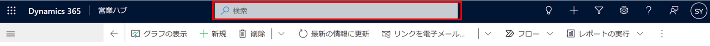
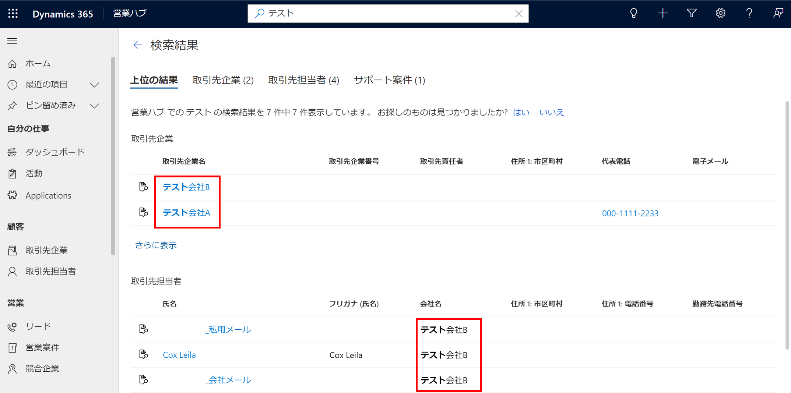
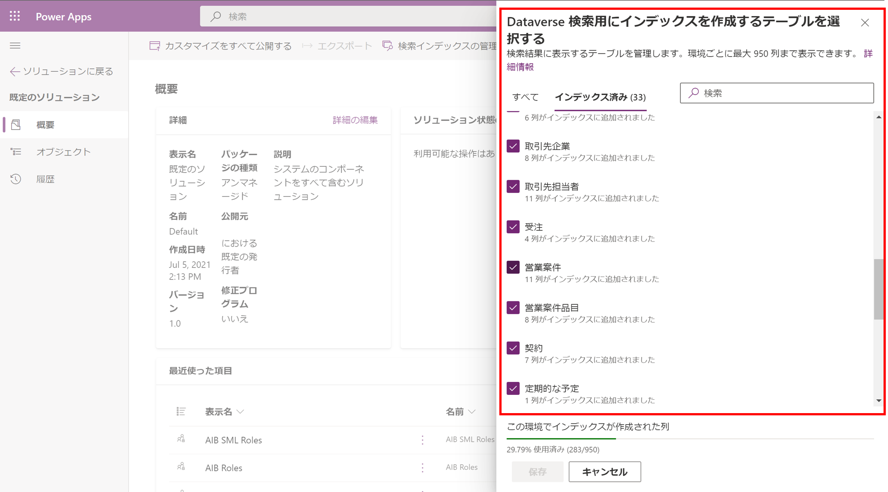
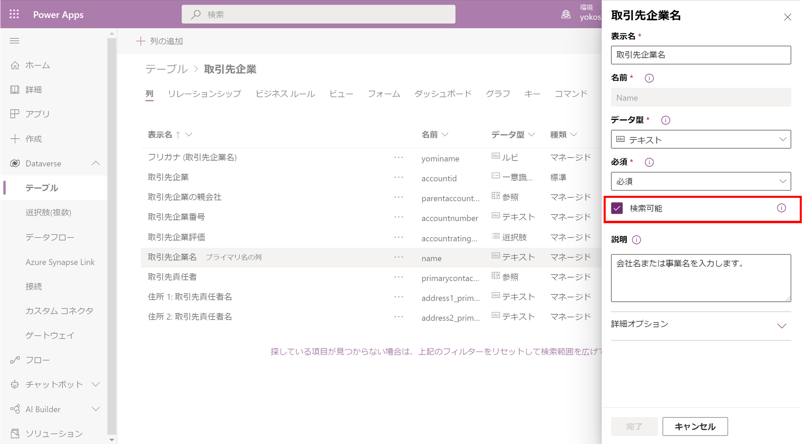
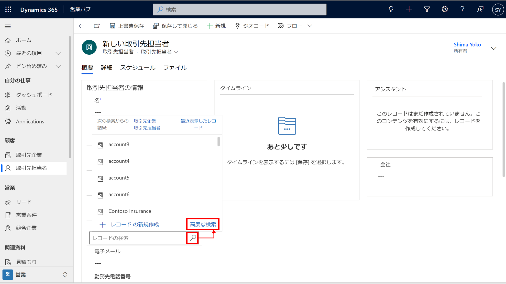
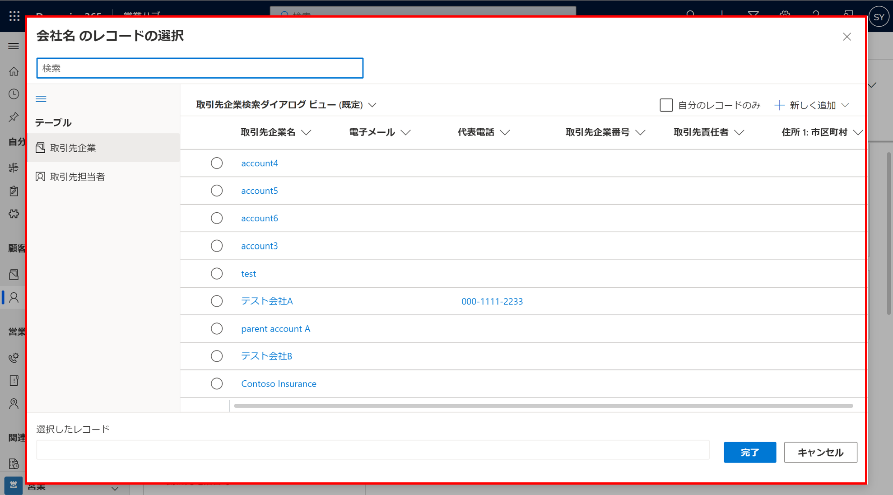
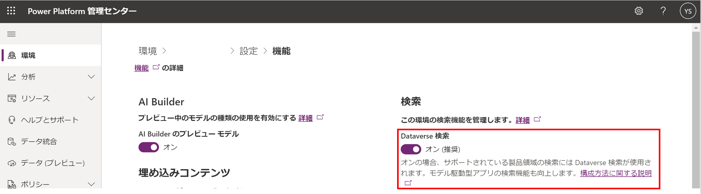

#  2021 年 Wave2 で追加されたモデル駆動アプリの検索方法まとめ

こんにちは、Power Platform サポートチームの島です。

Power Platform の半期に一度の大規模リリース (Wave2) が日本リージョンで 10 月 11 日 (月) から一般公開されました。
本記事では、このリリース内で行われた更新のうち、モデル駆動型アプリ / Dynamics 365 における検索についてご案内いたします。
<!-- more -->
Wave2 では、以下 2 つの検索方法が追加・更新されております。
1. Dataverse 検索 (関連性検索)
2. 高度な検索
サポートチームでもたくさんのお問合せをいただいているこれらの検索方法について、それぞれ詳しくご紹介いたします！

## Dataverse 検索
---
Wave2 より、運用環境において既定で Dataverse 検索が有効化されるようになりました。

### そもそも、Dataverse 検索とは？
以下のキャプチャのように、画面上部のヘッダに表示されている検索欄が Dataverse 検索 (関連性検索) です。

実際にこちらを検索してみると、以下のようにキーワードを入力するだけで関連エンティティを含めた検索ができます。

Wave2 以前では、この検索欄は「関連性検索」と呼ばれ、ヘッダの虫眼鏡マークからご利用いただくことができました。

この関連性検索から、より検索性や操作性を向上させた機能が Dataverse 検索です。

### Dataverse 検索では具体的に何を検索しているのか？
Dataverse 検索で検索対象を決定する仕組みは、カテゴリ別検索と同様です。
関連性検索を既に活用いただいていた方にはおさらいとなりますが、仕組みについてご案内いたします。

Dataverse 検索では、テーブル (エンティティ) × 列 (フィールド) をそれぞれ検索対象として決定します。

#### 1. 検索対象のテーブル
Dataverse 検索では、検索対象のテーブルを指定することができます。
環境の詳細設定画面、または Power Apps のソリューション設定画面から指定ができるのですが、今回はソリューション設定画面をご紹介いたします。
Power Apps ([https://make.powerapps.com](https://make.powerapps.com)) からソリューションを選択し、「概要」> 「Dataverse 検索」>「検索インデックスの管理」より、検索対象のテーブルを指定いただけます。
なお、Dataverse 検索の対象テーブル自体はソリューションに含まれる要素ではないため、ソリューションは任意のものをご選択いただければ問題ございません。

#### 2. 検索対象の列
検索対象の列も、環境の詳細設定画面の他、Power Apps のテーブル設定画面からご確認いただけます。
テーブルの各列を選択し「検索可能」をチェックいただくことで、検索対象に指定される列を指定いただけます。

## 高度な検索
---
Wave2 より、検索 (ルックアップ) 列の入力時に高度な検索をご利用いただけるようになりました。

1. 列の入力時に虫眼鏡マークをクリック後、「高度な検索」を選択ください。

2. 図のように、「高度な検索」ウィンドウが表示されます。

高度な検索ウィンドウでは、入力フィールドに適したテーブルのビューから、登録したいデータを選択することができます。
今までも、1. の画面で表示されている小さいウィンドウから対象データを検索することができましたが、大画面かつビューを選択できるようになったことで、よりデータの絞り込みがしやすくなりました。
複数選択や、複数テーブルの検索もできますので、ぜひご利用ください。

#### よくいただくお問合せ
---
### 各検索方法を無効化する方法
Dataverse 検索に関しては、以下の画像のように、Power Platform 管理センターから有効 / 無効を切り替えることができます。

高度な検索に関しては通常の方法で無効化することはできません。
どちらの検索もユーザーに適切な権限な付与されているレコードのみ検索することができるので、セキュリティ リスクの懸念から無効化を検討されている場合には、ご安心ください。

### 一部の環境で Dataverse 検索が有効化されていない
現在のところ、Dataverse 検索は運用環境 (Production 環境) のみで有効化されています。
サンドボックス環境など、その他の環境では既定では機能が無効化されています。これらの環境で Dataverse 検索をご利用の場合には、「各検索方法を無効化する方法」でご紹介した画面から機能を有効化することができるので、ぜひお試しください。

## おわりに
---
以上、Wave2 で追加された 2 種類の検索方法についてご紹介いたしました。
Power Platform / Dynamics 365 では、今後も様々な機能追加が予定されています。
こちらのブログでも追加機能をご紹介していきますので、ぜひご参考いただけますと幸いです！