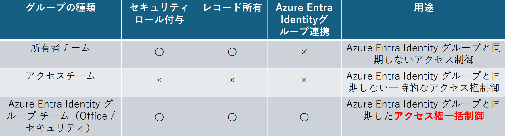

#  Dataverse グループ チームの活用方法＆注意点

こんにちは、Power Platform サポートチームの島です。

※ Azure Active Directory (Azure AD) は2023年7月に Azure Entra Identity に名称が変更となりましたので、ご承知おきくださいますようお願い申し上げます。

Dataverse では、Azure Entra Identity グループ チームを作成することで、セキュリティ グループへのユーザー所属状態によって、ロールを自動的に付け外しすることができます。
「特定の管理者用セキュリティ グループに所属するユーザーに、自動的にシステム管理者ロールを付与する」というような運用も可能です。
<!-- more -->
つまり、Azure Entra Identity グループ チームを利用いただくことで、**グループ チーム配下の Dataverse ユーザーを、Azure Entra Identity グループから一元管理**することが可能となります。

そこでこの記事では、使い方、またサポートでよくいただくグループ チーム関連のご質問についてご案内します。

## そもそも、チームとは？
---
Dataverse では、グループ チームを含め、4 種類のチームという概念を持ち、この中にユーザーを所属させることができます。
それぞれについて簡単にご紹介します。

**1. 所有者チーム**
セキュリティ ロールを割り当てることができ、レコードを所有できるチームです。
グループ チームと似ていますが、Azure Entra Identity グループとは連動しないため、ユーザーを明示的に指定して追加する必要があります。
また、Dataverse 上の「部署」というオブジェクトに紐づいて自動作成されます。(なのでグループ チームの操作を何もしていなくても、環境に最低ひとつはこの所有者チームが存在します。)
**2. アクセス チーム**
セキュリティ ロールを割り当てることができず、レコードも所有しないチームです。
ただ、アクセス チーム自体がレコードへのアクセス権を持つため、セキュリティ ロールに依存しないアクセス権制御を行うことができます。
将来削除される予定があり、レコードを所有させたくないような一時的なチーム (プロジェクトなど) に適したチームと言えます。
**3. Azure Entra Identity グループ チーム (Office グループ / セキュリティ グループ)**
セキュリティ ロールを割り当てることができ、レコードを所有できるチームです。また、Azure Entra Identity グループと連動します。
種類として Office グループ チームと セキュリティ グループ チームの 2 つに分かれますが、記事執筆時点ではグループの種類による機能差はありません。

上記の内容をまとめると、以下のように各チームを比較できます。

Azure Entra Identity グループチームの特色は、文字通り Azure Entra Identity グループと連携でき、**グループ チーム配下の Dataverse ユーザーを、Azure Entra Identity グループから一元管理**できることです。

## Azure Entra Identity グループチームで具体的にできること
---
Azure Entra Identity グループチームでできること、メリットについて具体的にご紹介します。

### 1. Azure Entra Identity グループとの連携
Azure Entra Identity グループチームでは、セキュリティ グループや Office グループとの同期が可能です。
Azure Entra Identity グループチームは Power Platform 管理センターから作成することができますが、このときに対応するAzure Entra Identity グループを選択することで、チームとグループを紐づけることができます。

**【手順】**
1. Power Platform 管理センターで 設定 > ユーザーとアクセス許可 > チーム を選択ください。

2. 「チームの作成」を選択ください。
3. 作成時の入力項目を以下の通り入力ください。この後チームを作成することで、入力したグループとチーム同士が紐づきます。
・チームの種類 : Azure Entra Identity セキュリティ グループ または Azure Entra Identity Office グループを選択ください。
・グループ名 : 対応するAzure Entra Identity グループ名を選択ください。

ちなみに、以下の項目はグループ チームとは関係がありませんが、ご参考までに入力内容を紹介いたします。
・チーム名、説明 : 任意のものを入力ください。
・部署 : Dataverse の部署を作成いただいている場合は適宜ご要件に合わせて選択ください。作成していない場合はデフォルトの部署が 1 つだけ表示されますので、その部署を選択ください。
・管理者 : ご要件に合わせて管理者となるユーザーをご選択ください。
・メンバーシップの種類 : Azure Entra Identity グループ メンバーシップを入力する欄です。**後のセクションでもご説明します！**

チームを作成すると、紐づけた Azure Entra Identity グループのメンバーのうち環境に対してアクセス権があるユーザーが、自動的に Dataverse のグループ チームに追加されます。
また、異動などでチームのメンバーでなくなったユーザーは、自動的にグループ チームのメンバーからも削除されます。

#### 2. セキュリティ ロールの紐づけ
Azure Entra Identity グループ チームに対してセキュリティ ロールを紐づけることで、配下の Dataverse のユーザーに対してそのロールを継承させることができます。

**[手順]**
1. Power Platform 管理センターで 設定 > ユーザーとアクセス許可 > チーム を選択後、任意のチームを選択ください。
2. セキュリティ ロールの管理 を選択ください。
3. 下図のように割り当てるセキュリティ ロールの一覧が表示されるので、任意のロールを選択ください。

このセキュリティ ロールの割り当て機能により、「管理者用のグループ チームにはシステム管理者ロールを付与する」「開発者用のグループ チームには Environment Makerを付与する」というように、チームごとに一括でロールを割り当てることが可能になります。
加えて 1 でご説明したように、チームのメンバーは Azure Entra Identity と同期して自動で決定されるので、この 2 つの機能を組み合わせることで、要件に即したロールの一括付与を自動で実行できるようになります。

## よくいただくお問合せ
---
上記の通り、Azure Entra Identity グループ チームは、ユーザーおよびロールの一元管理が可能な強力な機能です。
こちらの機能をよりご活用いただきたいため、サポート チームでよくいただく質問をおまとめいたしました。ぜひご確認ください。

### グループ チーム作成時、メンバーシップに何を指定すればよいのかわからない
グループ チームのメンバーシップは、Azure Entra Identity 側のグループのメンバーシップに対応するものです。
選択肢ごとにの具体的な設定内容は以下の通りです。
(1) メンバー ： Azure Entra Identity グループに所属するメンバー (ゲストユーザーを除く) です。
(2) ゲスト : Azure Entra Identity グループに所属するゲストユーザーです。
(3) メンバーとゲスト : (1) と (2) の両方をメンバーとする選択肢です。
(4) 所有者 : Azure Entra Identity グループの所有者です。通常、管理者など要件に合わせたユーザーを明示的に指定することで割り当てられます。

グループ チームをご活用いただく場合、通常はメンバーのロールを一元管理することが目的の場合が多いので、(1) または (3) を選んでいただくケースが最も多いかと存じます。

### Azure Entra Identity グループに所属するメンバーのうち、一部のメンバーしかグループ チームに所属していない
グループ チームを作成したタイミングと、実際に Dataverse 上のユーザーオブジェクトがグループに割り当てられるタイミングが異なることで、メンバーが一部しか所属していないように見えている可能性があります。
実際に、Dataverse 上のユーザーオブジェクトがグループに所属するのは、グループ チーム作成後、当該ユーザーが最初に環境のキャンバス アプリまたはモデル駆動アプリにアクセスしたタイミングです。
そのため、グループ チームを作成したあと、チームのメンバーを以下のように確認された際には、グループ チーム作成後にアプリにアクセスしたことのあるメンバーしか表示されません。

チームのメンバーがアプリにアクセスしていくことで、いずれは全員がメンバーに追加されますので、ご安心ください。

### ユーザーに対してロールが継承されていないように見える
Power Platform 管理センターまたはユーザーの設定画面で、ユーザーのセキュリティ ロールをご確認いただけますが、こちらの画面ではあくまでユーザー本人に対して直接割り当てられたセキュリティ ロールのみが表示されます。
そのためチームから継承されたロールをご確認いただくことができませんが、正しい手順を実施いただき、かつユーザーがアプリに既にアクセスしていれば、ユーザーに対してロールが継承されますので、ご安心ください。

ユーザーに対して直接付与されたロールと継承されたロールの両方を確認されたい場合には、特定データのフォームを開いた上で上部リボンの「アクセス権の確認」を選択いただくことで、当該データに関連するユーザーのすべての権限をご確認いただくことが可能です。

### 入れ子のAzure Entra Identity グループにグループ チームを作成する際の留意点について
Azure Entra Identity グループが入れ子になっており、かつ親グループと紐づくグループ チームが作成された場合、子グループのメンバーもグループ チーム内に追加されます。
なお、**「入れ子のうち子セキュリティグループのメンバーを環境に自動で追加したい・セキュリティ ロールを割り振りたい」** というお問合せをよくいただきますが、現時点では子セキュリティ グループのメンバーは環境に自動追加されません。
環境にセキュリティグループを追加し、かつセキュリティ グループに子となるセキュリティ グループが存在する場合でも、子グループのメンバーは環境に事前に追加されません。
グループチームを作成した場合でも自動プロビジョニングされるわけではなく、ユーザーによるアクセスや管理者による追加が必要です。
なおグループチームを作成すると、チームに対してセキュリティロールを設定しておけるため、グループチームに紐づく子セキュリティグループのユーザーが環境にアクセスしたタイミングでチームに設定したセキュリティロール継承できる仕組みとなっております。

(ご参考 : [環境へのユーザー アクセスのコントロール: セキュリティ グループおよびライセンス](https://learn.microsoft.com/ja-jp/power-platform/admin/control-user-access))

> [!NOTE]
> 抜粋
> *入れ子のセキュリティ グループについて*
> 
> *環境セキュリティ グループ内の入れ子のセキュリティ グループのメンバーは、事前にプロビジョニングされたり、 環境>に自動的に追加されたりすることはありません。 ただし、入れ子のセキュリティ グループに Dataverse グループ チーム を作成すると、環境に追加できます。* 
>
> *このシナリオの例: 環境が作成されたときに、環境にセキュリティ グループを割り当てました。 環境のライフサイクルの間に、セキュリティ グループで管理されるメンバーを環境に追加します。 たとえばセキュリティ グループを Microsoft Entra ID マネージャーに作成し、すべてのマネージャー全員をそのグループに割り当てます。 次に、このセキュリティ グループを環境セキュリティ グループの子として追加し、Dataverse グループ チーム を作成して、セキュリティ ロールをグループ チームに割り当てます。 これで、マネージャーは Dataverse にすぐにアクセスできます。*
>
> *入れ子のセキュリティ グループのメンバーは、メンバーが初めて環境にアクセスしたときに、実行時に環境にも追加されます。 ただし、メンバーはセキュリティ ロール が割り当てられるまで、アプリケーションを実行したり、データにアクセスしたりすることはできません。*

### チーム経由のセキュリティロール付与に対応していない機能はありますか。
ほとんどの機能でチーム経由のセキュリティロール付与をサポートしていますが、一部の機能はサポートしておりません。  

現時点でサポートしていないことを確認できているのは以下の２つの機能です。  
* [環境ピッカー](https://learn.microsoft.com/ja-jp/power-platform/admin/manage-teams#types-of-teams) - 所有者チームのセキュリティロールは継承されません。
* [Copilot in Power Apps](https://learn.microsoft.com/ja-jp/power-apps/maker/canvas-apps/ai-conversations-create-app) - セキュリティロールをユーザーに直接付与する必要がございます。

## 関連する公開情報
---
* [Microsoft Dataverse チームの管理](https://learn.microsoft.com/ja-jp/power-platform/admin/manage-teams) : グループ チームを含め、Dataverse の各チームについてご案内しています。
* [グループ チームの管理](https://learn.microsoft.com/ja-jp/power-platform/admin/manage-group-teams) : グループ チームの概要、また作成・編集手順をご案内しています。

## おわりに
---
以上、Azure Entra Identity グループ チームの概要、およびよくいただくお問合せについてご案内しました。
グループ チームを利用しない場合、ユーザーひとりひとりにアクセス権を付与する必要があるため、ユーザー数やセキュリティ ロール数が多い組織だと運用が煩雑になりがちです。
ぜひグループ チームを運用に導入いただき、効率的なユーザー管理にご活用ください！
