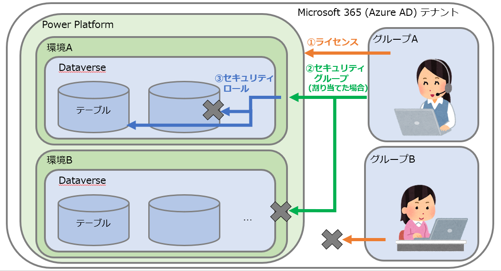
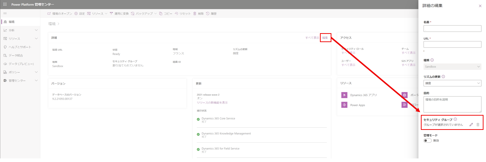

#  Dataverse 環境のアクセス権制御方法

こんにちは、Power Platform サポートチームの島です。

今回は、Power Platform、特に Dataverse を作成した環境に対して、セキュリティ グループやセキュリティ ロールを使ってアクセスを制御する方法についてご紹介いたします。
<!-- more -->

ビジネスユースで Dynamics 365 CRM やモデル駆動アプリを導入する場合、セキュアな環境管理のために必須となるのがこのアクセス権制御です。
特に今 Dataverse の導入にあたりセキュリティ面を検討されている方は、ぜひご覧ください！

## アクセス権制御方法の概要
---
Dataverse 環境のアクセス権は、おおまかに以下の構造で制御されています。

1. **ライセンス** : テナントごとに、**各ユーザーが Power Platform 製品を利用できるか**を決定します。
2. **セキュリティ グループ** : テナントの各環境ごとに、**ユーザーがその環境を利用できるか**を決定します。
3. **セキュリティ ロール** : 環境の Dataverse 内の各テーブルごとに、**環境における具体的なユーザーのアクセス権**を決定します。

図に表すとこのようなイメージです。
たとえば同じテナント内に、
・グループ A (サポート部門) とグループ B (管理部門) 
・環境A (サポート部門用の環境) と環境 B (管理部門用の環境)
があり、A 同士 / B 同士でそれぞれ環境にグループが割り当てられているとします。このとき、
1. **ライセンス** :
グループ A 内のサポート部門のユーザーは、ライセンスを所有しているため、Power Platform 製品を利用できます。
グループ B 内のユーザーは、今回の図の場合ライセンスを保有していないため、Power Platform 製品を利用できません。
2. **セキュリティ グループ** :
グループ A のユーザーは、サポート部門用の環境 A にアクセスすることができますが、管理部門用の環境 B にはアクセスすることができません。
3. **セキュリティ ロール** :
グループ A のユーザーは、セキュリティ ロールによってアクセスするテーブルや、実行可能な操作を制限されます。
たとえば図中のユーザーにサポート部門用のセキュリティ ロールが割り当てられ、システム管理者が割り当てられていないとき、ユーザーはシステム管理に使うテーブルにはアクセスができません。

1 から 3 を組み合わせることで、ユーザーに対してどの環境でのどのような操作を許可するかを制御できます。
今回の記事では 2 と 3 をより詳しく見ていきます。

### 環境へのセキュリティ グループの割り当て
---
Power Platform 環境には、デフォルトではテナントに所属する全ユーザーがアクセスできますが、
環境にセキュリティ グループを割り当てることで、**割り当てられたセキュリティ グループに所属するユーザーのみにアクセスを限定**することができます。
たとえば、「IT部門」用の環境を作成したときに、「IT部門」のセキュリティ グループを割り当てることで、その他の営業部門などのユーザーのアクセスを禁止する…というように、グループごとに環境の利用可否が異なる場合に、ぜひ設定いただきたい項目です。

セキュリティ グループの割り当ては、環境作成時にオプションで指定できる他、Power Platform 管理センターから既存の環境に対しても指定できます。
ただし、既存の環境にセキュリティ グループを割り当てた場合、セキュリティ グループに所属していないユーザーはすべて無効化されるのでご注意ください。

### セキュリティ ロールの設定
---
上記でご説明したセキュリティ グループでは、ユーザーに対して環境単位でのアクセス可否を決定します。
これに対して、ユーザーに割り当てることで、**環境内でユーザーが行える操作を決定**するのがセキュリティ ロールです。
Power Platform では、要件に合わせたさまざまな既定のセキュリティ ロールが存在します。一例をご紹介します。
- システム管理者 : 環境におけるすべての操作を実行できるロール。
- Basic User : 環境における一般的なアプリの利用ができるロール。管理操作が制限される他、自分以外のユーザーが作成したデータに対するアクセスも制限されます。
- システム カスタマイザー : 環境をカスタマイズするためのロール。多くの管理操作を実行できますが、自分以外のユーザーが作成したデータを参照できません。

またこちらの公開情報にも、より多くのセキュリティ ロールのご説明が記載されているので、ぜひご覧ください。
ご参考: [環境のリソースに対するユーザー セキュリティの構成](https://docs.microsoft.com/ja-jp/power-platform/admin/database-security)

### セキュリティ ロールの仕組みとカスタマイズ
---
セキュリティ ロールは、初期状態では、ユーザーのライセンスやMicrosoft 365 管理者役割に応じて自動的にユーザーに割り振られています。
ただ、デフォルトで割り当てられるセキュリティ ロールではなく、もっと具体的にアクセス権を管理したいという方に向けて、セキュリティ ロールの仕組みとカスタマイズ方法をご紹介します。

セキュリティ ロールの実体は、Dataverse 上の各テーブルに対するアクセス権の集合体です。
セキュリティ ロール編集画面にて、各セキュリティ ロールごとに、以下のようなイメージでアクセス権が定義されているのが確認できます。

上図左の列に記載されているのがDataverse の各テーブルの名称、右側の列に記載されているのがテーブルに対する操作です。
このマトリクスに対して、アクセス許可レベルを設定することで、**「(行)どのテーブルに対して × (列)どの操作を許可するか」**を定義することができます。
たとえば上図の「お知らせ」テーブルで言えば、Basic User セキュリティ ロールではお知らせの読み込みは完全に許可されている一方で、お知らせの作成・書き込み・削除・追加…など、他の操作は禁止されている、ということが定義されています。

また、上図では丸の色・塗られ方が権限によって様々ですが、これはアクセス許可のレベルを表現しています。
Power Platform ではアクセス許可レベルを 5 段階で設定しています。以下の公開情報に詳しく掲載されているので、ぜひご覧ください。
ご参考: [セキュリティ ロールおよび特権](https://docs.microsoft.com/ja-jp/power-platform/admin/security-roles-privileges)

このアクセス権の定義方法は、セキュリティ ロールのカスタマイズの考え方にもつながります。
例えば、
- サポート部門の担当者には、自分が担当する「サポート案件」を参照可とする
- サポート部門の管理者は、全員のサポート案件を参照可とする
- 経理部門の担当者には、サポート案件自体参照させたくない

というような要件がある場合、サポート案件に対するアクセス許可を変更したロールを 3 種類作成し、各ユーザーに割り当てることで要件が実現できます。

なお、セキュリティ ロールをカスタマイズする際は、既存のセキュリティ ロールは変更後に元々の状態にリセットできないので、
万が一に備えてカスタマイズ用のセキュリティ ロールを別途用意いただくことを推奨しています。
また、既存のセキュリティ ロールでは、内部処理に使われているさまざまなテーブルについても多数のアクセス制御が設定されています。
そのため、セキュリティ ロールを別途用意するときには、既存のセキュリティ ロールをコピーした上で、特定のテーブルのアクセス制御のみ変更することをお勧めいたします。

## 本記事からの発展
---
Dataverse では、これまでご案内してきたように、ライセンスやセキュリティ グループ、セキュリティ ロールの組み合わせでアクセス制御を行っています。
本記事では詳しくご紹介していませんが、より発展的な内容についても、公開情報をご案内いたします。

#### チーム単位でのセキュリティ ロールの割り当て
ユーザーが所属するDataverse 上の「チーム」に対してセキュリティ ロールを設定することで、ユーザーにもチームのセキュリティ ロールが引き継がれます。
また、この「チーム」を、Azure AD のセキュリティ グループと紐づけることで、Azure AD 側とのユーザー管理の一元化も可能です。
セキュリティ ロールをユーザーごとに設定するのは少し大変……という場合には、ぜひチームの導入をご検討ください。
ご参考: [チームを管理する](https://docs.microsoft.com/ja-jp/power-platform/admin/manage-teams)

#### フィールドレベルのセキュリティ付与
本記事でご案内したユーザーごとのアクセス制御とは別に、Dataverse の各列ごとにアクセス制御を設定することができます。
住所や電話番号など、ユーザーを問わず隠しておきたいようなデータに対して、ぜひご設定ください。
ご参考: [アクセスを制御するフィールド レベルのセキュリティ](https://docs.microsoft.com/ja-jp/power-platform/admin/field-level-security)

#### セキュリティ グループを環境に割り当てた際のメンバー同期
セキュリティ グループを環境に割り当てると、グループに所属するうちライセンスを保有するユーザーが、自動的に環境に追加されるようになります。
ただし以下のように、注意が必要な挙動もあります。
- ライセンスを保有しないユーザーは環境に追加されない
- 入れ子のセキュリティ グループのメンバーは、グループに「Azure AD グループ チーム」が割り当てられている場合を除いて、自動的に環境に追加されない
- ユーザーがグループから削除された際、Power Platform 側のユーザーは無効化される

以下の公開情報に注意点が列挙されていますので、ぜひご参照ください。
ご参考: [環境に対するユーザー アクセスを構成する](https://docs.microsoft.com/ja-jp/power-platform/admin/control-user-access)

## おわりに
---
以上、Dataverse でのユーザーアクセスの制御についてご案内いたしました。
こちらの記事が皆様のセキュアな環境管理のお役に立ちましたら幸いです。
