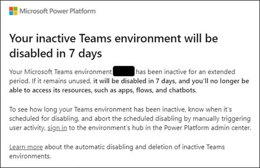
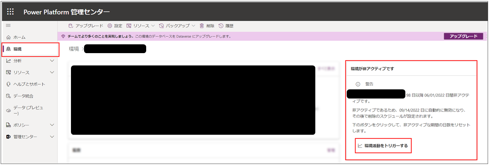

こんにちは、Power Platform サポートの山田です。 
今回は、Dataverse for Teams 環境の自動削除について、下記項目の順にご説明いたします。  

1. Dataverse for Teams環境の自動無効化/削除メカニズムとは  
2. 自動無効化/削除条件  
3. 自動無効化/削除メカニズム自体の無効化の可否  
4. 無効化/削除された環境の復元  
5. 環境の状態遷移
6. ご案内メール  
7. ご案内メールを受信された際の対応   
8. よくあるご質問  
  
下記公開情報を基にご説明いたします。   
[非アクティブな Microsoft Dataverse for Teams 環境の自動削除](https://learn.microsoft.com/ja-jp/power-platform/admin/inactive-teams-environment)   
各項目について公開情報内にも詳細を記載しておりますのでご参照ください。   
  
なお、対象はあくまで Dataverse for Teams 環境となります。   
環境が紐づいているチーム自体が削除されるわけではございませんので、ご安心ください。   
  
<!-- more -->  
## 0. 初めに -本メカニズムの停止について-
2022 年 12 月 5 日時点で、下記で停止についてご案内している本メカニズムが再度展開されることとなりました。 
2022 年 12 月より徐々に展開されます。 
本内容については、メッセージセンターにて **MC480563** (※) をご確認いただけますと幸いでございます。 
※日本リージョンのテナントの場合の番号となります。 
なお、2022 年 10 月より 11 月にかけて展開予定でございましたが、2022 年 12 月に延期となりました。 

> 2022 年 9 月 14 日時点、すでに展開されている Dataverse for Teams 環境の無効化に関する本メカニズムは停止されております。 
> 本メカニズムのメール通知について多数のお客様からのお問い合わせをいただいており、 
> メール通知の内容に分かりづらい点が多く混乱を招く状況となっております。 
> そのため、本メカニズムの公開は一旦延期されることになりました。 
> 
>  
> メール通知を受け取られたお客様には大変ご心配をおかけしておりますが、送付されました Dataverse for Teams 環境の削除に 
> 関する通知につきましては、無視いただいても問題ございませんのでご安心ください。 
> 
>  
> 改めて本メカニズムが公開される際にはメッセージセンター等にて通知させていただく予定でございますので、 
> その際にはご確認いただけますと幸いでございます。 
> 
>  
> なお、本メカニズムの停止に伴いまして、後述の「環境活動をトリガーする」機能も無効化されております。 
> しかしながら、Power Platform 管理センター上の無効化の警告、および「環境活動をトリガーする」機能は表示されたままとなっており、 
> 「環境活動をトリガーする」を実行しても無効化の警告表示が消えないとのお問い合わせを受けております。 
> 本メカニズム自体が停止されているため、本来は無効化の警告自体も表示されないべきですが、 
> 本記事執筆時点では警告が表示されたままとなってしまっております。 
> 
>  
> ご混乱をお招きし大変申し訳ございません。 
> 無効化の警告が表示されていても無視していただいて問題ございませんので、ご安心ください。 
>  
> 
> 再度本メカニズムが有効化された際には、その 7 日後に対象環境が無効化される動きとなる予定でございますので、 
> 再有効化後に「環境活動をトリガーする」をご実行いただけますと幸いでございます。  
>  
> 
> 下図は本メカニズムの停止に関するメッセージセンターの通知となります。 
>   
>  
>  

## 1. Dataverse for Teams 環境の自動無効化/削除メカニズムとは
本メカニズムは 2022 年 8 月末より徐々に展開されております。  
一定期間（非アクティブ期間）中、ユーザーによる活動のない Dataverse for Teams 環境が無効化されます。  
無効化状態が 30 日継続しますと、対象環境が自動削除されます。 

無効化された環境では、アプリやフロー、チャットボット等がご利用いただけません。 

非アクティブ期間は 90 日となっております。 
 

## 2. Dataverse for Teams 環境の自動無効化/削除条件
対象環境におけるユーザーのアプリ起動などの活動が設定期間中に実施されない場合、自動削除の対象となります。 
対象の活動は下記の通りです。 

- ユーザーの活動: アプリの起動、フローの実行、Power Virtual Agents ボットとのチャット
- 作成者の活動: アプリ、フロー 、Power Virtual Agents ボット、カスタムコネクタの作成、読み取り、更新、削除
- 管理者の活動: コピー、削除、バックアップ、復元、リセットなどの環境操作
 

## 3. Dataverse for Teams 環境の自動無効化/削除メカニズム自体の無効化の可否
本メカニズムは無効化いただくことが出来ません。 
何卒ご理解いただけますと幸いでございます。 
 

## 4. 自動無効化/削除された環境の復元
環境無効化後、30 日以内であれば環境の再有効化が可能でございます。 
また、環境削除後も、7 日以内であれば環境の復元が可能でございます。 
どちらも Power Platform 管理センターよりご実施いただけます。 

**無効にした Dataverse for Teams 環境の再有効化**  
① Power Platform 管理センター にサインイン 
② 環境 > 無効化された Dataverse for Teams 環境を選択 
③ 環境ページで 「環境を再度有効にする」 を選択 
 
**削除された Dataverse for Teams 環境の復元**  
① Power Platform 管理センター にサインイン 
② 環境 > 削除された環境を復元する を選択 
③ 回復する環境 > 回復 を選択 
 

## 5. 環境の状態遷移
### 状態の種類
環境の状態は、以下 5 つの種類があり、状況にて自動で変更されます。
 
1. 準備完了
2. 準備完了 (無効化まであと x 日)
3. 準備完了 (操作が必要)
4. 無効 (削除まであと x 日)
5. 無効 (操作が必要)
 
### 環境の自動削除までの流れ
開発者環境や Dataverse for Teams は、一定期間以上環境を利用しない場合、自動削除されます。
環境が無効化から削除されるまで、環境の状態も以下のように変更されます。
 
[準備完了] → [準備完了 (無効化まであと x 日)] → [準備完了 (操作が必要)] → [無効 (削除まであと x 日)] → [無効 (操作が必要)]
 
### 各状態のご案内
1. 準備完了  
環境がアクティブとなっている、一定期間以上未使用になっていない環境の状態です。
 
2. 準備完了 (無効化まであと x 日)  
環境を 90 日間非アクティブな状態が続く場合、自動削除される前に [環境の無効化] が行われます。
その際に状態は、無効化までの日数が記載された [無効化まであと x 日] で変更されます。
 
3. 準備完了 (操作が必要)  
2 の [準備完了 (無効化まであと x 日)] で日数の [x 日] が [0 日] となった後、[準備完了 (操作が必要)] に変更されます。
 
4. 無効 (削除まであと x 日)  
3 の 準備完了 (操作が必要) から 30 日間環境に対して何かのアクションをしない場合、[自動削除] が行われます。
その際に状態は、自動削除までの日数が記載された [削除まであと x 日] で変更されます。
 
5. 無効 (操作が必要)  
4 の 無効 (削除まであと x 日) で日数の [x 日] が [0 日] となった場合、[無効 (操作が必要)] に変更されます。
無効 (操作が必要) 後には、環境は自動削除されます。
 　　  

## 6. ご案内メール
対象環境の無効化が実施される 7 日前より、その旨についてのご案内メールが次のユーザーに通知されます。

- 対象 Dataverse for Teams 環境のチームの所有者
- 対象 Dataverse for Teams 環境の作成者
- システム管理者
   
環境が無効化される旨のご案内メールは下図のようなものになります。 
本記事執筆時点のメールのため、内容は変更される可能性がございます。 
黒塗りのマスキング部分に対象環境名が記載されます。 

  

## 7. 無効化対象のご案内メールを受信された際の対応
下記 2 通りの方法にて、無効化対象となる非アクティブな期間のカウントを一旦リセットいただけます。

- 対象環境において、アプリやフローのご実行など上述のユーザー活動を実施
- Power Platform 管理センターの対象環境ページにて、「環境活動をトリガーする」を実行

  

## 8. よくあるご質問
**Q：メッセージセンターの番号は?**  
A：MC415083 となります。 
該当メッセージ URL: https://admin.microsoft.com/adminportal/home?ref=MessageCenter/:/messages/MC415083 
 
  

**Q：Dataverse for Teams 環境とは何か。無効化された場合、どのような影響があるか?**  
A：Microsoft Dataverse for Teams 環境は、チームに Dataverse 機能を使用したアプリを追加した場合や、 
チーム内にチャットボットやP ower Apps キャンバス アプリ等を作成した場合に作成される環境です。 
無効化されると、環境内に作成されていたアプリやフロー、チャットボット等がご利用いただけなくなります。 
具体的なシナリオや詳細について、以下の記事にて解説しておりますので、よろしければご参照ください。 
[Dataverse for Teams 環境の管理方法](https://jpdynamicscrm.github.io/blog/powerplatform/Manage-Dataverse-for-Teams/)
  

**Q：Dataverse for Teams 環境にて無効化される際に配信される通知メールを配信停止することは可能か?**  
A：恐れ入りますが、メール配信を停止することのできる機能はございません。 
製品動作としてご理解賜りますようお願い申し上げます。 
 

**Q：Power Platform 管理センターの対象環境ページにて、「環境活動をトリガーする」の実効は、通常ユーザにて操作可能なものか?**  
A：Power Platform 管理センターにて Dataverse for Teams 環境の「環境活動をトリガーする」を実行できるユーザーは以下の通りでございます。 

- 対象 Dataverse for Teams 環境のチームの所有者
- 対象 Dataverse for Teams 環境の作成者
- グローバル管理者
- Power Platform 管理者
- Dynamics 365 管理者

 

**Q：「環境活動をトリガーする」を実行すると、有効期限は何日まで延びるのか?**  
A：有効期限は 90 日間延長され、その 90 日の期間中に、対象環境におけるユーザーのアプリ起動などの活動が実施されない場合、 
再び自動削除の対象となり、7 日前（トリガー実行から 83 日後）にメールにて通知されます。 
 

**Q：無効化される環境内のアプリ等の詳細については、どこから確認できるか?**  
A：下記より対象環境内のアプリ等をご確認いただけます。 
Power Platform 管理センター > 環境 > 対象環境 > リソース > Power Apps/フロー 
 
 
         
**Q：再有効化した場合、無効化前の情報が維持されるか?**  
A：再有効化後または復元後は、無効前の情報が維持されます。 
削除されてしまいますと、無効化前の情報は復元できなくなりますのでご注意ください。  
 

免責事項 
※本情報の内容 (添付文書、リンク先などを含む) は、作成日時点でのものであり、予告なく変更される場合があります。 
