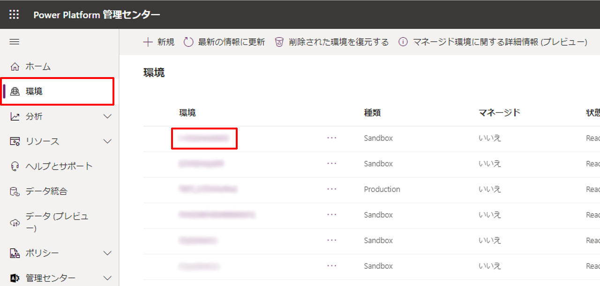
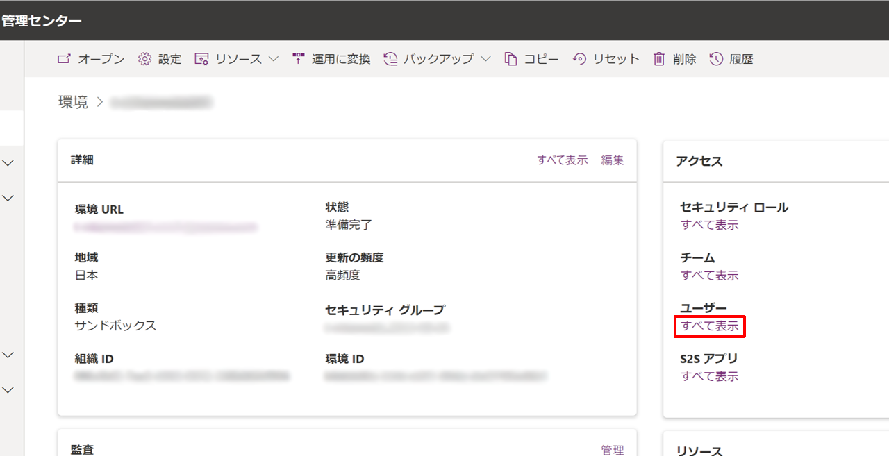
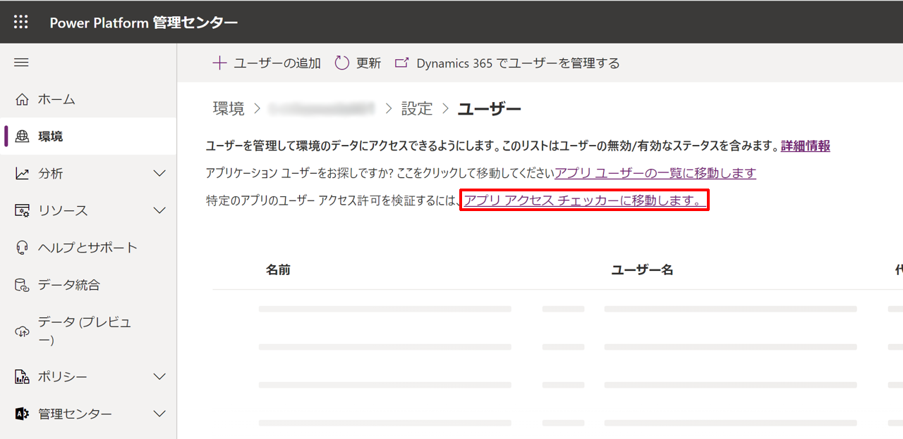
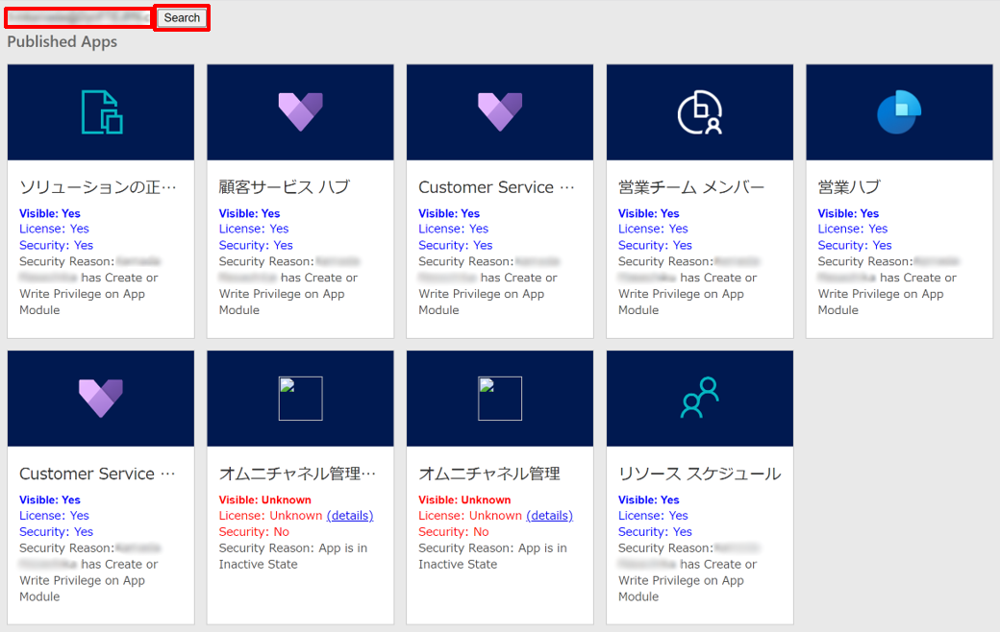
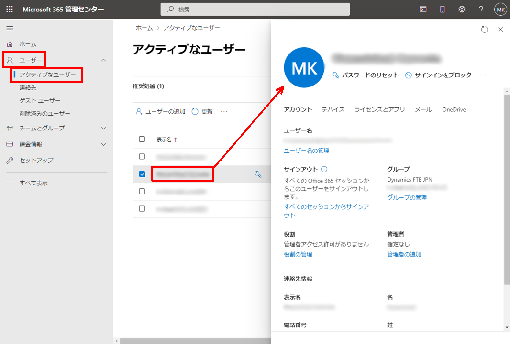
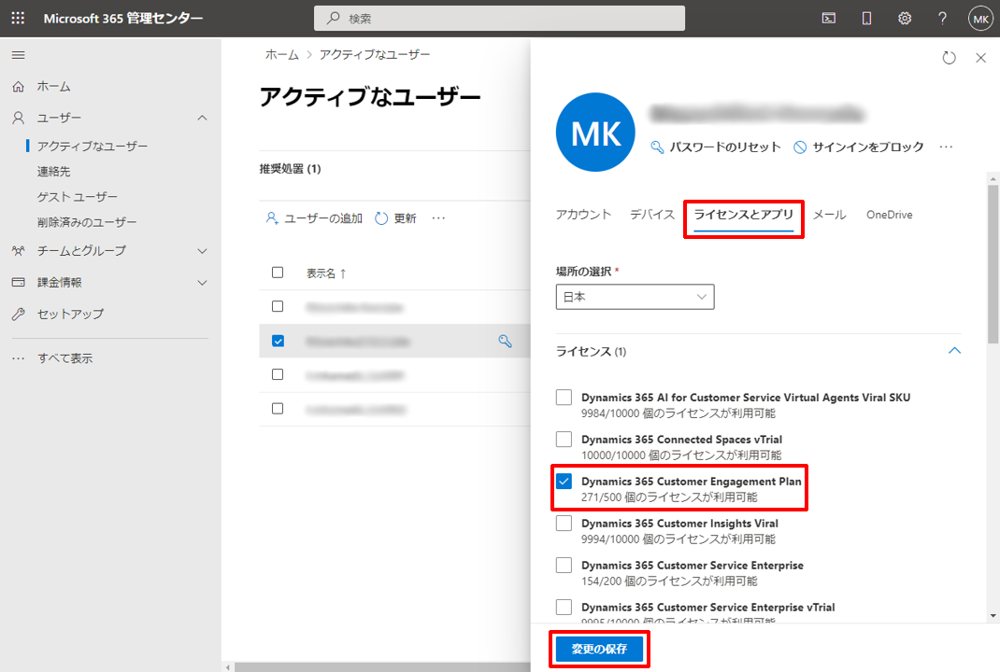
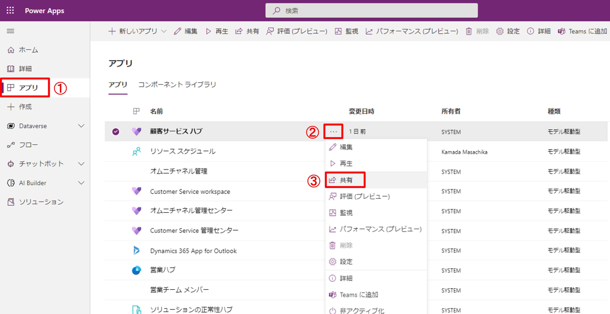
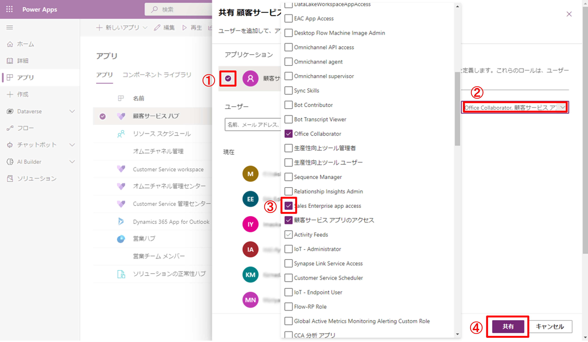
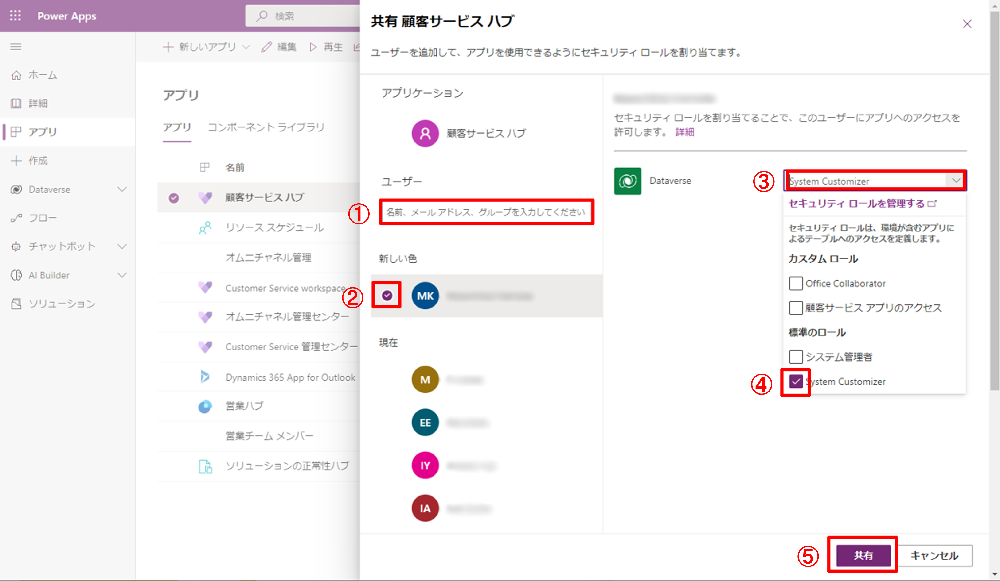

# モデル駆動型アプリにアクセスできないときの対処法

こんにちは、Power Platform サポートチームの鎌田です。

本記事では、モデル駆動型アプリにアクセスできないときの対処法についてご案内いたします。

## 目次

- [App Access Checker を使ってユーザーがアプリにアクセスできるか確認する](#app-access-checker-を使ってユーザーがアプリにアクセスできるか確認する)
- [ライセンスの割り当て](#ライセンスの割り当て)
- [セキュリティ ロールの割り当て](#セキュリティ-ロールの割り当て)
- [補足](#補足)
- [注釈](#注釈)
- [参考情報](#参考情報)

## App Access Checker を使ってユーザーがアプリにアクセスできるか確認する

モデル駆動型アプリをユーザーが閲覧するためには、以下の2点が必要となります。
- ユーザーにアプリを使用するための**ライセンス**が割り当てられていること
- ユーザーにアプリを使用できる**セキュリティ ロール** [(※1)](#注釈) が割り当てられていること

**App Access Checker** を使用することで、ユーザーがアプリを使用するためのライセンスとセキュリティの条件を満たしているかを確認することができます。
以下の手順では、App Access Checker を使って、ユーザーのアプリ使用に関するライセンスとセキュリティを確認する方法についてご説明いたします。

1. 全体管理者権限を持ったユーザー アカウントで、[Power Platform 管理センター](https://admin.powerplatform.microsoft.com/) へサインインします。

2. 左ペインより [環境] をクリックし、ユーザーがアプリにアクセスできない事象が発生しているインスタンスをクリックします。

3. 事象が発生しているインスタンスが開いたら、画面右の [アクセス] タブ内から [ユーザー] の下の [すべて表示] をクリックします。

4. 設定ページへの遷移後、[アプリ アクセス チェッカーに移動します。] のリンクをクリックします。

5. App Access Checker のページへ遷移したら、左上のテキスト ボックスに、アプリにアクセスできないアカウントのユーザー ID またはメール アドレスを入力し、[Search] ボタンをクリックすることで、ユーザー アカウントのアプリ使用に関する情報を閲覧することができます。
このとき、License および Security が Yes と表示されていれば、Visible も Yes となり、当該ユーザー アカウントでインスタンス内のアプリを使用できることを意味します。
License または Security で No と表示されている場合、次の [ライセンスの割り当て](#ライセンスの割り当て) または [セキュリティ ロールの割り当て](#セキュリティ-ロールの割り当て) の操作をお試しください。

## ライセンスの割り当て
App Access Checker にて、アカウントの License が No と表示されている場合、適切なライセンスの割り当てが必要です。
以下の手順でライセンスの割り当てが可能です。

1. ライセンス割り当ての権限を持つ管理者アカウントを使用して、[Microsoft 365 管理センター](https://admin.microsoft.com/) にアクセスします。

2. 左ペインより、[ユーザー] > [アクティブなユーザー] に移動し、ライセンスを割り当てるユーザーを選択します。そのユーザーの設定がポップアップで開きます。

3. ポップアップの [ライセンスとアプリ] タブを選択し、ユーザーに割り当てたいライセンスにチェックをつけ、[変更の保存] をクリックすることで、ユーザーへライセンスの割り当てが完了します。

## セキュリティ ロールの割り当て
App Access Checker にて、アカウントの Security が No と表示されている場合、適切なセキュリティ ロールの割り当てが必要です。
以下の手順でセキュリティ ロールの割り当てが可能です。

1. 管理者権限を持ったユーザー アカウントで、[Power Apps](https://make.powerapps.com/?utm_source=padocs&utm_medium=linkinadoc&utm_campaign=referralsfromdoc) にサインインします。

2. 左ペインから [アプリ] を選択後、ユーザーにアクセスを許可したいアプリの […] を押して出現するポップアップの [共有] をクリックします。

3. アプリ名左にチェックをつけ、下図②のテキスト ボックスをクリックすると、中央にカスタム ロールの管理をするポップアップが現れるので、アプリへのアクセスを許可するセキュリティ ロールにチェックをつけ、[共有] ボタンを押して変更を保存します。
この操作により、指定したセキュリティ ロールが割り当てられたユーザー アカウントに対して、一括でこのアプリへのアクセスを許可することができます。

4. 手順 3 では、特定のセキュリティ ロールを持つユーザー アカウントをまとめてアクセスできるように指定する方法を紹介しましたが、個別のユーザーごとにアクセスを許可する方法についても紹介します。
まず、[ユーザー] の下のテキスト ボックスからアクセスを許可したいアカウントを検索し、下図②のようにチェックを入れます。その後、下図③をクリックすると、アプリケーションへのアクセスが許可されているセキュリティ ロールが表示されるため、アクセスを許可したいアカウントへ割り当てたいセキュリティ ロールにチェックをつけて [共有] ボタンを押すことで変更を保存します。

## 補足
- App Access Checker は次のように URL を編集してアクセスすることも可能です。
\<orgURL\>/WebResources/msdyn_AppAccessChecker.html
例 : https://sample.crm7.dynamics.com//WebResources/msdyn_AppAccessChecker.html
※ sample の部分を適切な文字列に置き換えてください。

## 注釈
- (※1) セキュリティ ロールとは、営業担当者などの異なるユーザーが異なる種類のレコードにどのようにアクセスできるかを定義する機能のことです。詳しくは、[こちら](https://docs.microsoft.com/ja-jp/power-platform/admin/security-roles-privileges#security-roles) をご覧ください。

## 参考情報

| リンク | 内容 |
| ---- | --- |
| [How to access "App Access Checker" to see Role & Privileges needed for AppModule Entity to see and launch model app](https://community.dynamics.com/crm/f/microsoft-dynamics-crm-forum/427100/how-to-access-app-access-checker-to-see-role-privileges-needed-for-appmodule-entity-to-see-and-launch-model-app) | 本記事で紹介した App Access Checker のアクセスについて解説している英語記事です。 |
| [Manage user accounts, user licenses, and security roles](https://docs.microsoft.com/en-us/dynamics365/marketing/admin-users-licenses-roles) | Dynamics 365 のモデル駆動型アプリに必要な、ライセンスとセキュリティ ロールの割り当てについて解説している英語記事です。 |
| [モデル駆動型アプリのよく寄せられる質問](https://docs.microsoft.com/ja-jp/power-apps/maker/model-driven-apps/model-app-faq) | 解説している内容としてはタイトルの通りですが、インスタンス内のアプリがユーザーに表示されない原因について触れています。 |
| [セキュリティ ロールおよび特権](https://docs.microsoft.com/ja-jp/power-platform/admin/security-roles-privileges) | 本記事でアプリのアクセスを許可するために使用したセキュリティ ロールについて解説をしております。 |
