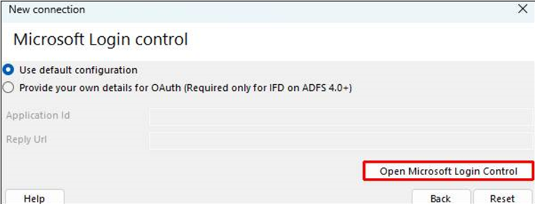
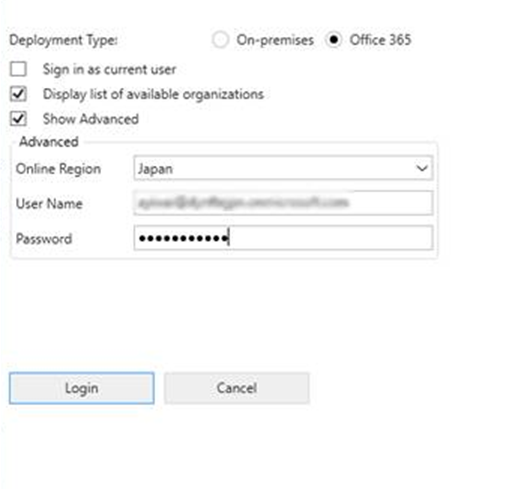
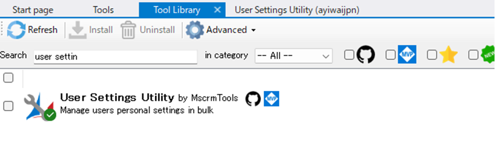
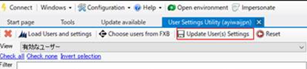

こんにちは、Power Platform サポートの原です。

今回は、ユーザーの個人設定を管理者が変更する方法をご紹介いたします。

### はじめに
個人設定では、タイムゾーンを変更したり、レコードのリストの各ページに表示するレコード数を変更したり、言語や通貨を変更したりなど様々な設定が可能です。 
一方で、ユーザーの個人設定は通常、ユーザー個人でのみ変更が可能となっている項目であり、管理者にて一括で変更する標準機能のご提供はございません。 
ただし、代替案として以下に紹介する方法で、管理者が他ユーザーの個人設定を変更することが可能です。
また、これはあくまでユーザーの個人設定を管理者が変更する方法であり、既定値を変更するものではないことにご注意ください。 

なお、弊社検証環境では下記にご紹介する API にて、ユーザーの個人設定の一括変更が実行可能なことを確認しておりますが、 下記でご案内いたします XrmToolBox につきましては、サードパーティー製ツールでございますため、 本ツールをご利用いただく中でのエラーやご不明点に関しましては弊社からサポートをご提供することがかないません。 
詳細な使用方法やエラーに対する対処は製品提供元へご確認いただく必要がございますことをご承知おきいただきますようお願い申し上げます。

### XrmToolBox を使用して変更する
1. XrmToolBox を [こちら](https://learn.microsoft.com/ja-jp/power-apps/developer/model-driven-apps/developer-tools) の記事の案内に従ってダウンロードします。

2. XrmToolBox アプリケーションを開き、 [Configuration] タブより [Manage connections] を選択します。

3. [New Connection] を選択し、[Microsoft Login Control] をクリックします。
4. [Open Microsoft Login Control] をクリックし、ユーザー名などを入力します。
 

5. 該当環境を選択して Connection の任意の名前を入力し、[Finish]を選択します。
Connection が作成されたことを確認し、[Connections Manager] ウィンドウを閉じます。
6. [Tools] タブより [User Settings Utility] を選択し、ダブルクリックします。
(表示されない場合は事前に [ToolLibrary] よりツールを追加してください)
※「Do you want to connect to an organization first?」というダイアログが表示された場合は「はい」を選択し
作成した Connection 先を選び「Connect」をクリックしてください。

7. [Load Users and settings] をクリックします。
8. 対象ユーザーを選択し、変更したい個人設定を変更します。
9. [Update User Settings]をクリックします。 

以上の手順で管理者がユーザーの個人設定を変更することが可能です。
また、繰り返しにはなりますが、冒頭でお伝えした通り、XrmToolBox につきましては、サードパーティー製ツールでございますため、本ツールをご利用いただく中でのエラーやご不明点に関しましては弊社からサポートをご提供することがかないませんことをご承知おきください。

### API を使用して変更する
以下の方法で個人設定の変更が可能です。
また、以下では一例としてタイムゾーンの変更の方法をご紹介いたします。

* 要求の方法：PATCH
* 要求のURL：https://\<orgname>.crm7.dynamics.com/api/data/v9.2/usersettingscollection(\<UserID>)
* ヘッダー：以下を入力します。 
{ 
  "Accept": "application/json", 
  "Content-Type": "application/json; charset=utf-8", 
  "OData-MaxVersion": "4.0", 
  "Odata-Version": "4.0", 
}
* 要求の本文：以下を入力します。 ※ここではタイムゾーンを「（GMT+09:00）大阪、札幌、東京」に変更する方法をご紹介しています。ここの本文を変更いただくことでタイムゾーン以外の個人設定の変更が可能となります。 
{ 
"timezonecode":235 
}

### おわりに
本記事が、ユーザーの個人設定を管理いただく上でのお役に立てましたら幸いです。
ご不明な点などがございましたら、弊社サポート一同にてお待ち申し上げておりますので、ぜひお気軽にお問合せください。
