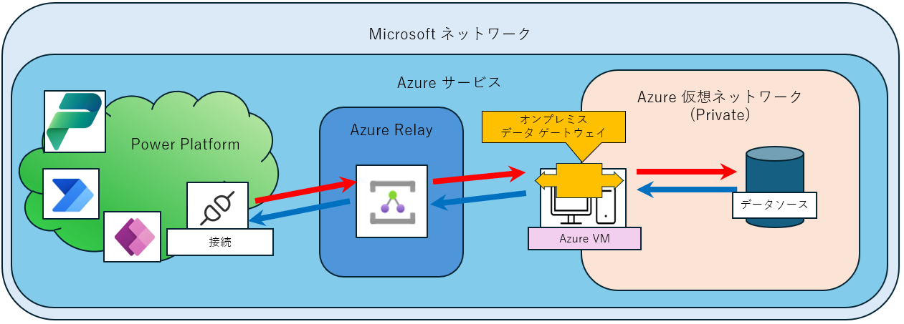
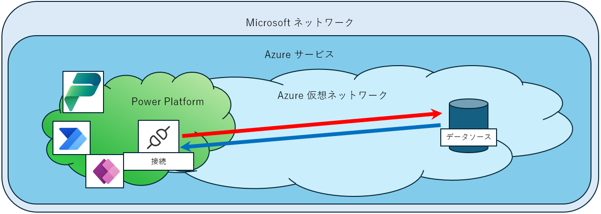

# Power Platform からプライベートな Azure 仮想ネットワークに存在するデータソースを利用する方法

こんにちは、Power Platform サポートチームの大友です。  
  
セキュリティ等の観点から、Azure SQL Database や Azure OpenAI 等のサービスをパブリックネットワークに公開した状態での運用は避けたい、というお問合せを頂く事があります。  
この記事では、Power Platform からプライベートな Azure 仮想ネットワークに存在するデータソースを利用する方法について紹介します。  
  
<!-- more -->
## 目次
  
1. [はじめに](#anchor-begin)
2. [オンプレミスデータゲートウェイとは？](#anchor-about-opdg)
3. [仮想ネットワークデータゲートウェイとは？](#anchor-about-vndg)
4. [VNET for Power Platform とは？](#anchor-about-vnet)
5. [機能の比較](#anchor-diff)
6. [おわりに](#anchor-finish)
  
> [!IMPORTANT]  
> 本記事は弊社公式ドキュメントの公開情報を元に構成しておりますが、 本記事編集時点と実際の機能に相違がある場合がございます。  
> 最新情報につきましては、参考情報として記載しておりますドキュメントをご確認ください。  
  
<!--------------------------------------------------------->

## 1. はじめに  
弊社 Azure サービスではデータセンター間含めサービス間の通信は弊社ネットワークを経由しパブリックネットワークは経由しません。  
Power Platform も Azure サービスに属しているため、例として Azure SQL からデータを取得している Power Automate であれば Power Automate サービス ～ Azure SQL の経路において、弊社外の公衆網は経由しない、ということになります。  
  
> [!NOTE]  
> [マイクロソフトは高速で信頼性の高いグローバル ネットワークをどのように構築しているのか (microsoft.com)](https://azure.microsoft.com/en-us/blog/how-microsoft-builds-its-fast-and-reliable-global-network/)  
> 以下、機械翻訳での抜粋  
> データセンター間の Azure トラフィックはネットワーク上にとどまり、インターネット経由では流れません。これには、世界中の Microsoft サービス間のすべてのトラフィックが含まれます。たとえば、Azure 内では、仮想マシン、ストレージ、SQL 通信間のトラフィックは、送信元と宛先のリージョンに関係なく、Microsoft ネットワークのみを経由します。  
  
ご要件によってデータソースが Azure 仮想ネットワーク内にのみ公開されている必要がある、といった場合のために、それらのデータソースに対応頂くための手段として Power Platform では以下の機能が提供されています。  
- オンプレミスデータゲートウェイ  
- 仮想ネットワークデータゲートウェイ  
- VNET for Power Platform  
  
この記事では、これらの機能について比較したいと思います。  
  
<!--------------------------------------------------------->

## 2. オンプレミスデータゲートウェイとは？  
[オンプレミス データ ゲートウェイとは](https://learn.microsoft.com/en-us/data-integration/gateway/service-gateway-onprem)  
  
Power Platfrom の接続からリクエストされたデータの取得は Azure Relay を介し、ゲートウェイがインストールされた端末からのリクエストによりセッションを確立し、端末からデータソースへデータのリクエストを行い、応答を受け取り、Power Platform へ返送します。  
[オンプレミスデータゲートウェイのしくみ](https://learn.microsoft.com/en-us/data-integration/gateway/service-gateway-onprem-indepth#how-the-gateway-works)  
  
> [!NOTE]  
> 主にオンプレミス環境上に存在するデータを操作する際に用いられます。  
> 関連記事：[クラウド フローとオンプレミス環境間でデータ連携する方法](https://jpdynamicscrm.github.io/blog/powerautomate/gateway-install/)  
  
Azure 仮想ネットワークのプライベートネットワークに属するリソースに接続する場合 Azure 仮想マシンに該当プライベートネットワークに属する NIC を構成する等**プライベートネットワークに存在するデータソースと通信可能な端末**を用意頂き、その端末にオンプレミスデータゲートウェイをインストールする必要があります。  

  
ご利用頂くにあたり、以下の注意点があります。  
* インストールされた端末がシャットダウン状態だと動作しません。  
* 環境と同じリージョンにゲートウェイを構成頂く必要があります。  
  
また、後述の VNET for Power Platform と比較し、以下のような差異があります。  
* 接続単位でオンプレミスデータゲートウェイの利用可否を指定することが可能です。  
* 接続毎にゲートウェイを利用する設定で接続を作成していただく必要があります。  
* オンプレミスデータゲートウェイ用に端末を用意する必要があります。  
* オンプレミスデータゲートウェイやインストールされた端末自体のバージョン維持等のメンテナンスが必要です。  
  
<!--------------------------------------------------------->

## 3. 仮想ネットワークデータゲートウェイとは？  
[仮想ネットワーク (VNet) データ ゲートウェイとは](https://learn.microsoft.com/en-us/data-integration/vnet/overview)  
  
仮想ネットワーク (VNet) データ ゲートウェイは、Microsoft Fabric(旧 Power BI) や Power Platfrom のデータフローを Azure 仮想ネットワークへ接続するために利用されます。  
  
> [!WARNING]  
> **Power Apps や Power Automate ではご利用いただくことはできません**のでご注意ください。  
> 関連記事：[Power Platform での仮想ネットワーク データ ゲートウェイについて](https://jpdynamicscrm.github.io/blog/powerplatform/vnetgateway-support-status/)  
  
<!--------------------------------------------------------->

## 4. VNET for Power Platform とは？  
[Virtual Network のサポートの概要](https://learn.microsoft.com/en-us/power-platform/admin/vnet-support-overview)  
  
VNET for Power Platform は、Power Platform の環境をネットワーク委任の機能で Azure 仮想ネットワークに接続する機能です。  

  
当機能に対応しているコネクタはすべて仮想ネットワーク経由でのリクエストを行います。  
> [!NOTE]  
> VNET for Power Platform に対応しているコネクタの一覧は、公開情報をご参照ください。  
> [Virtual Network のサポートの概要](https://learn.microsoft.com/en-us/power-platform/admin/vnet-support-overview#supported-services)  
  
オンプレミスデータゲートウェイと比較し、以下のような差異があります。  
* 2024年12月現在、オンプレミスデータゲートウェイには対応していない Azure Blob Storage コネクタに対応しています。  
* カスタムコネクタや HTTP with Microsoft Entra ID コネクタに対応しているため、Azure OpenAI 等をはじめ Azure 仮想ネットワークに対応しているサービス上に公開された API があればご利用頂く事が可能です。  
* 接続作成において特別な設定は不要です。  
* 端末やオンプレミスデータゲートウェイのバージョン維持をはじめとしたメンテナンスは不要です。  
* VNET にネットワーク委任をする Power Platform 環境はマネージド環境である必要があります。 ※ マネージド環境を利用するユーザーはプレミアムライセンスが割り当てられている必要があります。  
  
<!--------------------------------------------------------->

## 5. 機能の比較  
用途や必要なリソースについてまとめました。  
  
<table>
  <caption>
    Power Platfrom ネットワーク機能の比較
  </caption>
  <tr>
    <th>機能名</th>
    <th>用途</th>
    <th>対象</th>
    <th>マネージド環境</th>
    <th>ゲートウェイ端末</th>
  </tr>
  <tr>
    <td>オンプレミスデータゲートウェイ</td>
    <td>Power Platform コネクタ</td>
    <td>明示的に指定した接続のみ</td>
    <td>不要</td>
    <td><b>必要</b></td>
  </tr>
  <tr>
    <td>仮想ネットワークデータゲートウェイ</td>
    <td>データフロー、Microsoft Fabric</td>
    <td>明示的に指定した接続のみ</td>
    <td>不要</td>
    <td>不要</td>
  </tr>
  <tr>
    <td>VNET for Power Platform</td>
    <td>Power Platform コネクタ</td>
    <td>環境内すべての対応コネクタによる通信</td>
    <td><b>必要</b></td>
    <td>不要</td>
  </tr>
</table>
  
<!--------------------------------------------------------->

## 6. おわりに
当記事に関連した公開情報を掲載させていただきます。  
[マイクロソフトは高速で信頼性の高いグローバル ネットワークをどのように構築しているのか (microsoft.com)](https://azure.microsoft.com/en-us/blog/how-microsoft-builds-its-fast-and-reliable-global-network/)  
[オンプレミス データ ゲートウェイとは](https://learn.microsoft.com/en-us/data-integration/gateway/service-gateway-onprem)  
[仮想ネットワーク (VNet) データ ゲートウェイとは](https://learn.microsoft.com/en-us/data-integration/vnet/overview)  
[Virtual Network のサポートの概要](https://learn.microsoft.com/en-us/power-platform/admin/vnet-support-overview)  
  
Azure 仮想ネットワーク上でパブリックネットワークに公開されていないリソースへの接続に関してご参考となりましたら幸いです。  
ご不明な点や、もし具体的にお困りの点などがございましたら、弊社サポート一同にてお待ち申し上げておりますので、ぜひお気軽にお問合せください。  