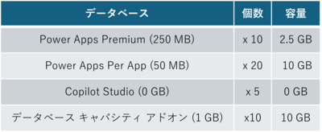
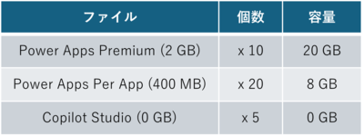

こんにちは、Power Platform サポートチームの吉永です。  

本記事では Dataverse ストレージにおけるライセンスごとに付与される容量の考え方についてご紹介させて頂きます。 
なお、Dataverse ストレージの基本的な考え方や Dataverse ストレージ超過時の影響などは、過去に公開させて頂いた後述の記事をご参考にしていただけますと幸いです。 
参考情報 : [Dataverse のストレージ容量について](https://jpdynamicscrm.github.io/blog/powerplatform/About-Dataverse-Storage/)

## 目次
  
1. [はじめに](#anchor-begin)
2. [テナントごとに付与されるストレージ容量のライセンスの概要](#anchor-dataverse-storeage)
3. [購入いただいたライセンスの種類によって決定する既定の容量](#anchor-default-storage)
4. [ライセンスやアドオンの購入数に応じて付与される追加容量](#anchor-addon-storage)
5. [おわりに](#anchor-finish)

> [!IMPORTANT]  
> 本記事は弊社公式ドキュメントの公開情報を元に構成しておりますが、 本記事編集時点と実際の機能に相違がある場合がございます。  
> 最新情報につきましては、参考情報として記載しておりますドキュメントをご確認ください。  

## 1. はじめに  
Dataverse では各環境でご利用される容量を合計したものとをテナント全体の容量として管理する仕組みとなっております。
なお、実際のご利用にあたっては、ご契約いただいているライセンスの数や種類に応じて、テナントに付与される容量内でご利用いただく必要がございます。

実際にテナントに割り当てられている以上の容量をご利用いただいている場合でも、環境の利用が停止するといったことはございませんが、新たな環境の作成などが行えなくなるなど管理上の影響が発生するため、容量の不足が発生する場合については、容量の削減やライセンスの追加購入を検討いただく必要がございます。

>[本記事でご紹介する内容について] 
> Dataverse の容量については、従量課金を利用しているかどうかによって動作が一部異なります。 
> 本記事では「従量課金」をご利用いただいていない場合のシナリオを元にご紹介させて頂いております。
従量課金制プランをご利用いただいている場合については、以下のドキュメントを合わせてご確認いただけますと幸いです。 
参考情報 : [Dataverse 容量メーター](https://learn.microsoft.com/ja-jp/power-platform/admin/pay-as-you-go-meters?tabs=image#dataverse-capacity-meter)

## 2. テナントごとに付与される容量のライセンスの概要 
Dataverse で利用可能な容量はご契約いただくライセンスの数や種類によって決定いたします。

なお、容量が割り当てられるかどうかや、割り当てられる場合の容量はライセンスによって異なるため、詳細についてはライセンスガイドをご確認頂きたくと存じますが、ライセンスのご契約によって割り当てられる容量には 2 種類の考え方がございます。

1.契約いただいたライセンスの種類によって決定されるテナント「既定の容量」 
2.ライセンスやアドオンの購入数に応じて付与される「追加の容量」

>ライセンスガイドについては、以下のリンクからダウンロード可能でございます。 
>参考情報 : [Microsoft Power Platform のライセンスの概要](https://learn.microsoft.com/ja-jp/power-platform/admin/pricing-billing-skus)

つまり、Dataverse では以下の計算に基づきテナントに付与される容量が決定いたします。

・「ライセンスの種類によって決定する 既定の容量」  +  「ライセンスごとに追加される 追加の容量」   =  「テナントに付与される容量」

## 3. 購入いただいたライセンスの種類によって決定する既定の容量
Dataverese ではご購入いただくライセンスの種類によって、テナントに付与される「既定の容量」が異なります。 
既定の容量が付与されるライセンスの種類としては、主に以下のような製品に関するライセンスがございます。 
・Power Apps  
・Power Automate  
・Copilot Studio  
・Power Pages  
・Dynamics  

なお、具体的なライセンス例ごとに割り当てられる「既定の容量」は以下の通りとなります。 

 
「既定の容量」はご契約いただいたライセンスごとの「既定の容量の合計値」ではなく、ご契約いただいたライセンスごとに定められた「既定の容量」の内、最も大きい容量が割り当てられる動作となります。

上記の動作について、具体的なシナリオ例についても合わせてご紹介させて頂きます。

### 参考シナリオ 

>購入ライセンス 
>・Power Apps Premium 
>・Power Apps Per App 
>・Copilot Studio 

上記のシナリオの場合、実際に適用される「既定の容量」は以下の通りとなります。 

上記のシナリオでは、3 種類のライセンスをご契約いただいており、ライセンスごとに「既定の容量」が異なります。 
ただし、テナントに割り当てられる「既定の容量」は、各ライセンスごとの「既定の容量」の合計値ではなく、最も大きい「既定の容量」が採用されます。 
このため、本シナリオでは Power Apps Premium によって割り当てられる「既定の容量」がテナントに適用されます。

## 4. ライセンスやアドオンの購入数に応じて付与される追加容量
Dataverse の容量は先述させて頂きました「既定の容量」とは別に、ライセンスやアドオンの購入数に応じてテナントに付与される追加容量がございます。 
こちらは既定の容量とは異なり、購入いただいたライセンスとアドオンの数に応じて、付与される容量が変動する仕組みとなっております。 
このため、ご契約いただくライセンスの数が多いほど、テナントに付与されるストレージ量は増加します。

なお、ライセンスの種類によって、ストレージ量が付与されるかどうか、どの程度のサイズが付与されるかが異なり、具体的な例として以下のような違いがございます。 

また、購入いただいたライセンスに応じて付与される追加容量とは別に、ストレージ量の追加を目的として購入いただくアドオンがございます。 
参考情報 : [テナントに Microsoft Dataverse 容量を追加](https://learn.microsoft.com/ja-jp/power-platform/admin/add-storage#purchase-dataverse-capacity-add-on)

このアドオンは「データベース」「ファイル」「ログ」とストレージの種類ごとに購入いただくことが可能であり、いずれも 1 GB 単位で購入いただくことが可能です。 
このため、お客様のテナントでストレージ量の不足が発生した場合については、ライセンスを追加でご契約いただくか、アドオンをご契約いただくことで、付与されるストレージ量を増加頂くことが可能です。

上記の動作について、具体的なシナリオ例についても合わせてご紹介させて頂きます。

### 参考シナリオ 
>購入ライセンス 
>・Power Apps Premium x 10 
>・Power Apps Per App x 20 
>・Copilot Studio x 5 
>・データベース キャパシティ アドオン (1 GB) x 10 

上記のシナリオの場合、実際に適用される「追加の容量」は、データベース、ファイル、ログごとに以下の通りとなります。 

データベースの場合、「2.5 GB + 10 GB + 0 GB + 10 GB」で 22.5 GB 

ファイルの場合、「20 GB + 8 GB + 0 GB」で 28 GB 

ログの場合、「0 GB + 0 GB + 0 GB」で 0 GB 

## 5.おわりに

<!-- more -->
本記事にてご説明させて頂きましたように Dataverse のキャパシティについては、ご契約いただいておりますライセンスの種類や数によって、利用可能なストレージ量が異なります。

実際にお客様のテナントにおいて、どの程度の容量が割り当てられているかという点については、Power Platforom 管理センターから確認頂くことが可能です。  
参考情報 : [セルフサービス ストレージ容量の表示](https://learn.microsoft.com/ja-jp/power-platform/admin/view-self-service-capacity)

このため、お手元での計算と実際に割り当てられている容量が一致しない場合など、ご不明な点や、もし具体的にお困りの点などがございましたら、弊社サポート一同にてお待ち申し上げておりますので、ぜひお気軽にお問合せください。 