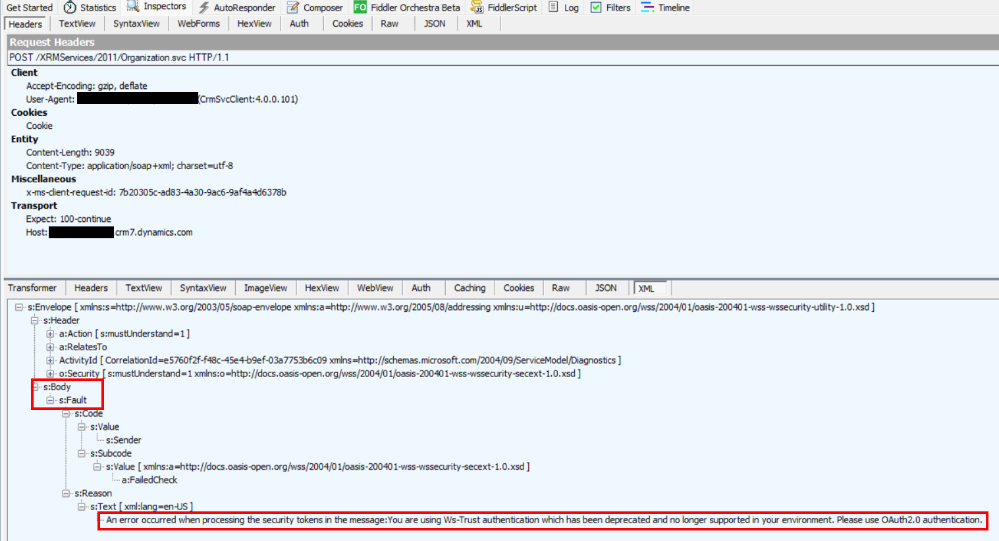

こんにちは。Power Platform サポートチームの金子です。  
2022 年 4 月以降、すべての Dataverse 環境にて、クライアントプログラムから WS-Trust (Office365) プロトコルによる認証が廃止されます。結果、ログインに失敗する可能性がございますので、該当する場合、プログラム対応をお願いいたします。  
この記事では WS-Trust プロトコル利用有無の確認方法や対処方法についてご案内します。  

<!-- more -->
# 目次

1. [はじめに](#anchor-intro)
2. [スケジュール](#anchor-schedule)
3. [影響範囲](#anchor-impacts)
4. [WS-Trust 利用有無確認方法](#anchor-how-do-i-know)
5. [対処方法](#anchor-fix)

# はじめに
---
2020 年 2 月に、セキュリティ観点により、クライアントプログラムからの WS-Trust 認証プロトコルによる Dataverse への接続が非推奨になることがアナウンスされ、段階的に廃止されています。  
現時点では一部の Dynamics 365 や Power Platform 環境では、引き続き WS-Trust プロトコルにて認証可能ですが、2022 年 4 月以降、すべての環境で非推奨（廃止）となります。その結果、クライアントプログラムから Dataverse 環境へのログインに失敗する可能性がございます。  

[Dataverse に接続するための Office365 認証の種類と OrganizationServiceProxy クラスの廃止](https://learn.microsoft.com/ja-jp/power-platform/important-changes-coming#deprecation-of-office365-authentication-type-and-organizationserviceproxy-class-for-connecting-to-dataverse) 

# スケジュール
---
2020 年より、クライアントプログラムからの Dataverse への接続において、WS-Trust による認証は段階的に廃止されています。  
- 2020 年 10 月以降に新規に作成されたテナントでは利用不可。以前に作成された既存テナントでは継続利用可能。
- 2021 年 4 月以降に新規に作成された環境は利用不可。以前に作成された既存環境では継続利用可能。
- 2022 年 4 月以降は、利用可能であった既存環境も含め、すべての環境で利用できなくなります。

# 影響範囲
---
WS-Trust 廃止による影響範囲は以下の通りです。 
- Microsoft Dataverse へ接続するクライアントアプリケーションにのみ影響があります。
- プラグイン、ワークフロー、オンプレミス/IFD 接続には影響を与えません。

一例として、CrmServiceClient で接続文字列 AuthType=Office365 を指定するサンプルプログラムの動作を Fiddler でキャプチャした様子を以下に示します。  
※ Fiddler はクライアント・サーバー間の HTTP/HTTPS 通信ログを取得して調査するためのツールです。具体的なログ採取方法は [Fiddler ログの採取手順](https://social.technet.microsoft.com/Forums/exchange/ja-JP/fe5f977a-2992-44c3-b643-38ad570a3d18/fiddler-12525124641239825505214622516338918?forum=DCRMSupport) に紹介されています。  

2021 年 4 月以前に作成された環境へ WS-Trust プロトコルで認証する場合：  
現時点で WS-Trust プロトコルが利用可能であるため、HTTP 200 が返却されています。  
  

2021 年 4 月以降に作成された環境へ WS-Trust プロトコルで認証する場合：  
既に WS-Trust プロトコルが利用不可であるため、ログインに失敗します。HTTP 500 エラーが発生し、下記メッセージが返却されます。  
An error occurred when processing the security tokens in the message:You are using Ws-Trust authentication which has been deprecated and no longer supported in your environment. Please use OAuth2.0 authentication.
   
Response Body 情報  
  

# WS-Trust 利用有無確認方法
---
テナントにおいて、WS-Trust を用いた Dataverse への接続が発生している場合、[Microsoft 365 メッセージ センター](https://admin.microsoft.com/#/MessageCenter) にて下記タイトルのメッセージが配信されている可能性があります。   
Microsoft Dynamics 365: WS-Trust authentication protocol for connecting to Dataverse is being deprecated

なお、メッセージが配信されていない場合であっても、下記処理を実装している場合、WS-Trust を利用しています。
-	CrmServiceClientクラスを接続文字列で使用しており、AuthType=Office365 を指定している
-	OrganizationServiceProxy クラスを使用している
-	CrmServiceClient.OrganizationServiceProxy を使用している

下記公開情報も併せてご参照のうえ、プログラムのご確認をお願いいたします。  
[コードやアプリケーションが WS-Trust を使用しているかどうかを確認するにはどうすればよいですか？](https://learn.microsoft.com/ja-jp/power-apps/developer/data-platform/authenticate-office365-deprecation#how-do-i-know-if-my-code-or-application-is-using-ws-trust)

# 対処方法  
---
下記公開情報を参考に、接続インターフェイスの変更や、認証タイプ OAuth へ移行をご検討ください。  
[この影響を受けた場合、アプリケーションのコードを修正するにはどうすればよいですか。](https://learn.microsoft.com/ja-jp/power-apps/developer/data-platform/authenticate-office365-deprecation#what-should-i-do-to-fix-my-application-code-if-affected)

2021 年 4 月以降に作成された環境では WS-Trust が利用できないため、改修後の認証接続テストにご利用ください。必要に応じて、既存の運用環境を WS-Trust プロトコル利用不可環境へコピーしてテストをお願いいたします。

---
## おわりに

より詳細な情報が必要な場合、弊社テクニカルサポート、Customer Success Account Manager (CSAM), Customer Engineer (CE) までお問い合わせください。 
