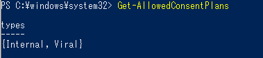
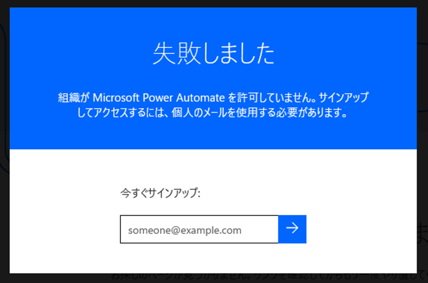

# Power Automate/Power Appsの試用版・無償版を利用不可にする方法

こんにちは、Power Platform サポートチームの網野です。

<br>
今回はよく寄せられるお問い合わせの一つ、Power Automate、Power Apps の無償版・試用版を利用不可にする方法についてご案内いたします。<br>
<br>

> [!IMPORTANT] 
> 本記事は弊社公式ドキュメントの公開情報を元に構成しておりますが、 本記事編集時点と実際の機能に相違がある場合がございます。 
> 最新情報につきましては、参考情報として記載しておりますドキュメントをご確認ください
<!-- more -->

---

# 目次
1. [対象ライセンス](#anchor-license)
1. [ライセンスの種類](#anchor-license-type)
1. [事前準備](#anchor-preparation)
1. [コマンドの実行](#anchor-command)
1. [実行結果](#anchor-result)
1. [FAQ](#anchor-faq)

<br>

<a id='anchor-license'></a>

## 対象ライセンス
ご案内するコマンドを実行しますと、以下のすべてのライセンスが制限されます。

- Power Automate Free
- Power Apps 開発者プラン (コミュニティプラン)
- Power Automate 試用版
- Power Apps 試用版

<br>

<a id='anchor-license-type'></a>

## ライセンスの種類
ライセンスには Internal ライセンスと Viral ライセンスの 2 つがあります。<br>

- Internal ：Power Automate / Power Apps ポータルからユーザーが自身で取得する無償版・試用版ライセンス<br>
- Viral： 管理者により付与される無償版・試用版ライセンス、および https://signup.microsoft.com/ からユーザーが自身で取得する無償版・試用版ライセンス<br>

     参考情報： [試用ライセンスのブロックコマンド](https://learn.microsoft.com/ja-jp/power-platform/admin/powerapps-powershell#block-trial-licenses-commands)

<a id='anchor-preparation'></a>

## 事前準備
### PowerShell モジュールのインストール
1. Power Apps の PowerShell モジュールを [こちらの手順](https://learn.microsoft.com/ja-jp/power-platform/admin/powerapps-powershell#installation) に従ってインストールします。

### 現在の設定を確認<br>
1. 以下のコマンドを実行し、無償版・試用版が無効化されているかどうか確認します。<br>
   ```powershell 
   Get-AllowedConsentPlans
   ```
   ※Internal と Viral のライセンスが共に有効である場合 (＝無償版、試用版が利用可能な状態)<br>
    <br>
   ※Internal と Viral のライセンスが共に無効である場合 (＝無償版、試用版が利用不可の状態)<br>
    <br>
<br>
1. ライセンス一覧を表示するコマンドを実行し、テナント内に無償版、試用版ライセンスを利用しているユーザーがいるかどうかを確認します。<br>
   ```powershell 
   Get-AdminPowerAppLicenses -OutputFilePath <ファイルパス＋ファイル名>
   ```

<a id='anchor-command'></a>

## コマンドの実行
以下のコマンドを実行し、無償版、試用版のライセンスを無効化し、利用停止にします。
```powershell 
Remove-AllowedConsentPlans -Types "Internal"
Remove-AllowedConsentPlans -Types "Viral"
```
以下のように確認メッセージが表示されるので、"y" と入力し、Enter キーを押してください。
   <br>

<br>
試用版、無償版の利用を許可する場合は、下記のコマンドを実行してください。

```powershell 
Add-AllowedConsentPlans -Types "Internal"
Add-AllowedConsentPlans -Types "Viral"
```

<a id='anchor-result'></a>

## 実行結果
ライセンスを持たないアカウントで Power Automate ポータルへ接続を試みます。

   <br>
   以下のようにエラーが表示され、ポータル画面へアクセスすることができません<br>
   <br>


<a id='anchor-faq'></a>

## 既知の問題と制限事項
コマンド実行後、 Microsoft 365 管理センターからライセンス付与状況を確認すると無償版・試用版のライセンスが付与されているように見える場合がありますが、内部的には無償版・試用版のライセンスが無効化されております。<br>
無効化作業をした後のライセンス状況の確認は、以下の「テナント内のユーザーとライセンスの一覧を確認するコマンド」にてご確認ください。<br>
 ```powershell 
  Get-AdminPowerAppLicenses -OutputFilePath <ファイルパス＋ファイル名>
 ```

## FAQ
### <font color=blue>Q. コマンド実行前に取得された無償版、試用版のライセンスはどうなるのか</font>
   コマンド実行時に付与済みのライセンスがはく奪され、利用できなくなります。<br>
   <br>
### <font color=blue>Q. コマンド実行前に有償ライセンスや Office 365 / Microsoft 365 付帯ライセンスが付与されている場合はどうなるのか</font>
   有償ライセンスや Office 365 / Microsoft 365 付帯ライセンスには影響を与えませんので、引き続きご利用いただけます。<br>
   <br>
### <font color=blue>Q. コマンド実行後に有償ライセンスの購入に影響は与えるか</font>
   有償ライセンスには影響を与えませんので、引き続き購入いただけます。<br>
   <br>
### <font color=blue>Q. コマンド実行後にもPower Apps への接続が可能です。またアプリの作成と編集もできましたが、制御することはできないのでしょうか。</font>
   Power Apps は "アプリの実行時" にライセンスの有無が確認される製品となっております。<br>そのため、Power Apps へのアクセス、アプリの作成・編集はライセンスを所持していないユーザーでも可能となっており、ライセンスの付与の有無で制御することはできません。
   <br>
### <font color=blue>Q. コマンド実行前に「無償版」ライセンスで作成したフローやアプリはどうなるのか</font>
   フローやアプリは削除されず残り続けます。<br>
   <b>＜Power Apps＞</b>
   アプリを実行するユーザーに Office 365 / Microsoft 365 付帯ライセンスなど他の Power Apps のライセンスが付与されている場合は、コマンド実行前と変わらずアプリの実行を行うことができます。他の Power Apps のライセンスが付与されていない場合はアプリを実行できなくなります。<br>なお、Power Apps はアプリの実行時にライセンスを必要とする製品となっておりますため、コマンド実行後にもアプリの作成・編集は可能となります。
   <br> 
   <b>＜Power Automate＞</b>
   作成者に Office 365 / Microsoft 365 付帯ライセンス など他の Power Automate のライセンスが付与されている場合は、コマンド実行前と変わらずフローの編集・実行を行うことができます。<br>作成者に Power Automate のライセンスが一つも付与されていない場合は、バックグラウンド処理にてフローがオフになります。
   <br>
   
### <font color=blue>Q. コマンド実行前に「試用版」ライセンスで作成したフローやアプリはどうなるのか</font>
   フローやアプリは削除されず残り続けます。<br>
   <b>＜Power Apps＞</b>
   アプリを実行するユーザーに [Power Apps の有償ライセンス](https://powerapps.microsoft.com/ja-jp/pricing/)が付与されている場合は、コマンド実行前と変わらずアプリの実行を行うことができます。<br>なお、Power Apps はアプリの実行時にライセンスを必要とする製品となっておりますため、コマンド実行後にも<u><b>アプリの作成・編集は可能</b></u>となります。<br>ただし、作成・編集ユーザーに Power Apps の有償ライセンスが付与されていない場合、ゲートウェイなど一部のプレミアム機能がご利用いただけない可能性がございます。<br>[こちらの公開情報](https://learn.microsoft.com/ja-jp/power-platform/admin/about-powerapps-perapp#for-users-expected-to-use-a-power-apps-per-app-plan-why-are-users-that-use-an-app-shared-with-them-prompted-to-start-a-power-apps-trial)にもございます通り、この制限は最終的には削除される予定です。<br>最新の動作については公開情報及び、製品動作をご確認ください。
   <br>
   <b>＜Power Automate＞</b>
   [フローの編集]
     <u>作成者</u>に [Power Automate の有償ライセンス](https://flow.microsoft.com/ja-jp/pricing/)が付与されている場合は、コマンド実行前と変わらずフローの編集を行うことができます。<br>作成者に Power Automate の有償ライセンスが付与されていない場合は、プレミアム コネクタなど有償ライセンスが必要な機能がご利用できなくなります。また、作成者が有償ライセンスを持たず、有償ライセンスが必要な機能を利用しているフローはバックグラウンド処理にてフローがオフになります。<br>
     ※ Power Apps トリガーの場合は、Power Apps の有償ライセンスのみで Power Automate の有償ライセンスが必要な機能をご利用できます。

   [フローの実行]
   <u>実行者に有償ライセンス</u>が必要となります。実行者が有償ライセンスを持たない場合は、フローを実行することができなくなります。
   - 自動化フロー
     フローの実行者は作成者となるため、<u><b>作成者</b></u>に Power Automate の有償ライセンスが必要です。
   - ボタンフローなどの手動フロー
     <u><b>フロー実行者</b></u>に Power Automate の有償ライセンスが必要です。
   - Power Apps トリガー
     <u><b>Power Apps 実行者</b></u>に <u><b>Power Apps</b></u> の有償ライセンスが必要です。
     Power Automate の使用権は Power Apps の有償ライセンスに含まれているため、Power Automate のライセンスは必要ありません。<br>

### <font color=blue>Q. コマンド実行すると他の製品には影響を与えないか</font>
   Power Automate、Power Apps の無償版、試用版のみに影響があります。<br>
   <br>


<br>

---
Hope to acceralate your business with Power Automate!
