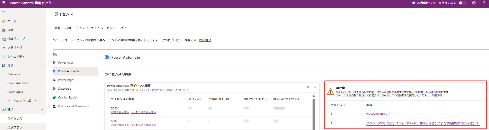

# プレミアム コネクタ・オンプレミス データ ゲートウェイ 使用権の猶予期間終了のご案内 - MC901924
<!-- ここに 導入部分 -->
こんにちは、Power Platform サポートチームの藤田です。

今回は、Power Apps・Power Automateの一部機能の使用権に関する、2019年のライセンス変更の猶予期間が終了したことについてご紹介します。
この内容はメッセージ センターにて、MC901924として配信されました。

<!-- more -->

<!-- ここに Read more 以降の文章 -->
> [!IMPORTANT] 
> 本記事は弊社公式ドキュメントの公開情報を元に構成しておりますが、 本記事編集時点と実際の機能に相違がある場合がございます。 
> 最新情報につきましては、参考情報として記載しておりますドキュメントをご確認ください

---
### 本変更の対象のテナント

2019 年 10 月 1 日以前から Microsoft 365 サブスクリプションで対象の機能を使用していたテナントのみが対象となっております。

### 本変更の対象外のテナント

2019 年 10 月 1 日以前に対象となる機能を使用していなかったテナントでは、既に適切なライセンスがないとご利用いただけない動作となっておりますので、変更や影響はございません。

## 概要

2019 年に一部の標準コネクタとオンプレミス データ ゲートウェイが、プレミアム ライセンスの必要な機能へ変更されました。

2019 年 2 月 ： HTTP コネクタ・[カスタム コネクタ](https://learn.microsoft.com/ja-jp/connectors/custom-connectors/)・[オンプレミス データ ゲートウェイ](https://learn.microsoft.com/ja-jp/data-integration/gateway/service-gateway-onprem) をプレミアムへ変更

2019 年 10 月： 一部の標準コネクタ（※）をプレミアムへ変更

※ 該当するコネクタは以下をご参照ください。 
   公開情報 : [Microsoft 365 アプリケーションの Microsoft Power Apps および Power Automate の使用権とは何ですか。](https://learn.microsoft.com/ja-jp/power-platform/admin/powerapps-flow-licensing-faq#what-are-microsoft-power-apps-and-power-automate-use-rights-for-microsoft-365-applications)

2019 年 10 月 1 日以前から Microsoft 365 サブスクリプションで対象の機能を使用していたテナントでは、対象の機能の使用権が
2024 年 10 月 1 日まで猶予期間の状態にあり、使用できる状況となっておりました。

2024 年 10 月 1 日以降、上記で変更されたコネクタを含む、プレミアム コネクタや HTTP コネクタ、カスタム コネクタ、オンプレミス データ ゲートウェイをご利用いただく場合には、適切なライセンスが必要となります。
製品内での制限は 2025 年 4 月 1 日から開始される予定です。

## 必要なライセンスの割り当てのために

該当するテナントで引き続きプレミアム機能をご利用いただくためには、プレミアム ライセンスをユーザーに割り当てることが必要となります。
この作業を自動で行いたい場合、自動請求ポリシーをご利用いただくことが出来ます。

公開情報： [Microsoft 365 管理センターで自動要求ポリシーを管理する](https://learn.microsoft.com/ja-jp/microsoft-365/commerce/licenses/manage-auto-claim-policies?view=o365-worldwide&WT.mc_id=365AdminCSH_inproduct)

一方で、有償のライセンスの割り当ては承認を行ってからにしたい、ということもあるかと思います。
その場合は、自動請求ポリシーをオフにご設定いただきますようお願いいたします。

公開情報：[自動請求ポリシーをオフにする](https://learn.microsoft.com/ja-jp/microsoft-365/commerce/licenses/manage-auto-claim-policies?view=o365-worldwide&WT.mc_id=365AdminCSH_inproduct#turn-off-auto-claim-policies)

## FAQ

**Q. 自分が使っているテナントが本変更の影響を受けるかどうか確認する方法は？**

A. [Power Automateのポータル](https://make.powerautomate.com/) へサインインし、Ctrl + Alt + A キーを押下します。 表示される情報を Ctrl + F で検索し、以下の値のいずれかが含まれる場合には対象テナントと判断いただけます。
  - AllowCustomConnectorsForOfficeSeededPlan
  - AllowGatewayUsageForOfficeSeededPlan
  - Oct2019ConnectorGrandfathering

**Q. ライセンスが必要なクラウド フローやキャンバス アプリの確認方法は？**

A. クラウド フローについては、Power Platform 管理センター 左ペインより、[請求] > [ライセンス] を表示いただき、  [概要] タブの Power Automate をクリックすると、対象のフローがある場合は [要注意] セクションに表示されます。
 
  キャンバス アプリについては、フローと異なりひとつのアプリに対応するライセンスが一意に定まらず、一覧で抽出することが難しい (※) ため、「[プレミアム コネクタ](https://learn.microsoft.com/ja-jp/connectors/connector-reference/connector-reference-premium-connectors)を使用するアプリ」 または 「特定のコネクタを使用するアプリ」 という観点で別途抽出いただきご確認いただく必要がございます。 

> [!NOTE]
> ※ アプリはユーザーにより実行される際に各ユーザーに対してライセンスチェックを行っております。 
> Aさんはプレミアム ライセンスを持っていて問題なく実行可能、Bさんは Office 付帯ライセンスしかないためライセンス不足になっている、という状況になりえます。 
> その為、ライセンスが足りていないかどうか、アプリ毎に抽出できないこととなります。

  キャンバス アプリ・クラウド フローで使用しているコネクタ一覧の抽出については後日ブログ記事を公開予定です。

**Q. フローやアプリがライセンス不足になっていたら？必要なライセンスは？**

A. クラウド フローにつきましては、フローごとのライセンス ([容量ライセンス](https://learn.microsoft.com/ja-jp/power-platform/admin/power-automate-licensing/types?tabs=power-automate-premium%2Cpower-automate-process%2Cconnector-types#capacity-licenses)) をフローに対し割り当てるか、フローの作成者にプレミアム コネクタ使用権のあるライセンスを割り当てます。その後すぐにライセンスを反映させるには、フローを再度保存します。

フローごとのライセンスの割り当て方法については、以下の公開情報をご参照ください。

公開情報：[プロセス キャパシティをクラウド フローに割り当てる](https://learn.microsoft.com/ja-jp/power-automate/desktop-flows/capacity-process#allocate-process-capacity-to-a-cloud-flow)

プレミアム コネクタ使用権のあるライセンスについては、以下の公開情報もご参照ください。

公開情報：[ユーザー ライセンス](https://learn.microsoft.com/ja-jp/power-platform/admin/power-automate-licensing/types?tabs=power-automate-premium%2Cpower-automate-process%2Cconnector-types#user-licenses)

公開情報：[Power Automate シードライセンス](https://learn.microsoft.com/ja-jp/power-platform/admin/power-automate-licensing/deep-dive-on-specific-license#power-automate-seeded-licenses)

キャンバス アプリにつきましては、[アプリごとのライセンス](https://jpdynamicscrm.github.io/blog/powerapps/power-apps-per-app-license/) を必要ユーザー分ご用意いただき、"パスの割り当て" の設定をオンとする、もしくはアプリのユーザーにプレミアム コネクタ使用権のあるライセンスを割り当てます。 
または、環境に [従量課金制プラン](https://learn.microsoft.com/ja-jp/power-platform/admin/pay-as-you-go-overview) を割り当てます。

具体的なライセンスや使用権の詳細は [ライセンスガイド](https://go.microsoft.com/fwlink/?LinkId=2085130) をご参照ください。
