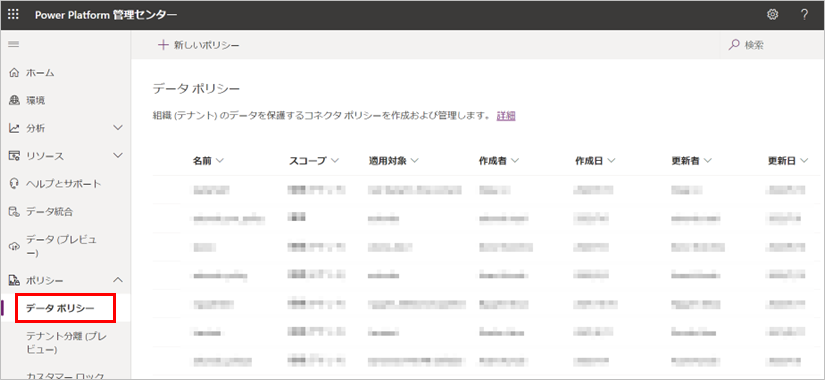
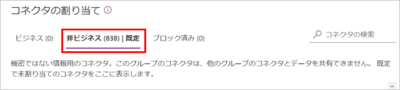
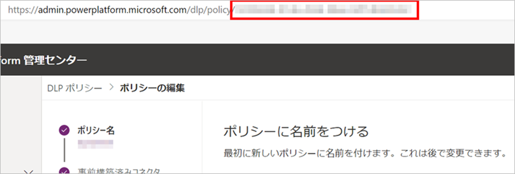
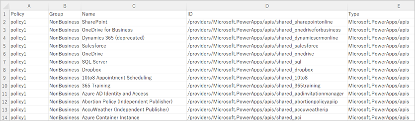

こんにちは、Power Platform サポートの瀬戸です。

この記事では、データ消失防止 (DLP) ポリシー に設定されたコネクタの一覧を、CSV ファイルに出力する方法をご案内いたします。

<!-- more -->

## DLP ポリシーとコネクタ
データ消失防止 (DLP) ポリシーとは、テナントや環境単位でコネクタの利用を制限できる、管理者向けの機能です。
[Power Platform 管理センター](https://admin.powerplatform.microsoft.com/home) よりアクセスいただけます。



参考：[データの消失防止ポリシー](https://learn.microsoft.com/ja-jp/power-platform/admin/wp-data-loss-prevention)

しかし、提供されているコネクタは非常に数が多く、DLP ポリシーを設定する画面ではすべてを把握するのが難しいのが現状です。

  
(2022年8月某日に確認した時点で800個以上)

こんな時は、コネクタの一覧をファイルに出力できると、より把握しやすくなるのではないでしょうか。Power Platform の管理者向けの PowerShell コマンドレットを活用すれば、コネクタの一覧を CSV ファイルに出力できます。

## 事前準備
Power Platform の PowerShell コマンドレットのご利用には、事前準備が必要です。詳しい手順は下記公開情報の「インストール」の章をご参照ください。

[Power Apps の PowerShell サポート](https://learn.microsoft.com/ja-jp/power-platform/admin/powerapps-powershell)

`Install-Module` に失敗する場合は、インストールに必要な設定が不足している可能性が考えられます。その設定については、弊社 Windows サポートチームによる記事にまとめられていますので、こちらもぜひご覧ください。

[PowerShell Gallery からモジュールをインストールするために必要な設定 | Microsoft Japan Windows Technology Support Blog](https://jpwinsup.github.io/blog/2021/06/14/UserInterfaceAndApps/PowerShell/how-to-setup-install-module/)

## サンプル
今回は、[Get-DlpPolicy](https://learn.microsoft.com/ja-jp/powershell/module/microsoft.powerapps.administration.powershell/get-dlppolicy?view=pa-ps-latest) を使用します。

このコマンドレットは DLP ポリシーの一覧や DLP ポリシーの詳細情報を取得できます。これを `Export-Csv` と組み合わせ、CSV ファイルを作成します。

以下に、サンプルコードを記載いたします。

>[!NOTE]  
>説明のためのサンプルであり、エラー処理などは含まれておりません。ご使用の際は、十分にご検証いただきますようお願いします。

```powershell
<#
特定のDLPポリシーに設定されているコネクタの一覧をcsvファイルに出力します
#>
Import-Module Microsoft.PowerApps.Administration.PowerShell

# CSVファイルパス
$filePath = "[CSVファイルパス]"
# ポリシーのID
$policyId = "[DLPポリシーのID]"
# メールアドレス
$mailAddress = "[メールアドレス]"
# パスワード
$plainPassword = "[パスワード]"

# サインイン
$pass = ConvertTo-SecureString $plainPassword -AsPlainText -Force
Add-PowerAppsAccount -Username $mailAddress -Password $pass

# DLP ポリシーとコネクタの取得
$DLPPolicy = Get-DlpPolicy -PolicyName $policyId

if (Test-Path $filePath) {
    Remove-Item $filePath
}

foreach($group in $DLPPolicy.connectorGroups) {
    $groupName = ""
    # グループの名前を分かりやすいものに置き換えます
    if ($group.classification -eq "Confidential") {
        $groupName = "Business"
    
    } elseif ($group.classification -eq "General") {
        $groupName = "NonBusiness"

    } elseif ($group.classification -eq "Blocked") {
        $groupName = "Blocked"
    }

    foreach($connector in $group.connectors) {
        $obj = [PSCustomObject]@{
            Policy = $DLPPolicy.displayName
            Group = $groupName
            Name = $connector.name
            ID = $connector.id
            Type = $connector.type
        }

        $obj | Export-Csv -Path $filePath -Encoding UTF8 -NoTypeInformation -Append
    }
}
```

サンプル中の `[DLPポリシーのID]` は DLP ポリシーの編集画面の URL から取得できます。



そして、サンプルを実行すると、以下のような CSV ファイルを出力できます。DLP ポリシーでどのようにコネクタを分類しているか、より把握しやすくなりました。  


## 画面で確認できるコネクタと件数が異なるとき

PowerShell の `Get-DlpPolicy` で取得できるコネクタの顔ぶれと Power Platform 管理センター で確認できるコネクタの顔ぶれが異なる場合があります。

原因は以下の2つのいずれか、または両方が考えられます。

* 最後に DLP ポリシーを保存してから、新しいコネクタが追加されたか、廃止されたコネクタがある。
* Power Virtual Agents など、DLP ポリシーの対象とならないコネクタがある。

### 新しいコネクタが追加されたか、廃止されたコネクタがある

PowerShell で取得できるコネクタと、Power Platform 管理センターで見えるコネクタには、以下の違いがあります。

|種類|説明|
|---|---|
|PowerShell で取得できるコネクタ|ポリシーに明示的に追加されたコネクタのみを取得できます。|
|Power Platform 管理センターで見るコネクタ|現時点で有効なコネクタが表示されます (ポリシー作成以降に追加/廃止されたコネクタが表示/非表示になります)。|

つまり、以下のような現象が起きます。

DLP ポリシーを作成した後に、新しく追加されたコネクタがある場合：

* Power Platform 管理センターでは新しいコネクタが表示されます。
* 新しいコネクタは自動的にポリシーに追加されないため、PowerShell で取得した結果には含まれません。

ポリシー作成以降に廃止されたコネクタがある場合：

* Power Platform 管理センターでは廃止されたコネクタが表示されなくなります。
* PowerShell で取得した結果には、廃止されたコネクタが残ります。

表示上の不一致はありますが、ポリシー作成以降に追加されたコネクタは既定のデータグループの設定に従って制御されるため、ポリシーは想定通り動作しますのでご安心ください。

 参考：

 * [新しいコネクタの既定データ グループ について](https://learn.microsoft.com/ja-jp/power-platform/admin/dlp-connector-classification#default-data-group-for-new-connectors)
 * [既定のデータ グループの変更](https://learn.microsoft.com/ja-jp/power-platform/admin/prevent-data-loss#change-the-default-data-group)

なお、Power Platform 管理センターで対象のポリシーを編集し保存し直していただくと、新しく追加されたコネクタが PowerShell で取得した結果に含まれるようになります。しかし、廃止されたコネクタは PowerShell で取得した結果に残り続けますのでご承知おきください。
