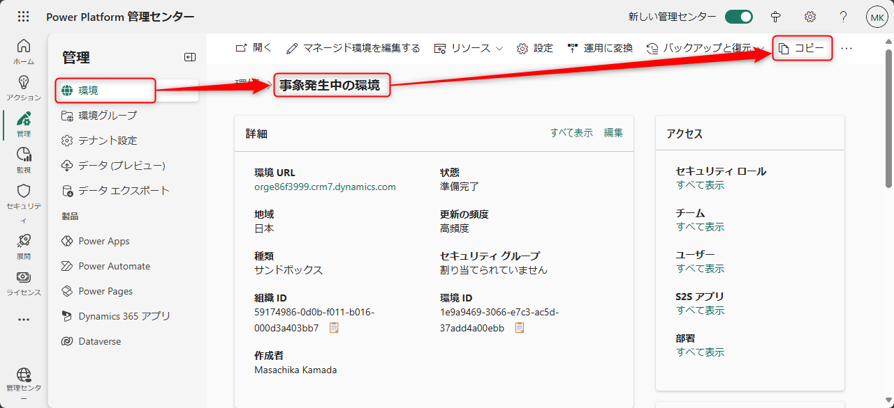
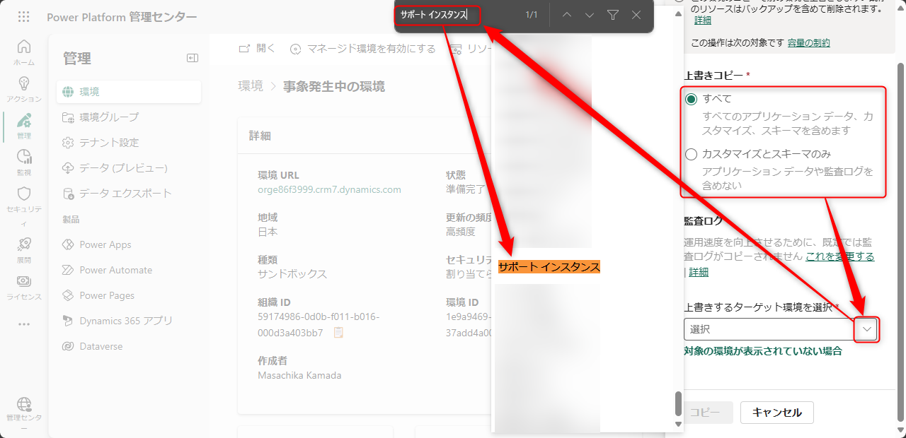

# サポート インスタンスの提供

こんにちは、Power Platform サポートチームの鎌田です。

本記事では当社サポート サービスでお問い合わせいただいたお客様に向けてご案内しておりますサポート インスタンスを紹介します。

## 概要

サポート インスタンスは、当社エンジニアがお客様の問題を再現させて調査することを目的とした環境です。 
サポート インスタンスへお客様の事象が発生している環境をコピーしていただくことで、事象の再現と調査を一貫して行うことが可能となり、早期解決が見込めます。 
当社エンジニアがサポート インスタンスを利用した調査が有効であると判断した場合、お客様にサポート インスタンスの作成について可否を伺います。ご了承いただける場合は、以下に一連の流れをご案内いたしますので、ご確認お願いいたします。

> [!IMPORTANT]
> お客様のテナントにサポート インスタンス (新しい環境) が作成されますが、お客様のテナントのストレージ容量には影響ございません。

---

1. [サポート インスタンス作成条件の確認](#anchor-about-criteria)
2. [情報の提供](#anchor-about-information)
3. [サポート インスタンスの作成](#anchor-create-instance)（当社の作業）
4. [サポート インスタンスへの環境のコピー](#anchor-about-copy)

---

## 1. サポート インスタンス作成条件の確認

サポート インスタンスを作成するために、次の全ての条件を満たす必要がございます。

* お問い合わせ起票者が、事象発生環境にて、システム管理者のセキュリティ ロールであること
* お問い合わせにて、サポート インスタンス作成の同意レベルが、次のいずれかに設定されていること
  * 診断情報へのアクセスで [最小限のコピー](https://learn.microsoft.com/ja-jp/power-platform/admin/copy-environment#copy-over-customizations-and-schemas-only) を許可する
  * 診断情報へのアクセスで [完全なコピー](https://learn.microsoft.com/ja-jp/power-platform/admin/copy-environment#copy-over-everything) を許可する

同意レベルが異なる場合 [サポート リクエストを作成した後、同意を付与または取り消すにはどうすればよいですか?](https://learn.microsoft.com/ja-jp/power-platform/admin/support-environment#how-do-i-grant-or-revoke-consent-after-i-create-a-support-request) を参考に、同意レベルを設定ください。

> [!NOTE]
> 上記の同意レベルが表示されない場合は、当社にて同意レベルの変更を代理で実施することも可能です。
> その場合、作業の同意として以下の項目について記載の上ご共有いただきますようお願いいたします。
> 作業完了まで 1、2 営業日ほどお時間いただく場合がございますので予めご了承ください。
> ・事象発生環境 URL（\*.crm\*.dynamics.com）
> ・貴社名
> ・エンドユーザー企業名
> ・同意レベル（完全コピー or 最小コピー）

## 2. 情報の提供

ステップ 1 の条件を満たした後、サポート インスタンス作成のため、当社サポート エンジニアへ **事象発生環境 URL (\*.crm\*.dynamics.com)** をご提供ください。

## 3. サポート インスタンスの作成（当社の作業）

ステップ 2 の情報をもとに、当社にてサポート インスタンスを作成いたします。 
お客様テナント内に作成したサポート インスタンスの環境名をご連絡いたしますので、ステップ 4 以降の環境のコピーを実施ください。

## 4. サポート インスタンスへの環境のコピー

以下の手順で、事象発生中の環境をサポート インスタンスへのコピーをお願いいたします。

1. [Power Platform 管理センター](https://admin.powerplatform.microsoft.com/) へアクセス
2. 環境一覧より、事象が発生中の環境を選択して開く
3. 上部リボンの [コピー] をクリック

4. 下図のように、[上書きコピー] と [上書きするターゲット環境を選択] を設定してコピーを実施 (グローバル管理者、Power Platform 管理者等が付与されておらずサポート インスタンスが表示されない場合は、下記の対処策をご確認下さい)

5. コピーが完了したら担当エンジニアまで完了の旨をご連絡ください

> [!NOTE]
> ターゲット環境の検索は Ctrl + F が便利です。
> 監査ログをコピーすると、環境のコピーにかかる時間が大幅に長くなる可能性があり、既定では実行されません。当社エンジニアから監査ログのコピーを依頼された場合は [監査ログ] の箇所を「はい」にご設定ください。

> [!IMPORTANT]
> コピーを実施するユーザーにグローバル管理者、Power Platform 管理者等が付与されていない場合、サポート インスタンス検索してもターゲット環境として表示されません。
> 当社側でコピーを実施するユーザーに管理者ロールを付与することで環境が表示されるようになります。 
> これを実施するため、まずエンジニアから共有された環境 URL に一度アクセスし、環境を開けない旨が表示されることを確認します。
> この操作により、当該ユーザーがサポート インスタンスにプロビジョニングされます。 
> ここまで操作が完了したら、担当エンジニアへ当該ユーザーの UPN をお伝えください。管理者ロールが付与されたという連絡を受けたら、サポート インスタンスを表示できるようになっているため、再度コピー操作の実施をお願いいたします。

> [!NOTE]
> UPN は Power Platform 管理センター > 環境 > 設定 > ユーザー のユーザー名よりご確認いただけます。
> 

## 参考情報

| リンク | 内容 |
| ---- | --- |
| [サポート環境とは](https://learn.microsoft.com/ja-jp/power-platform/admin/support-environment#what-are-support-environments) | サポート インスタンス全般の解説をしております。 |
| [環境のコピー](https://learn.microsoft.com/ja-jp/power-platform/admin/copy-environment) | 完全コピー (すべて) や最小限のコピー (カスタマイズとスキーマのみ) について解説をしております。 |
| [監査ログのコピー](https://learn.microsoft.com/ja-jp/power-platform/admin/copy-environment#copying-audit-logs) | 環境コピー時に監査ログをコピーする手順について解説をしております。 |
