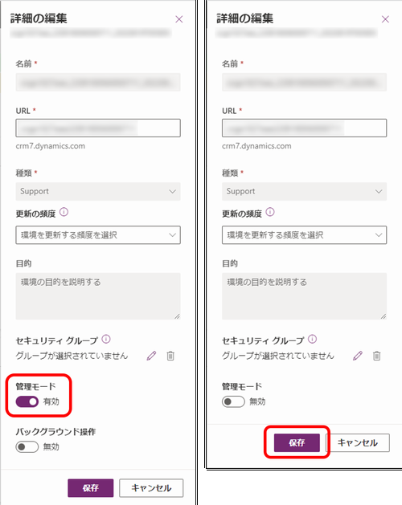

#  サポート インスタンスの提供

こんにちは、Power Platform サポートチームの鎌田です。

本記事では弊社サポート サービスでお問合せいただいたお客様に向けてご案内しておりますサポート インスタンスを紹介します。

## 概要

サポート インスタンスは、お客様の問題を再現させて調査することを目的とした環境です。

お客様同意のもと、お客様テナント内に作成されますので、事象発生環境をサポート インスタンスへコピーしてください。マイクロソフトのサポート部門や開発部門のエンジニアはサポート インスタンスに管理者権限でアクセスを行うことができますので、事象の再現と調査を一貫して行うことが可能となり、問題解決までの期間短縮が期待されます。

弊社エンジニアがサポート インスタンスを利用した調査が有効であると判断した場合、お問い合わせ起票者にサポート インスタンスの作成について可否を伺います。ご了承いただける場合は、1, 2 をご対応いただき、弊社にてサポート インスタンス作成後、3 の実施をお願いいたします。

---
1. [サポートインスタンス作成条件の確認](#anchor-about-criteria)
2. [情報の提供](#anchor-about-information)
3. [サポートインスタンスのコピー](#anchor-about-copy)

## 1. サポートインスタンス作成条件の確認

サポート インスタンスを作成するために次の条件を満たす必要がございます。
1. お問い合わせは、事象発生環境が属するテナントの [Power Platform 管理センター](https://admin.powerplatform.microsoft.com/) から起票されている。
2. お問い合わせ起票者は、事象発生環境にて、システム管理者のセキュリティロールが割り当てられている。
3. お問い合わせにて、サポート インスタンス作成の同意レベルが、下記いずれかに設定されている。
    * 診断情報へのアクセスで [最小限のコピー](https://learn.microsoft.com/ja-jp/power-platform/admin/copy-environment#copy-over-customizations-and-schemas-only) を許可する
    * 診断情報へのアクセスで [フル コピー](https://learn.microsoft.com/ja-jp/power-platform/admin/copy-environment#copy-over-everything) を許可する
    [サポート リクエストを作成した後、同意を付与または取り消すにはどうすればよいですか?](https://learn.microsoft.com/ja-jp/power-platform/admin/support-environment#how-do-i-grant-or-revoke-consent-after-i-create-a-support-request) を参考に、同意いただけるレベルを、いずれかに設定ください。
4. お問い合わせの対象製品として Dynamics 365 Customer Enagagement が選択されている。

__留意事項__

事象発生テナントとお問い合わせ起票テナントが異なる場合、例えば A 社環境で事象が発生しており、パートナー様 B 社が代理で調査依頼を起票する場合、上記条件を満たすことをご確認ください。条件を満たさない場合、条件を満たすよう A 社テナントからお問い合わせの新規ご起票をお願いさせていただくことがございます。

これらの条件は [サポート環境と顧客データへのアクセスへの同意](https://learn.microsoft.com/ja-jp/power-platform/admin/support-environment) に説明されますように、お客様のプライバシーを尊重するための措置でございます。ご了承くださいますようお願いいたします。

## 2. 情報の提供
1. [サポートインスタンス作成条件の確認](#anchor-about-criteria) が完了しましたら、サポート インスタンス作成のため、弊社サポートへ次の情報をご提供ください。
* 事象発生環境 URL (\***.crm\*.dynamics.com)
* 事象発生環境をサポートインスタンスへコピーするユーザーの UPN (ユーザーは事象発生環境にてシステム管理者セキュリティ ロールが割り当てられている必要がございます。)

  UPN は Power Platform 管理センター > 環境 > 設定 > ユーザー のユーザー名よりご確認いただけます。

ご提供いただいた情報より、弊社にてサポート インスタンスを作成いたします。

新規作成したサポート インスタンス環境名をお問い合わせ起票者へご連絡いたしますので、3. [サポートインスタンスのコピー](#anchor-about-copy) の手順でコピーを実施くださいますようお願いいたします。

## 3. サポートインスタンスのコピー

Microsoft エンジニアより、サポートインスタンス環境名が通知されましたら、2. [情報の提供](#anchor-about-information) にて、ご共有いただきました UPN のユーザーにて、コピー操作をお願いいたします。

1. 当該 UPN のユーザーにて、 [Power Platform 管理センター](https://admin.powerplatform.microsoft.com/) へサインインします。

2. 左ペインより [環境] をクリックし、さらに、事象が発生しているインスタンスをクリックします。

3. 事象が発生しているインスタンスが開いたら、上部メニューの [コピー] をクリックします。

4. [環境のコピー] が右ペインに表示されます。[上書きコピー] や [上書きする環境を選択します] を設定します。設定は担当のサポート エンジニアより指定された項目をお選びください [(※1)](#注釈) 。その後、「私は、Microsoft がオンライン サービスの運用に…」 からはじまる注意書きを確認、チェックをつけた後に、最下段の [コピー] をクリックします。

__留意事項__

監査ログはコピーするか否かを選択することができます。監査ログをコピーすると、環境のコピーにかかる時間が大幅に長くなる可能性があり、既定では実行されません。 [こちらのページ](https://learn.microsoft.com/ja-jp/power-platform/admin/copy-environment#copying-audit-logs) の操作を実行することで、環境コピーに監査ログを含めることができます。弊社エンジニアから監査ログのコピーを依頼された場合はご対応をお願いいたします。

5. 確認のダイアログでは [確認] をクリックします。

6. コピーが開始されますので、お待ちください。各フェイズが [開始前] [進行中] [成功] と進展していきます。

7. コピーが完了しましたら、以下の [編集] ボタンをクリックします。

8. [管理モード] を [有効] から [無効] にし [保存] をクリックします [(※2)](#注釈) 。

9. 提供手順は終了です。担当エンジニアまで完了の旨をご連絡ください。

## 補足

- 本手順は執筆時点の弊社検証環境でのユーザー インターフェイスを基に紹介しております。不明点がございましたら、担当のサポート エンジニアまでご相談ください。
- 作成したインスタンスはお客様のテナントのストレージ容量には影響ございません。
- サポート インスタンスは、既定では7日間で自動削除されますが、サポート エンジニアの調査状況により削除が延長される場合があります。この場合についても、調査が終了した後に自動削除されます。

## 注釈
- (※1) [環境のコピー] で、サポート インスタンス名が長すぎることなどが原因で、サポート インスタンスを見つけられない場合は、ブラウザの Ctrl + F、もしくは F3 キーで検索が可能です。

- (※2) 一部のお客様より [管理モード] が変更できない動作をお寄せいただいております。その場合、データ センター上で同作業を行いますため、担当のサポート エンジニアまでご相談ください。

## 参考情報

| リンク | 内容 |
| ---- | --- |
| [サポート環境とは](https://learn.microsoft.com/ja-jp/power-platform/admin/support-environment#what-are-support-environments) | サポートインスタンス全般の解説をしております。 |
| [環境のコピー](https://learn.microsoft.com/ja-jp/power-platform/admin/copy-environment) | 完全コピー (すべて) や最小限のコピー (カスタマイズとスキーマのみ) について解説をしております。 |
| [監査ログのコピー](https://learn.microsoft.com/ja-jp/power-platform/admin/copy-environment#copying-audit-logs) | 環境コピー時に監査ログをコピーする手順について解説をしております。 |
