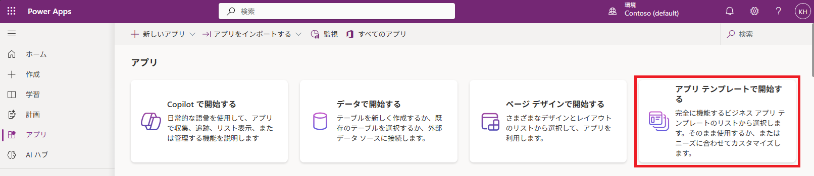

こんにちは、Power Platform サポートチームの原です。

サポート窓口には、お客様のご要望の動作を満たすPower Automateクラウドフロー（以下フロー）、Power Appsキャンバスアプリ（以下アプリ）を実装する方法についてのお問い合わせが数多く寄せられます。  
しかしながら、プレミアムサポート（有償サポート）を含め、これらを1から作成支援することはサポート範囲には含まれておりません。  
サポート契約をご利用の場合であっても、ご支援が可能となる範囲は限定されており、サポートチーム一同、この範囲内にて最大限のサポートを提供しています。  

一方、マイクロソフトは、お客様ご自身にて実装を進めていただけるよう、お役立ていただける数多くの方法を提供しています。  
この記事では、前提となるPower Platformのサポート範囲と、お客様ご自身にて実装を進める上で役立つ様々な方法をご案内します。  

<!-- more -->

## Power Platform 実装支援のサポート範囲について
サポートサービスには、「テクニカル サポート」と「アドバイザリーサービス」の大きく2つのサポートがあります。  

・**「テクニカルサポート」**：障害対応や製品の問題に対するサポートを提供しています。「テクニカルサポート」は、**無償サポートプランを含む全てのサポートプラン**に含まれています。  
・**「アドバイザリーサービス」**：製品の使用方法に関する推奨事項、一般的なアドバイス、ベスト プラクティス、またはガイダンスを提供しています。「アドバイザリサービス」は、**プレミアムサポート（有償サポート）プランに対してのみ**含まれています。  

このサポート範囲は、以下の公式サイトにて定義されているものになります。  
[テクニカル サポートとアドバイザリ サポートの違いは何ですか？](https://www.microsoft.com/ja-jp/dynamics-365/support)

プレミアムサポート（有償サポート）プランが含まれるのは、**Professional Direct、Unified契約、Premier契約**　となります。  
これらの契約をご利用である場合、「アドバイザリサポート」の範囲内にて、お客様がご要望の動作を満たすフローやアプリの実装のご支援を提供しています。  
これらのフローやアプリを1から作成するご支援は叶いませんが、後述にてご案内する方法をご活用いただくことで、お客様ご自身にてフローやアプリの実装をお試しいただければ幸いです。

なお、無償サポートには、「アドバイザリーサポート」は含まれておりません。  
そのため、無償サポートをご利用のお客様で、実装のご支援をご希望の場合は、プレミアムサポート（有償サポート）でのお問い合わせをお願いいたします。

## Power Platform 実装に役立つ様々な方法のご紹介
### １．Power Platform コミュニティ
####　概要
Power Platform コミュニティは、Power Platformの専門家やマイクロソフトのエンジニア、その他のお客様とつながり、質問への回答を得ることが出来るコミュニティチャネルとなります。  
回答を得るためには英語での投稿を推奨しますが、過去の投稿内容をご確認いただくことでも自己解決のための貴重なリソースとなりますので、ご活用をいただければと思います。  

[Power Automate](https://communitypowerplatformprod.powerappsportals.com/forums/thread/?groupid=46ce02a3-e1a7-4176-81fc-d93a4001d287)
[Power Apps](https://communitypowerplatformprod.powerappsportals.com/forums/thread/?groupid=b5652dc6-2c99-4e33-8b6f-45be4a896a40)
[Copilot Studio](https://communitypowerplatformprod.powerappsportals.com/forums/thread/?groupid=db8f53c2-767d-47d6-a1ae-fe4c828a6553)

####　使用例
- 以下の手順で、ご質問を投稿することが出来ます。

１．画面右上の「Post a question」を選択します。  

２．個人アカウント（Personal account）もしくは職場アカウント（Work account）でサインインします。  

３．遷移後の画面で、以下を選択・入力します。  
Forum：確認をされたい内容と最も近いフォーラムを選択します。  
Subject：タイトルを入力します。  
Description：本文を入力します。  
Categories：Forumに応じて表示される値が変更されます。確認をされたい内容と最も近いカテゴリを選択します。  
Attachments：任意項目となります。ファイルを添付したい場合、ここから添付します。  

４．３入力後、Postを選択し投稿します。  

- 画面右上の「Search」より検索ワードを入力することで、過去の投稿内容をご確認いただけます。
類似の投稿が既に行われている可能性もありますので、ご参照をいただければと思います。

### ２．テンプレート
####　概要
フロー、アプリには、数多くのテンプレートが数多く用意されています。  
実現されたい動作に近い内容や、新規に構築したいフローやアプリ作成のヒントとなるテンプレートが用意されている可能性がありますので、ご確認をいただければと思います。  

[Power Automate のテンプレートからクラウド フローを作成する](https://learn.microsoft.com/ja-jp/power-automate/get-started-logic-template)  
[テンプレートからキャンバス アプリを作成する](https://learn.microsoft.com/ja-jp/power-apps/maker/canvas-apps/get-started-test-drive)  

####　使用例
- Power Automateクラウドフロー

１．[Power Automateポータル](https://make.powerautomate.com/) ＞　左メニューにより「テンプレート」を選択します。  

２．検索バーを使用して、実現されたい動作に関連する検索ワードよりテンプレートを検索します。  
例：SharePoint Teams 通知  

３．検索結果より、実現をされたい動作に近いテンプレートを選択します。  

４．テンプレート内の各コネクタの接続を確認します。接続が作成されていない場合、サインイン を選択して画面に従います。  

５．接続を作成、確認後、「続行」を選択します。

６．テンプレートのフローが表示されます。実現されたい内容に応じ内容を変更します。

- Power Appsキャンバスアプリ

１．[Power Appsポータル](https://make.powerapps.com/)　＞　「ホーム」にて、「アプリ テンプレートで開始する」を選択します。

２．テンプレートを選択します。  
データソースからテンプレートアプリを作成する場合は「データ中心のモバイル アプリ」から、
もしくは用途に沿ったテンプレートアプリがある場合は「その他のアプリ テンプレート」からテンプレートを選択します。  

３．画面に従って必要事項を入力、選択し、「アプリを作成する」を選択します。  
例：SharePointリストをデータソースとするアプリを作成する場合  

４．テンプレートのアプリが表示されます。実現されたい内容に応じ内容を変更します。  

### ３．Copilot
####　概要
Power Automate、Power AppsのCopilotを使用することで、自然言語を用いてクラウドフローやキャンバスアプリを作成することができます。  
なお、日本リージョンの環境においてCopilotを使用するためには、[「リージョン間でデータを移動する」](https://learn.microsoft.com/ja-jp/power-platform/admin/geographical-availability-copilot#turn-on-copilots-and-generative-ai-features-1)の設定が有効となっている必要があります。  
Copilotを利用することで、テンプレートが用意されていない場合であっても、自然言語での対話を通じて短時間で自動的にクラウドフローやキャンバスアプリを作成することが可能ですので、是非ともご活用ください。  

[クラウド フローで Copilot の利用を開始する](https://learn.microsoft.com/ja-jp/power-automate/get-started-with-copilot)
[Copilot で会話を通じてアプリを構築する](https://learn.microsoft.com/ja-jp/power-apps/maker/canvas-apps/ai-conversations-create-app)

####　使用例
- Power Automateクラウドフロー  

１．[Power Automateポータル](https://make.powerautomate.com/) ＞　「ホーム」にて、実現をされたいフローの動作をプロンプトで記述し、「生成」を選択します。
例：SharePointリストに対しレコードが追加されたことをトリガとし、Teamsチャネルへ通知を行いたい

２．Copilotがトリガ、アクションを提案します。  
さらにCopilotとの対話を行いフローを変更したい場合は、「Copilot が作業で利用する詳細をさらに追加します」から追加のプロンプトを記述します。

３．「保存して続行する」を選択します。  

４．フロー内の各コネクタの接続を確認します。接続が作成されていない場合、サインイン を選択して画面に従います。

５．接続を作成、確認後、「フローを作成」を選択します。

６．フローの編集画面（新デザイナー）へ遷移します。実現されたい内容に応じ内容を変更します。
なお、新デザイナー上でも、右側パネルより、プロンプトによるフローの変更が可能です。

- Power Appsキャンバスアプリ
※Dataverseテーブルと、そのテーブルをデータソースとするアプリが自動で作成されます。  

１．[Power Appsポータル](https://make.powerapps.com/)　＞　「ホーム」にて、アプリの用途をプロンプトで記述し、Enterキーを押下します。
例：セミナーを管理するためのアプリを作成したい

２．Copilotがプロンプトに基づいてデータソースとなるDataverseテーブルを生成します。さらにCopilotとの対話を行いテーブルを変更したい場合は、「次に行う作業は何ですか？」から追加のプロンプトを記述します。  

３．「アプリを保存して開く」を選択します。

４．テーブルが作成され、アプリが表示されます。実現されたい内容に応じ内容を変更します。  

