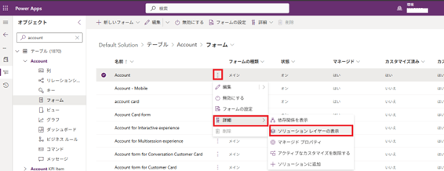
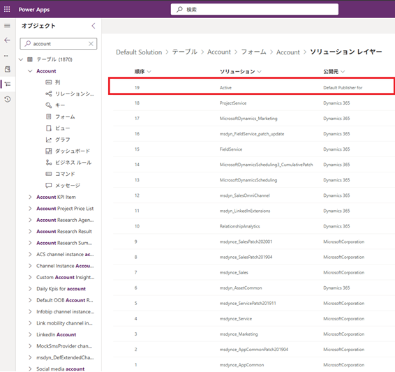
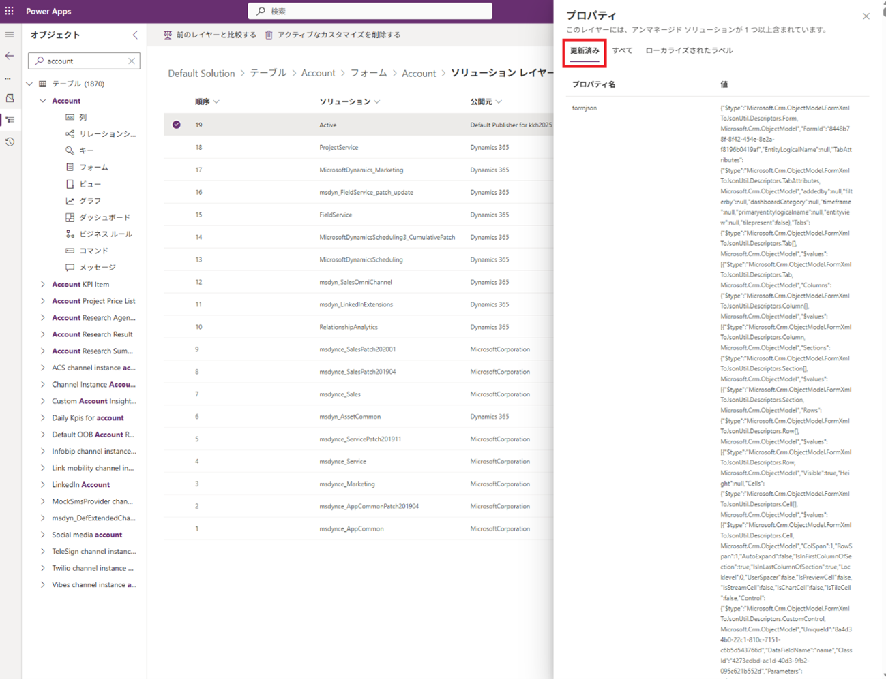
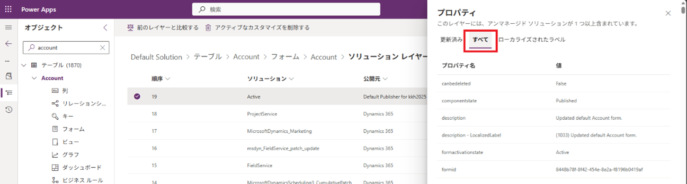
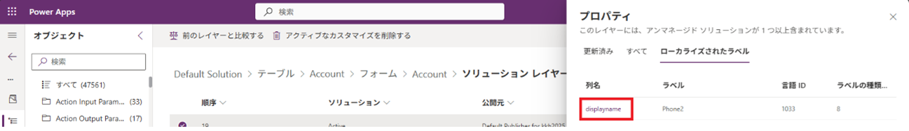
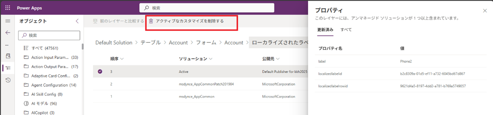

# アクティブレイヤーの確認・削除方法

こんにちは、Power Platform サポートチームの早川です。

今回は、Power Platform 環境でできるアクティブレイヤーの確認・削除方法についてご紹介いたします。

Power Apps や Power Automate を利用してアプリを作成していると、**「アクティブレイヤーというものができてしまった」**、 
**「アプリが誰かの編集のせいで意図しない動作になっている」**、**「マネージドソリューションで導入した変更が反映されない」**  
といったトラブルに直面することがあります。  
この記事では、Power Platform の「アクティブレイヤー」について、仕組み → 確認方法 → 削除手順 → 注意点の流れで解説します。   

## ソリューションレイヤーとは何か？

Power Platform（特にモデル駆動型アプリ、テーブル、フォーム、ビューなど）のカスタマイズは、  
レイヤー（層）構造で管理されています。  
通常、あるコンポーネント（例：テーブルの列、フォーム、ビュー）は、  
* アンマネージドレイヤー（デフォルト）
* マネージドレイヤー内のマネージドソリューション  
* マネージドレイヤー内のシステムソリューション  
の順に積み上がっており、上位レイヤーのカスタマイズが実際の動作(ランタイム動作)として反映されます。  

   

## アクティブレイヤー = ユーザーが加えたアンマネージド変更  
アクティブレイヤーは上記図のアンマネージドレイヤーであり、**環境で直接行ったカスタマイズと環境にインポートしたアンマネージドのソリューションを組み合わせたカスタマイズの層**を指します。  
アクティブレイヤーはマネージドレイヤーの上位に存在するため、アクティブレイヤーのカスタマイズはマネージドレイヤーのカスタマイズより優先され、  
アクティブレイヤーがある場合、意図したカスタマイズが反映されないなどの問題が発生しえます。   

## アクティブレイヤーの確認手順

アクティブレイヤーは Power Apps の編集画面 から確認できます。

**【確認手順】**
1.	Power Apps（make.powerapps.com）へアクセス
2.	左メニューから ［ソリューション］ を開く
3.	ソリューション一覧から対象のコンポーネントを含むソリューションを開く
4.	対象のコンポーネント（例：フォーム、ビュー、テーブルなど）右側にある三点リーダー(︙) をクリックし、「詳細」->「ソリューション レイヤーの表示」を選択

5.  レイヤー一覧の最上部に Activeが表示されていれば、それがアクティブレイヤー

6.	アクティブレイヤーを選択し、アクティブレイヤーの内容を表示

**ここで確認できるもの**
* 「更新済み」タブからアクティブレイヤーで変更されている項目の内容を確認できます。  

* 「すべて」タブから該当コンポーネントに含まれているすべての項目の内容を確認できます。  

* 「ローカライズされたラベル」タブからアクティブレイヤーで実施されたラベルのカスタマイズ内容を確認することができます。  

* ローカライズラベルの列名リンクをクリックすることで、ローカライズラベルのソリューションレイヤーも確認できます。  

## アクティブレイヤーの削除手順

アクティブレイヤーは、ソリューションレイヤー画面から削除できます。

**【削除方法】**
1.	ソリューションレイヤー一覧画面で Activeレイヤーを選択
2.	コマンドバーから 「アクティブなカスタマイズを削除する」 をクリック  

  

3.	確認ダイアログで 「削除」ボタンを押す
4.	完了後、コンポーネントが下層レイヤーのマネージドソリューションの定義に戻る

### アクティブレイヤーに関する注意点
1. **アクティブレイヤーの削除で現在の動作が変わる可能性がある**  

   アクティブレイヤーを削除すると下位のマネージドソリューションの動作に戻ります。

2. **アクティブレイヤーの内容を後から確認したい場合や、アクティブレイヤーを復旧したい場合にはバックアップを取る**  

   削除する前に、現在のカスタマイズ内容をエクスポートしておくと安心です。 

3. **アンマネージド環境の作業ルールが重要**  

   アクティブレイヤー発生の多くは、「誰かが環境を直接編集した」ことが原因です。  
   カスタマイズの運用ルールを決めておかないと、再びアクティブレイヤーが発生する可能性があります。
4. **マネージドソリューションとして管理するのがベスト**  

   アクティブレイヤー問題を避けるためには、すべての変更をマネージドソリューションのインポートで適用するという原則が最も重要です。

## まとめ
* アクティブレイヤーとは、ユーザーが環境で直接行ったアンマネージドの変更
* ソリューションレイヤー画面からアクティブレイヤーを確認できる
* 不要なら削除することで、正規レイヤー構造に戻せる
* 削除前のバックアップと運用ルール設計が重要

Power Platform のカスタマイズを健全に保つためには、アクティブレイヤーの存在と取り扱いを理解することが必須です。

## おわりに

以上、Power Platform のアクティブレイヤーの確認・削除方法についてご案内いたしました。  
こちらの記事が皆様の環境カスタマイズの管理のお役に立ちましたら幸いです。

