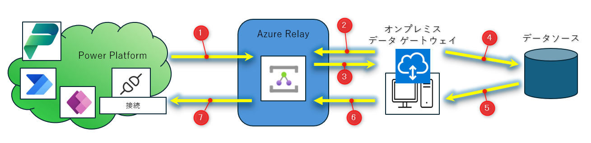
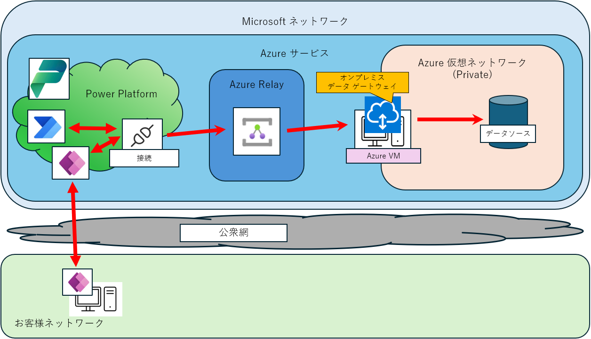
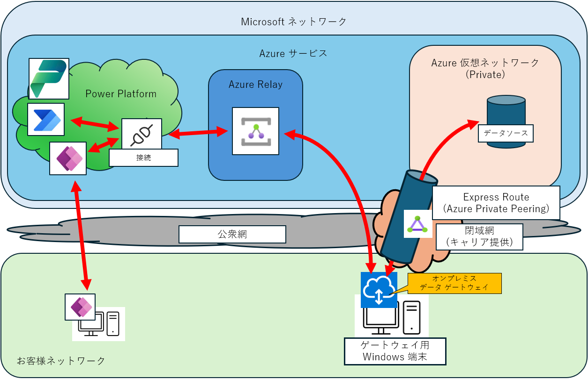
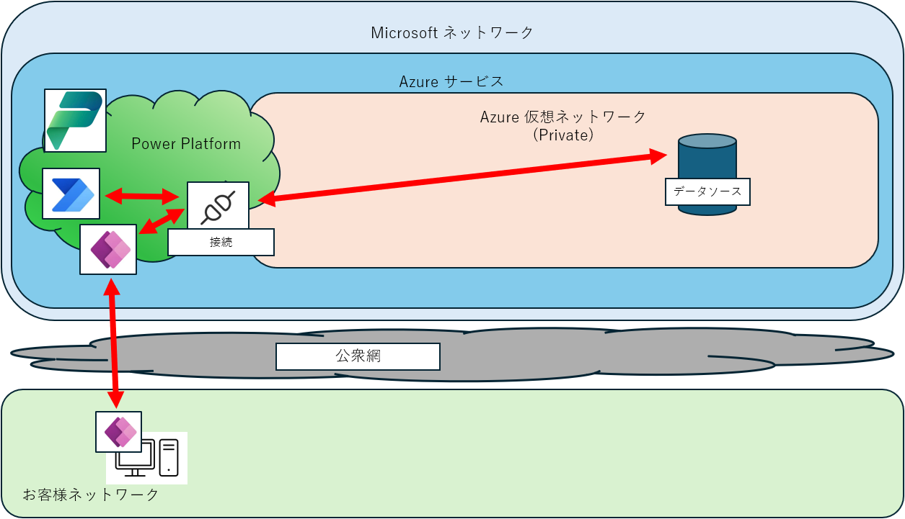

# Power Platform からプライベートな Azure 仮想ネットワークに存在するデータソースを利用する方法

こんにちは、Power Platform サポートチームの大友です。  
  
セキュリティ等の観点から、Azure SQL Database や Azure OpenAI 等のサービスをパブリックネットワークに公開した状態での運用は避けたい、というお問合せを頂く事があります。  
この記事では、Power Platform からプライベートな Azure 仮想ネットワークに存在するデータソースを利用する方法について紹介します。  
  
<!-- more -->
## 目次
  
1. [はじめに](#anchor-begin)
2. [オンプレミス データ ゲートウェイとは？](#anchor-about-opdg)
3. [仮想ネットワーク データ ゲートウェイとは？](#anchor-about-vndg)
4. [VNET for Power Platform とは？](#anchor-about-vnet)
5. [機能の比較](#anchor-diff)
6. [おわりに](#anchor-finish)
  
> [!IMPORTANT]  
> 本記事は弊社公式ドキュメントの公開情報を元に構成しておりますが、 本記事編集時点と実際の機能に相違がある場合がございます。  
> 最新情報につきましては、参考情報として記載しておりますドキュメントをご確認ください。  
  
<!--------------------------------------------------------->

## 1. はじめに  
弊社 Azure サービスではデータセンター間含めサービス間の通信は弊社ネットワークを経由しパブリックネットワークは経由しません。  
Power Platform も Azure サービスに属しているため、例として Azure SQL からデータを取得している Power Automate であれば Power Automate サービス ～ Azure SQL の経路において、弊社外の公衆網は経由しない、ということになります。  
Power Apps の場合はブラウザ上で動作するため、お客様ネットワーク上から弊社ネットワークまでの間を Express Route をご利用頂く等で閉域化していただく必要がございます。
  
> [!NOTE]  
> [マイクロソフトは高速で信頼性の高いグローバル ネットワークをどのように構築しているのか (microsoft.com)](https://azure.microsoft.com/en-us/blog/how-microsoft-builds-its-fast-and-reliable-global-network/)  
> 以下、機械翻訳での抜粋  
> データセンター間の Azure トラフィックはネットワーク上にとどまり、インターネット経由では流れません。これには、世界中の Microsoft サービス間のすべてのトラフィックが含まれます。たとえば、Azure 内では、仮想マシン、ストレージ、SQL 通信間のトラフィックは、送信元と宛先のリージョンに関係なく、Microsoft ネットワークのみを経由します。  
  
ご利用の要件によってデータソースが Azure 仮想ネットワーク内にのみ公開されている必要がある、といった場合のために、それらのデータソースに対応頂くための手段として Power Platform では以下の機能が提供されています。  
- オンプレミス データ ゲートウェイ  
- 仮想ネットワーク データ ゲートウェイ  
- VNET for Power Platform  
  
この記事では、これらの機能について比較したいと思います。  
  
<!--------------------------------------------------------->

## 2. オンプレミス データ ゲートウェイとは？  
[オンプレミス データ ゲートウェイとは](https://learn.microsoft.com/en-us/data-integration/gateway/service-gateway-onprem)  

簡単に説明すると…
オンプレミスデータゲートウェイとは、Windows 端末を介してコネクタからデータソースにアクセスする方法で、アプリケーションを Windows 端末にインストールして利用します。  
お客様のネットワーク内にある Windows 端末を介することで、データソースをプライベートネットワーク内においたままコネクタからデータソースにアクセスすることができます。  
  
以下にリクエストと応答の流れを番号と矢印で表しました。  
  
1. Power Platfrom は Azure Relay に向けリクエストを行います。  
1. オンプレミス データ ゲートウェイがインストールされた端末は Azure Relay に未処理のリクエストがあるか確認します。  
1. Azure Relay からオンプレミス データ ゲートウェイがインストールされた端末へ未処理のリクエストを返答します。  
1. オンプレミス データ ゲートウェイがインストールされた端末からデータソースへデータのリクエストを行います。  
1. データソースからオンプレミス データ ゲートウェイがインストールされた端末へデータを返答します。  
1. オンプレミス データ ゲートウェイがインストールされた端末は Azure Relay へデータを返答します。  
1. Azure Relay 経由が Power Platform データを返答します。  

上記の図にもあるように、オンプレミス データ ゲートウェイがインストールされた端末から見ると Azure Relay に対して発信リクエストのみ行い通信を確立するため、外部から端末向けの、いわゆるインバウンドのポート解放は不要となっています。  
[オンプレミス データ ゲートウェイのしくみ](https://learn.microsoft.com/en-us/data-integration/gateway/service-gateway-onprem-indepth#how-the-gateway-works)  
  
> [!NOTE]  
> 主にオンプレミス環境(お客様の建屋等のネットワーク)上に存在するデータを操作する際に用いられます。  
> 関連記事：[クラウド フローとオンプレミス環境間でデータ連携する方法](https://jpdynamicscrm.github.io/blog/powerautomate/gateway-install/)  
  
Azure 仮想ネットワークのプライベートネットワークからのみアクセスを受け付けているリソースに接続する場合、以下のような**アクセス対象のデータソースと通信可能な端末**を用意頂き、その端末にオンプレミス データ ゲートウェイをインストールする必要があります。  
* Azure 仮想マシンにAzure 仮想ネットワークに属する NIC を構成する  

* お客様ネットワーク上にある端末を利用される場合、Azure 仮想ネットワークと接続可能な Express Route をご利用頂く  

  
ご利用頂くにあたり、以下の注意点があります。  
* インストールされた端末がシャットダウン状態だと動作しません。  
* 環境と同じリージョンにオンプレミス データ ゲートウェイを構成頂く必要があります。  
* オンプレミス データ ゲートウェイのインストールにあたってはプレミアムライセンスは必須ではありませんが、Power Apps や Power Automate で利用する際にはプレミアムライセンスが必要です。  
* Azure Relay ～ Power Platform コネクタの間は閉域化できず弊社ネットワーク内での通信となるため、全経路を閉域化することはできません。 
  
また、後述の VNET for Power Platform と比較し、以下のような差異があります。  
* 接続単位でオンプレミス データ ゲートウェイの利用可否を指定することが可能です。  
* 接続毎にオンプレミス データ ゲートウェイを利用する設定で接続を作成していただく必要があります。  
* オンプレミス データ ゲートウェイ用に端末を用意する必要があります。  
* オンプレミス データ ゲートウェイやインストールされた端末自体のバージョン維持等のメンテナンスが必要です。  

以下のコネクタがオンプレミス データ ゲートウェイに対応しています。  
[サポートされるデータ ソース](https://learn.microsoft.com/ja-jp/azure/logic-apps/connect-on-premises-data-sources?WT.mc_id=Portal-Microsoft_Azure_EMA#supported-data-sources)  

> [!WARNING]
> [Azure Blob Storage コネクタ](https://learn.microsoft.com/ja-jp/connectors/azureblobconnector/)は、接続作成画面上オンプレミス データ ゲートウェイの選択項目が表示されますが、オンプレミス データ ゲートウェイには対応しておりません。
> 「誤ったオプションである」旨が公開情報にも明記されていますのでご注意ください。
  
<!--------------------------------------------------------->

## 3. 仮想ネットワーク データ ゲートウェイとは？  
[仮想ネットワーク (VNet) データ ゲートウェイとは](https://learn.microsoft.com/en-us/data-integration/vnet/overview)  
  
仮想ネットワーク (VNet) データ ゲートウェイは、Microsoft Fabric(旧 Power BI) や Power Platfrom のデータフローを Azure 仮想ネットワークへ接続するために利用されます。  
  
> [!WARNING]  
> **Power Apps や Power Automate ではご利用いただくことはできません**のでご注意ください。  
> 関連記事：[Power Platform での仮想ネットワーク データ ゲートウェイについて](https://jpdynamicscrm.github.io/blog/powerplatform/vnetgateway-support-status/)  
  
<!--------------------------------------------------------->

## 4. VNET for Power Platform とは？  
[Virtual Network のサポートの概要](https://learn.microsoft.com/en-us/power-platform/admin/vnet-support-overview)  
  
VNET for Power Platform は、Power Platform の環境をネットワーク委任の機能で Azure 仮想ネットワークに接続する機能です。  

  
当機能に対応しているコネクタはすべて仮想ネットワーク経由でのリクエストを行います。  
対応コネクタに限りますが、完全に Azure 仮想ネットワーク内にて完全閉域化が可能です。  
※ Power Apps も閉域にしたい場合は、Microsoft Peering の Express Route が必要となります。  
   
> [!NOTE]  
> VNET for Power Platform に対応しているコネクタの一覧は、公開情報をご参照ください。  
> [Virtual Network のサポートの概要](https://learn.microsoft.com/en-us/power-platform/admin/vnet-support-overview#supported-services)  
  
オンプレミス データ ゲートウェイと比較し、以下のような差異があります。  
* オンプレミス データ ゲートウェイには対応していない Azure Blob Storage コネクタに対応しています。  
* カスタムコネクタや HTTP with Microsoft Entra ID コネクタに対応しているため、Azure OpenAI 等をはじめ Azure 仮想ネットワークに対応しているサービス上に公開された API があればご利用頂く事が可能です。  
* 接続作成において特別な設定は不要です。  
* 端末やオンプレミス データ ゲートウェイのバージョン維持をはじめとしたメンテナンスは不要です。  
* VNET にネットワーク委任をする Power Platform 環境は[マネージド環境](https://learn.microsoft.com/ja-jp/power-platform/admin/managed-environment-overview)である必要があります。 ※マネージド環境を利用するユーザーはプレミアムライセンスが割り当てられている必要があります。 
  
<!--------------------------------------------------------->

## 5. 機能の比較  
用途や必要なリソースについてまとめました。  
  
<table>
  <caption>
    Power Platfrom ネットワーク機能の比較
  </caption>
  <tr>
    <th>機能名</th>
    <th>用途</th>
    <th>対象</th>
    <th>マネージド環境</th>
    <th>ゲートウェイ端末</th>
    <th>完全閉域化</th>
  </tr>
  <tr>
    <td>オンプレミス データ ゲートウェイ</td>
    <td>Power Platform コネクタ</td>
    <td>指定した接続のみ</td>
    <td>不要</td>
    <td><b>必要</b></td>
    <td>不可</td>
  </tr>
  <tr>
    <td>仮想ネットワーク データ ゲートウェイ</td>
    <td><b>データフロー Microsoft Fabric</b></td>
    <td>指定した接続のみ</td>
    <td>不要</td>
    <td>不要</td>
    <td>—</td>
  </tr>
  <tr>
    <td>VNET for Power Platform</td>
    <td>Power Platform コネクタ</td>
    <td><b>環境内の対応コネクタ すべて</b></td>
    <td><b>必要</b></td>
    <td>不要</td>
    <td><b>可能(※)</b></td>
  </tr>
</table>  
※ Power Apps の利用も閉域にしたい場合は、Microsoft Peering の Express Route が必要となります。  

> [!NOTE]  
> マネージド環境については、以下の公開情報をご参照ください。  
> [マネージド環境の概要](https://learn.microsoft.com/ja-jp/power-platform/admin/managed-environment-overview)  

<!--------------------------------------------------------->

## 6. おわりに  
当記事に関連した公開情報を掲載させていただきます。  
[マイクロソフトは高速で信頼性の高いグローバル ネットワークをどのように構築しているのか (microsoft.com)](https://azure.microsoft.com/en-us/blog/how-microsoft-builds-its-fast-and-reliable-global-network/)  
[オンプレミス データ ゲートウェイとは](https://learn.microsoft.com/en-us/data-integration/gateway/service-gateway-onprem)  
[仮想ネットワーク (VNet) データ ゲートウェイとは](https://learn.microsoft.com/en-us/data-integration/vnet/overview)  
[Virtual Network のサポートの概要](https://learn.microsoft.com/en-us/power-platform/admin/vnet-support-overview)  
[マネージド環境の概要](https://learn.microsoft.com/ja-jp/power-platform/admin/managed-environment-overview)  
  
Azure 仮想ネットワーク上でパブリックネットワークに公開されていないリソースへの接続に関してご参考となりましたら幸いです。  
ご不明な点や、もし具体的にお困りの点などがございましたら、弊社サポート一同にてお待ち申し上げておりますので、ぜひお気軽にお問合せください。  