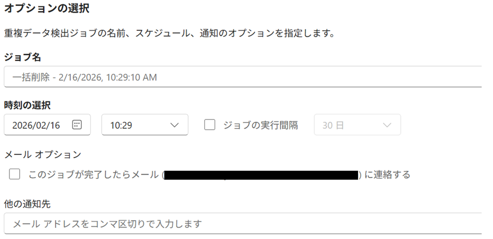

# Dataverse 容量不足を解消！一括削除機能の使い方と注意点まとめ

こんにちは、Power Platformサポートチームの中下です。

本記事ではDataverse の容量削減について、以下の Q1〜Q5 の質問に回答する形でご説明させていただきます。

- [Q1: Dataverse の「一括削除」とは、どのような機能ですか？](#q1)
- [Q2: 一括削除の具体的な設定手順を教えてください](#q2)
- [Q3: 監査ログもこの機能で削除できますか？](#q3)
- [Q4: 実行前に気をつけるべき注意点はありますか？](#q4)
- [Q5: 削除したはずなのに容量レポートが減りません](#q5)

### この記事でわかること
- Dataverse の容量（データベース、ファイル）を減らすための標準機能「一括削除」の概要
- 「30日以上前の成功したシステムジョブ」など、条件を指定して削除する方法
- 監査ログの削除が通常のレコード削除と異なる点
- 削除実行時のリスク（関連データの削除）と事前のバックアップ推奨
- 容量反映までのタイムラグについての理解

## 目次
- [Dataverse の「一括削除」とは (Q1)](#q1)
- [一括削除の設定手順 (Q2)](#q2)
- [監査ログの削除について (Q3)](#q3)
- [実行時の注意点とリスク (Q4)](#q4)
- [容量反映のタイムラグ (Q5)](#q5)

<h2 id="q1">Dataverse の「一括削除」とは (Q1)</h2>

【結論】条件を指定して大量のデータをバックグラウンドで安全に削除し、Dataverse の容量を空けるための標準機能です。

Dataverse 容量が増加すると、環境の動作パフォーマンスが低下したり、テナントの容量をひっ迫する恐れがあります。このような場合、手動で1件ずつデータを消すのは現実的ではありません。

「一括削除（Bulk Delete）」機能を使うと、例えば以下のような条件で不要なデータをまとめて削除できます。
- 「作成から 1 年以上経過した『システム ジョブ』の履歴」
- 「ステータスが完了になっている古い『電子メール』」
- 「もう使われていない『添付ファイル（メモ）』」

この処理はバックグラウンド（裏側）で実行されるため、ユーザーの業務を止めることなく行えます。また、一度だけの実行だけでなく、「30日ごとに繰り返し実行する」といったスケジュールの設定も可能です。

＜参考資料＞
- [Microsoft Dataverse ストレージ容量の解放 (Docs)](https://learn.microsoft.com/ja-jp/power-platform/admin/free-storage-space)
- [大量の特定の対象データを一括削除で削除する (Docs)](https://learn.microsoft.com/ja-jp/power-platform/admin/delete-bulk-records)

<h2 id="q2">一括削除の設定手順 (Q2)</h2>

【結論】Power Platform 管理センターの設定メニューからウィザード形式で作成します。

具体的な手順は以下の通りです。

1. **Power Platform 管理センター** にサインインします。
2. 左側のメニューから [環境] を選択し、対象の環境を開きます。
3. 上部のコマンドバー、または「設定」から [設定] > [データ管理] > [一括削除] をクリックします。
4. 一括削除の管理画面が開きますので、[新規] をクリックしフォームを開きます。
6. **レコード、検索条件の選択**:
    - [エンティティを検索する] のドロップダウンから削除したいテーブル（例: システム ジョブ）を選びます。
    - 条件を指定します（例: [状態] [等しい] [成功]、[完了日] [次の値より古い] [1 か月] など）。
    - 画面下の [レコードをプレビューする] ボタンを押すと、削除対象となるデータを確認できます。意図しないデータが含まれていないか必ず確認しましょう。

7. **オプションの選択**:
    - ジョブに名前を付けます。
    - [一括削除ジョブの開始時刻] を設定します（業務時間外の夜間などが推奨されます）。
    - 定期的に実行したい場合は、[ジョブの実行間隔] にチェックを入れ、日数（例: 30日ごと）を指定します。
    - 完了時にメール通知が必要な場合は、通知を送るユーザーを選択します。
8. 内容を確認して [送信] をクリックします。

これでジョブが登録され、指定した日時に削除処理が開始されます。

＜参考資料＞
- [大量の特定の対象データを一括削除で削除する (Docs)](https://learn.microsoft.com/ja-jp/power-platform/admin/delete-bulk-records)

<h2 id="q3">監査ログの削除について (Q3)</h2>

【結論】監査ログは通常の一括削除ウィザードではなく、「監査ログ管理」から期間単位で削除します。

「監査ログ（Audit Log）」は、誰がいつデータにアクセスしたか、変更したかを記録する重要なデータです。これは通常のテーブル（行）とは異なる仕組みで保存されているため、Q2 で紹介した一括削除ウィザードでは削除できません。

監査ログを削除して「ログ容量」を空けるには、以下の手順を行います。

1. Power Platform 管理センターで、対象の環境の [設定] > [監査とログ] > [監査ログ管理] を開きます。
2. ログが期間ごとにリスト表示されます。
3. 最も古いログ、または特定の期間のログを選択し、[ログの削除] を実行します。

以前は「最も古いログから順にしか消せない」という制約がありましたが、現在は特定の期間を選んで削除できる柔軟な管理が可能になっています。

＜参考資料＞
- [監査ログ データの削除 (Docs)](https://learn.microsoft.com/ja-jp/power-platform/admin/audit-log-deletion)
- [Dataverse 監査の概要 (Docs)](https://learn.microsoft.com/ja-jp/power-platform/admin/audit-data-user-activity)

<h2 id="q4">実行時の注意点とリスク (Q4)</h2>

【結論】一度削除したデータは元に戻せません。また、定期実行の設定を変更するとジョブが解除されてしまうため注意が必要です。

一括削除を実行する前に、以下のリスクと「よくある失敗」を確認してください。

【ポイント】
1. **一括削除で削除されたレコードの復元機能はございますが、対応していないデータもあるので注意しましょう（ゴミ箱機能は制限があります）**
    - 現在、削除されたデータを復元する機能（ゴミ箱）がプレビューとして提供されていますが、すべてのデータには対応していません。
    - 特に、容量削減のためによく削除される **「システム ジョブ」などは復元の対象外** となっているため、一括削除で消してしまうと元に戻せません。
    - 「あとで戻せるから大丈夫」と過信せず、消してはいけないデータが含まれていないか慎重に確認してください。

2. **「関連するデータ」も一緒に消えることがあります**
    - 例えば「取引先（会社）」のデータを消すと、その会社に紐付いている「担当者」や「やり取り履歴」も自動的に一緒に消える設定になっていることが多いです。
    - 消すつもりのなかったデータまで巻き込んで消えてしまわないか、事前にプレビュー機能でよく確認しましょう。

3. **みんなが使っていない時間に実行しましょう**
    - 大量のデータを消す作業は、コンピューターに大きな負荷がかかります。お昼休みや夜間など、システムを使う人が少ない時間に実行するように設定するのがおすすめです。

＜参考資料＞
- [環境のバックアップと復元 (Docs)](https://learn.microsoft.com/ja-jp/power-platform/admin/backup-restore-environments)
- [テーブルの関連付けの動作 (Docs)](https://learn.microsoft.com/ja-jp/power-apps/maker/data-platform/create-edit-entity-relationships#table-relationship-behavior)
- [削除されたテーブル レコードを復元する - プレビュー (Docs)](https://learn.microsoft.com/ja-jp/power-platform/admin/restore-deleted-table-records)
- [削除されたレコード機能で現在サポートされていないテーブル](https://learn.microsoft.com/ja-jp/power-platform/admin/restore-deleted-table-records#tables-not-currently-supported-for-the-deleted-records-feature)

<h2 id="q5">容量反映のタイムラグ (Q5)</h2>

【結論】削除後、容量レポートに反映されるまで最大 24 〜 48 時間かかる場合があります。

「一括削除ジョブが『成功』になったのに、管理センターの容量グラフが減っていない」というお問い合わせをよくいただきます。これは不具合ではなく、仕様によるタイムラグです。

Dataverse の容量計算はリアルタイムではなく、非同期の集計処理によって行われています。削除処理が完了してから、その結果が容量レポートの数値に反映されるまで、通常 24 時間程度、場合によっては 48 時間ほどかかることがあります。

削除直後に減っていなくても焦らず、翌日以降に再度確認してみてください。もし数日経っても変化がない場合は、削除したデータ量が全体に対して微々たるものだった可能性や、インデックス等のシステム領域が再計算されていない可能性が考えられます。

＜参考資料＞
- [新しい Microsoft Dataverse ストレージ容量 - 容量ページの詳細 (Docs)](https://learn.microsoft.com/ja-jp/power-platform/admin/capacity-storage#capacity-page-details)

<h2 id="summary">まとめ</h2>

Dataverse の容量不足は、システムの安定稼働に関わる重要な課題です。手動での対応には限界があるため、「一括削除機能」を有効活用して、定期的に不要なデータをクリーニングする運用を自動化しましょう。

- **一括削除機能**: 条件を指定して大量データをバックグラウンドで削除できる。
- **監査ログ**: 専用の管理画面から削除する。
- **注意点**: 復元できないためバックアップを推奨。関連データの削除に注意。
- **反映**: 容量レポートへの反映には 1〜2 日かかることがある。

まずは「成功した古いシステムジョブ」など、業務影響のない安全なデータから削除設定を試してみることをおすすめします。

<h2 id="notice">注意事項（情報の更新可能性）</h2>
本記事の内容は執筆日時点の公開情報に基づいております。仕様や UI、制限事項は将来変更される可能性がございます。最新情報は公式ドキュメントをご確認くださいますようお願い申し上げます。
