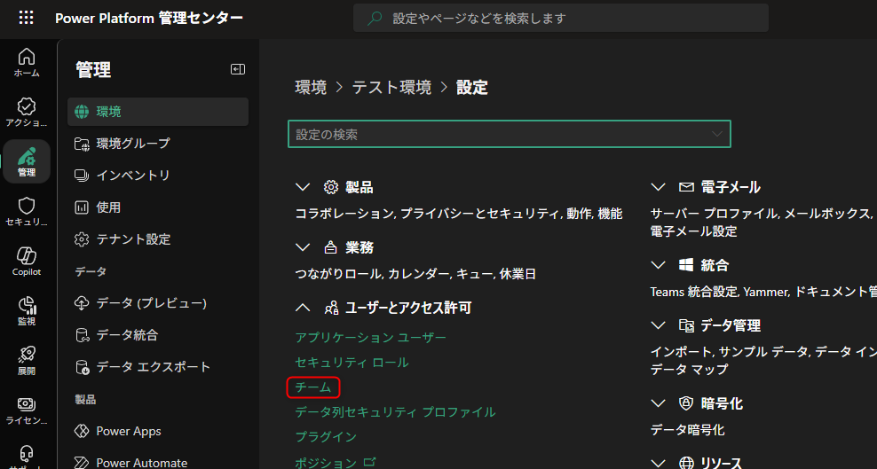
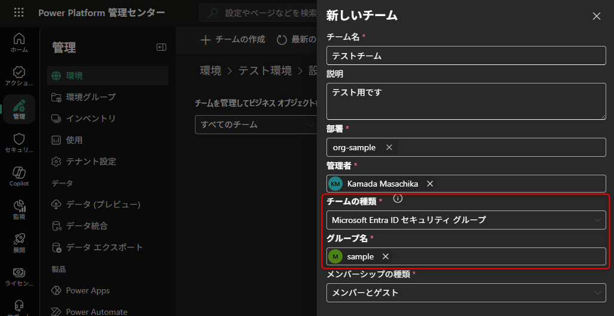
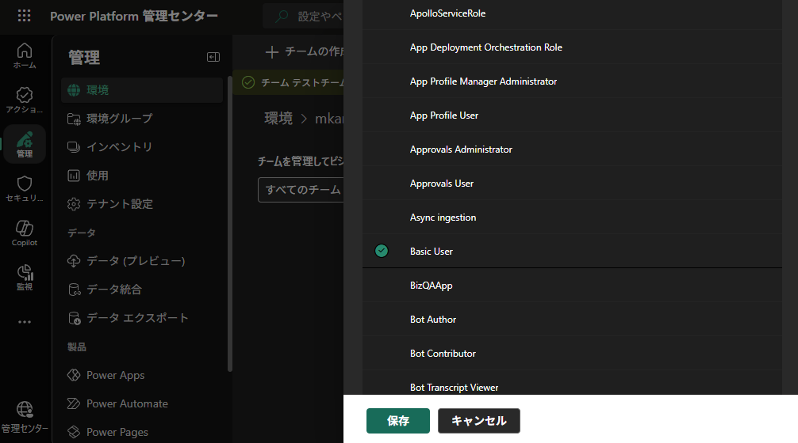

# Dataverse グループ チームによるユーザー・ロールの一元管理

こんにちは、Power Platform サポートチームの鎌田です。

Dataverse では、Microsoft Entra ID のセキュリティ グループや Microsoft 365 グループと連携する **グループ チーム** を作成できます。
グループ チームを活用すると、Microsoft Entra ID 側のグループ メンバーシップに基づいて、Dataverse 環境のユーザーとセキュリティ ロールを一元管理できます。
<!-- more -->

本記事では、グループ チームの概要・作成手順と、サポートへよくお寄せいただくご質問についてまとめています。

<!-- no toc -->
- [Dataverse のチームの種類](#team-types)
- [グループ チームのメリット](#benefits)
- [グループ チームの作成手順](#create-group-team)
- [セキュリティ ロールの割り当て](#assign-security-role)
- [よくあるお問い合わせ](#faq)
  - [メンバーシップの種類について](#membership-type)
  - [グループ チームに一部のメンバーしか表示されない](#partial-members)
  - [チームから継承されたセキュリティ ロールが確認できない](#inherited-role-not-visible)
  - [入れ子の Microsoft Entra グループのメンバーが環境に自動追加されない](#nested-group)
  - [グループ チーム経由のセキュリティ ロールに対応していない機能](#unsupported-features)
- [関連する公開情報](#references)

## Dataverse のチームの種類

Dataverse には以下の 4 種類のチームがあります。Power Platform 管理センターの「チームの種類」ドロップダウンで選択できます。

| | 所有者 | アクセス | Microsoft Entra ID セキュリティ グループ | Microsoft Entra ID オフィス グループ |
|---|---|---|---|---|
| セキュリティ ロールの割り当て | 可 | 不可 | 可 | 可 |
| レコードの所有 | 可 | 不可 | 可 | 可 |
| Microsoft Entra グループとの連動 | なし | なし | あり | あり |
| メンバー管理 | 手動 | 手動 | 自動同期 | 自動同期 |

このうち「Microsoft Entra ID セキュリティ グループ」と「Microsoft Entra ID オフィス グループ」の 2 つが、本記事で扱う **グループ チーム** に該当します。現時点ではこの 2 種類のグループ チームに機能差はなく、紐づける Microsoft Entra ID グループの種類に応じて選択します。

**所有者チーム** は部署に紐づいて自動作成されるチームで、ユーザーを手動で追加してセキュリティ ロールを割り当てます。環境には最低 1 つの所有者チームが存在します。

**アクセス チーム** はセキュリティ ロールの割り当てやレコードの所有ができないチームです。チーム自体にレコードへのアクセス権を付与できるため、セキュリティ ロールに依存しない一時的なアクセス制御に利用されます。

## グループ チームのメリット

グループ チームを導入する主なメリットは以下の通りです。

- **ユーザー管理の自動化** : Microsoft Entra ID のグループにユーザーを追加・削除するだけで、Dataverse 環境へのアクセス権が自動的に反映されます。管理者が環境ごとにユーザーを個別に追加する必要はありません。
- **セキュリティ ロールの一括付与** : グループ チームにセキュリティ ロールを割り当てておくことで、グループに所属するすべてのメンバーにロールが継承されます。「管理者グループにはシステム管理者ロール」「開発者グループには Environment Maker ロール」といった運用が可能です。
- **異動・退職時の自動反映** : Microsoft Entra ID のグループからユーザーが削除されると、そのユーザーは Dataverse のグループ チームからも自動的に除外され、継承されていたセキュリティ ロールも失効します。

## グループ チームの作成手順

グループ チームは Power Platform 管理センターから作成します。

1. [Power Platform 管理センター](https://admin.powerplatform.microsoft.com) にサインインし、対象環境の **設定** > **ユーザーとアクセス許可** > **チーム** を選択します。
   
2. **+ チームの作成** を選択します。
3. 各フィールドを入力します。

   | フィールド | 入力内容 |
   |---|---|
   | チーム名 | 任意の名称 (部署内で一意) |
   | 説明 | チームの用途などを記載 |
   | 部署 | 対象の部署を選択 |
   | 管理者 | チームの管理者となるユーザーを選択 |
   | チームの種類 | **Microsoft Entra ID セキュリティ グループ** または **Microsoft Entra ID オフィス グループ** を選択 |

4. チームの種類で上記いずれかを選択すると、以下の追加フィールドが表示されます。

   | フィールド | 入力内容 |
   |---|---|
   | グループ名 | 紐づける Microsoft Entra ID グループを検索・選択 |
   | メンバーシップの種類 | 後述の [メンバーシップの種類について](#membership-type) を参照 |

   

チームを作成すると、紐づけた Microsoft Entra グループのメンバーが環境にアクセスしたタイミングで、自動的にグループ チームに追加されます。

## セキュリティ ロールの割り当て

作成したグループ チームにセキュリティ ロールを割り当てることで、メンバー全員にそのロールを継承させることができます。

1. Power Platform 管理センターの **チーム** 一覧から対象のチームを選択します。
2. **セキュリティ ロールの管理** を選択します。
3. 割り当てるセキュリティ ロールを選択し、**保存** を選択します。
   

## よくあるお問い合わせ

### メンバーシップの種類について

グループ チーム作成時に指定する「メンバーシップの種類」は、Microsoft Entra ID グループのどのメンバーを Dataverse のグループ チームに含めるかを決定します。

| メンバーシップの種類 | 対象 |
|---|---|
| メンバー | グループのメンバー (ゲスト ユーザーを除く) |
| ゲスト | グループのゲスト ユーザーのみ |
| メンバーとゲスト | メンバーとゲスト ユーザーの両方 |
| 所有者 | グループの所有者 |

一般的なユースケースでは、**メンバー** または **メンバーとゲスト** を選択するケースが多いです。
なお、メンバーシップの種類はグループ チーム作成後に変更できません。変更が必要な場合は、グループ チームを削除して再作成する必要があります。

### グループ チームに一部のメンバーしか表示されない

これは想定される動作です。グループ チームのメンバー一覧には、**実際に環境へアクセスしたユーザーのみ** が表示されます。

Microsoft Entra グループのメンバーであっても、まだ環境にアクセスしていないユーザーは一覧に表示されません。ユーザーが環境 (キャンバス アプリやモデル駆動アプリなど) に初めてアクセスした時点で、グループ チームに追加されます。

> [!NOTE]
> グループ チームのメンバー一覧は、Microsoft Entra グループ全体のメンバーを表示するものではありません。環境にアクセス済みのユーザーのみが表示される仕様です。
> (参考 : [グループ チームを編集する](https://learn.microsoft.com/ja-jp/power-platform/admin/manage-group-teams#edit-a-group-team))

### チームから継承されたセキュリティ ロールが確認できない

Power Platform 管理センターのユーザー画面では、ユーザーに **直接割り当てられた** セキュリティ ロールのみが表示されます。グループ チーム経由で継承されたロールはこの画面には表示されませんが、グループ チームへのセキュリティ ロール割り当てとユーザーのグループ メンバーシップが正しく構成されていれば、ロールは正常に継承されています。

グループ チームに割り当てられたセキュリティ ロールを確認するには、Power Platform 管理センターの **チーム** 一覧から対象のグループ チームを選択し、**セキュリティ ロールの管理** を参照してください。

### 入れ子の Microsoft Entra グループのメンバーが環境に自動追加されない

環境セキュリティ グループ内に入れ子 (ネスト) されたセキュリティ グループのメンバーは、環境に事前プロビジョニングされません。これは仕様による動作です。

ただし、入れ子のセキュリティ グループに対してグループ チームを作成し、セキュリティ ロールを割り当てておくことで、そのグループのメンバーが環境にアクセスしたタイミングで自動的にチームに追加され、セキュリティ ロールが継承されます。(参考 : [セキュリティ グループとライセンスで環境へのユーザーアクセスを制御する](https://learn.microsoft.com/ja-jp/power-platform/admin/control-user-access))

### グループ チーム経由のセキュリティ ロールに対応していない機能

ほとんどの機能でグループ チーム経由のセキュリティ ロール継承がサポートされていますが、一部対応していない機能があります。

| 機能 | 制限事項 |
|---|---|
| [環境ピッカー](https://learn.microsoft.com/ja-jp/power-platform/admin/manage-teams#types-of-teams) | Microsoft Entra グループ チームのメンバーであるユーザーと、セキュリティ ロールが直接割り当てられているユーザーのみが認識されます |
| [Copilot in Power Apps](https://learn.microsoft.com/ja-jp/power-apps/maker/canvas-apps/ai-conversations-create-app) | セキュリティ ロールをユーザーに直接付与する必要があります |

## 関連する公開情報

- [Microsoft Dataverse チーム管理](https://learn.microsoft.com/ja-jp/power-platform/admin/manage-teams)
- [グループ チームの管理](https://learn.microsoft.com/ja-jp/power-platform/admin/manage-group-teams)
- [Microsoft Entra ID グループ チームとの連携](https://learn.microsoft.com/ja-jp/power-apps/developer/data-platform/aad-group-team)
- [環境へのユーザー アクセスのコントロール](https://learn.microsoft.com/ja-jp/power-platform/admin/control-user-access)
