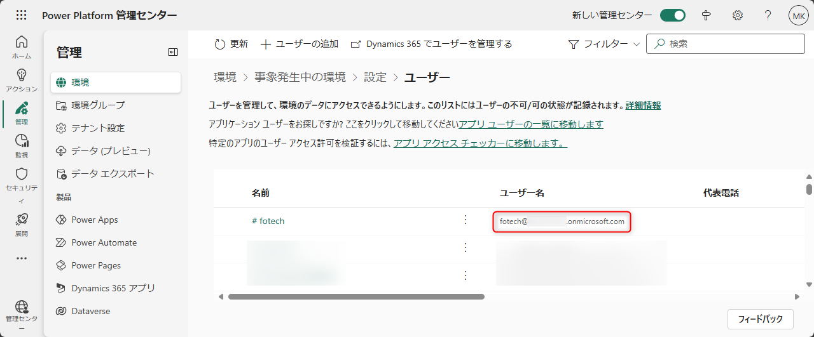
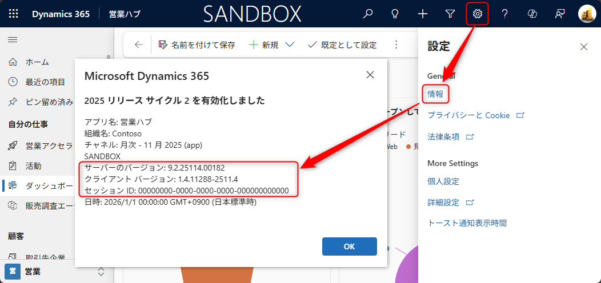
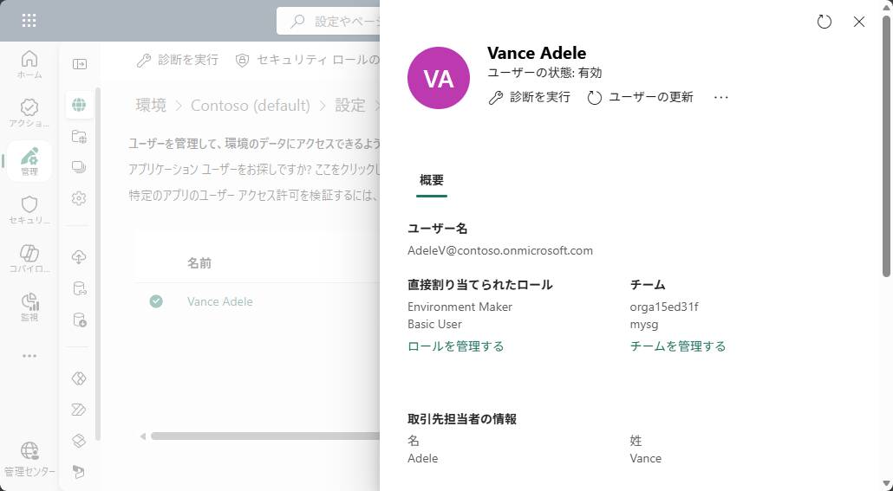
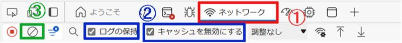
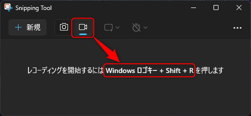

# Dynamics 365 トラブルシューティングのための情報収集ガイド

こんにちは、Power Platform サポートチームの鎌田です。

本記事では、Dynamics 365 に関するお問い合わせの際に必要となる情報の取得手順をご説明します。
適切な情報をご提供いただくことで、問題の早期解決につながります。

<!-- more -->

## 目次

1. [識別情報の取得](#identification-info)
   1. [環境 URL](#environment-url)
   2. [UPN（ユーザー プリンシパル名）](#upn)
   3. [セッション ID・バージョン情報](#session-id)
2. [セキュリティロールとチームの確認](#security-role-and-team)
3. [診断情報の取得](#diagnostic-info)
   1. [ネットワーク トレース（HAR ファイル）](#network-trace)
   2. [動画の録画](#video-recording)

---

## 1. 識別情報の取得

サーバー側のログ調査に必要な識別情報です。

### 1-1. 環境 URL

1. Dynamics 365 にサインインします
2. ブラウザのアドレスバーから URL をコピーします
例: `https://contoso.crm7.dynamics.com`

### 1-2. UPN（ユーザー プリンシパル名）

事象が発生しているユーザーを特定するために必要です。
例: `user@contoso.onmicrosoft.com`

Power Platform 管理センターで環境を開き、[設定] > [ユーザーとアクセス許可] > [ユーザー] のユーザー名よりご確認いただけます。

### 1-3. セッション ID・バージョン情報

1. Dynamics 365 アプリの画面右上の歯車アイコンをクリックします
2. 「情報」をクリックするとダイアログに情報が表示されます

---

## 2. セキュリティロールとチームの確認

アクセス権限に関連する問題の調査に必要です。

1. Power Platform 管理センターで環境を開き、[設定] > [ユーザーとアクセス許可] > [ユーザー] を開きます
2. 対象ユーザーをクリックします
3. サイドバーの「直接割り当てられたロール」から、割り当てられたセキュリティ ロールの一覧を確認できます（チーム経由で割り当てられたロールはここには表示されません）
4. サイドバーの「チーム」から、所属しているチームの一覧を確認できます

---

## 3. 診断情報の取得

問題の詳細な調査に必要な診断情報です。

### 3-1. ネットワーク トレース（HAR ファイル）

ブラウザと Dynamics 365 サーバー間の通信を記録します。
ネットワーク トレースとは、ブラウザーがページを表示するために送受信した通信を時系列で記録したものです。
問題が発生した操作を記録し HAR ファイルとして共有いただくことで、調査がスムーズになります。

> [!IMPORTANT]
> **事象再現の直前**に取得を開始し、**事象を再現させた直後**に保存してください。不要な通信が増え肝心な要求が埋もれるため、不要なページ遷移はせず最小の再現だけに留めてください。

**取得手順（Microsoft Edge）：**
1. ブラウザで `F12` キーを押し、開発者ツールを開き、「ネットワーク」タブを選択します
2. 以下のオプションを有効にします：
   - 「ログを保持」にチェック
   - 「キャッシュを無効にする」にチェック
3. 「クリア」ボタンで古いログを消去します
   
4. 事象を**最小の手順で 1 回だけ**再現させます
5. 再現後、「Export HAR」ボタン（↓アイコン）をクリックして保存します（ファイル名は `YYYYMMDD_issue.har` のように日付と概要を含めてください）
   

**参考資料：** [ブラウザー トレースの取得（Azure Portal）](https://learn.microsoft.com/ja-jp/azure/azure-portal/capture-browser-trace)

### 3-2. 動画の録画

事象再現時の動画があると、発生状況をより正確に把握できます。

> [!IMPORTANT]
> 事象発生の**事前**に録画を開始し、事象発生を確認した**後**に停止してください。

#### Snipping Tool での画面録画

1. `Windows + Shift + S` キーを押して Snipping Tool を起動、または検索から「Snipping Tool」を起動します
2. 動画ボタン（ビデオカメラアイコン）をクリックします
   
3. 録画する画面の範囲をドラッグで選択し、「スタート」をクリックして録画を開始します
   
4. 事象を再現させます
5. 録画停止ボタンを押して終了し、ファイルを保存します

#### その他の録画方法

- [PowerPoint で画面を記録する](https://support.microsoft.com/ja-jp/office/powerpoint-%E3%81%A7%E7%94%BB%E9%9D%A2%E3%82%92%E8%A8%98%E9%8C%B2%E3%81%99%E3%82%8B-0b4c3f65-534c-4cf1-9c59-402b6e9d79d0)
- [問題ステップ レコーダーの使用方法](https://learn.microsoft.com/ja-jp/office/troubleshoot/settings/how-to-use-problem-steps-recorder)
