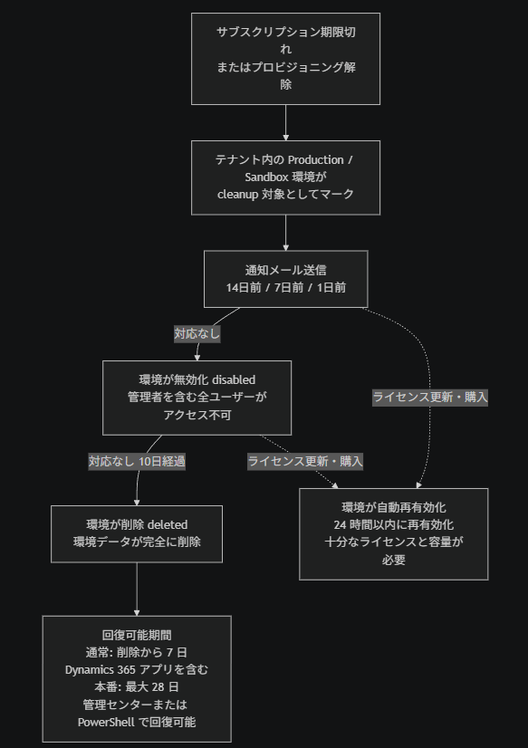

こんにちは、Power Platform サポートの王です。

サブスクリプションの有効期限が切れた際に、Power Platform の本番環境やサンドボックス環境がどのような流れで無効化・削除されるのか、というお問い合わせをいただくことがあります。  
本記事では、下記公開情報の内容をもとに、タイムラインやフロー図を用いてまとめております。

[Automatic deletion of Power Platform environments (英語)](https://learn.microsoft.com/en-us/power-platform/admin/automatic-environment-cleanup)  
[Power Platform 環境の自動削除 (日本語)](https://learn.microsoft.com/ja-jp/power-platform/admin/automatic-environment-cleanup)

<!-- more -->

## 目次
1. [対象となる環境](#anchor-target-environments)
2. [サブスクリプション期限切れ後のタイムライン](#anchor-timeline)
3. [フロー図](#anchor-flowchart)
4. [ライセンスを更新・購入した場合](#anchor-license-renewal)
5. [環境が削除されてしまった場合の回復](#anchor-recovery)
6. [よくあるご質問](#anchor-faq)
7. [参考情報](#anchor-reference)

---

<a id='anchor-target-environments'></a>

## 1. 対象となる環境

サブスクリプション期限切れに伴う自動 cleanup の対象は **本番 (Production) 環境** と **サンドボックス (Sandbox) 環境** です。  
開発者 (Developer) 環境や既定 (Default) 環境、Dataverse for Teams 環境は、サブスクリプション期限切れではなく **非アクティブ (Inactivity) ベースの cleanup** の対象となり、本記事で説明するフローとは異なります。

> **参考**: 開発者環境の自動削除については [非アクティブな開発者環境の自動削除について](../Automatic-deletion-of-inactive-Developer-environments) もあわせてご参照ください。

---

<a id='anchor-timeline'></a>

## 2. サブスクリプション期限切れ後のタイムライン

以下は、サブスクリプションが期限切れ (expired) またはプロビジョニング解除 (deprovisioned) となった後の、環境に対する処理の流れです。  
公開情報に記載の日数をベースに時系列で整理しています。

| # | タイミング | 状態 | 何が起こるか |
|---|-----------|------|-------------|
| ① | サブスクリプション期限切れ / プロビジョニング解除 | **cleanup 対象としてマーク** | テナント内の Production / Sandbox 環境すべてが、無効化および最終削除の対象としてマークされます。 |
| ② | 環境無効化の **14 日前** | マーク済み（通知） | 組織内のすべての管理者へ、環境が無効化される旨の **1 回目の通知メール** が送信されます。 |
| ③ | 環境無効化の **7 日前** | マーク済み（通知） | **2 回目の通知メール** が送信されます。 |
| ④ | 環境無効化の **1 日前** | マーク済み（通知） | **最終 (3 回目) の通知メール** が送信されます。 |
| ⑤ | 無効化日 | **環境が無効化 (disabled)** | 対応がなかった場合、環境が disabled になります。**管理者を含むすべてのユーザーが環境にアクセスできなくなります。** |
| ⑥ | 最終通知から **10 日後** | **環境が削除 (deleted)** | 無効化後もライセンスの回復等の対応がなかった場合、環境は完全に削除されます。 |
| ⑦ | 削除後 **7 日以内** (※) | 削除済み（回復可能期間） | Power Platform 管理センターまたは PowerShell コマンドレットから環境を回復できる期間です。<br>※ Dynamics 365 アプリを含む本番環境は最大 **28 日間** 回復可能です。 |

> [!NOTE]
> 上記の「環境無効化の〇日前」は、cleanup 対象としてマークされた後にシステムが設定する無効化予定日を基準とした日数です。  
> サブスクリプション期限切れ日からの具体的な経過日数は公開情報では明記されていないため、通知メールに記載された日付をご確認ください。

---

<a id='anchor-flowchart'></a>

## 3. フロー図

以下に、サブスクリプション期限切れ後の処理フローを図示します。



---

<a id='anchor-license-renewal'></a>

## 4. ライセンスを更新・購入した場合

環境が **削除される前に** 必要なライセンスと容量を更新または購入した場合、環境は **24 時間以内に自動的に再有効化** されます。

再有効化のために必要な条件は以下の通りです。

- テナント内のすべての本番環境をカバーするのに **十分なライセンス** を保有していること
- テナント内のすべての本番環境をカバーするのに **十分な Dataverse 容量** を保有していること

> [!IMPORTANT]
> ライセンスの更新・購入には組織内の承認フローや、パートナー経由での手続きなど、時間がかかるケースがあります。  
> 環境が削除されてしまうと復元の難易度が上がりますので、サブスクリプションの更新は **有効期限が切れる前に** 余裕を持ってご計画ください。

---

<a id='anchor-recovery'></a>

## 5. 環境が削除されてしまった場合の回復

万が一、環境が削除されてしまった場合でも、一定期間内であれば回復が可能です。

| 環境の種類 | 回復可能期間 |
|-----------|-------------|
| 一般的な環境 | 削除から **7 日間** |
| Dynamics 365 アプリを含む本番環境 | 削除から最大 **28 日間** |

### 回復手順 (Power Platform 管理センター)

1. [Power Platform 管理センター](https://admin.powerplatform.microsoft.com/) に管理者でサインインします。
2. ナビゲーション ペインで **管理** を選択します。
3. 管理ペインで **環境** を選択します。
4. コマンド バーの **最近削除された環境** を選択します。
5. 回復する環境を選択し、**回復** を実行します。

### 回復手順 (PowerShell)

```powershell
# 論理削除された環境の一覧を取得
Get-AdminPowerAppSoftDeletedEnvironment

# 環境を回復
Recover-AdminPowerAppEnvironment -EnvironmentName <環境名> -WaitUntilFinished $true
```

> [!NOTE]
> 環境の回復には、回復先の環境をカバーするための十分なストレージ容量が必要になる場合があります。  
> また、回復後のソリューション フローは無効状態となるため、必要に応じて手動で有効化してください。

---

<a id='anchor-faq'></a>

## 6. よくあるご質問

### Q1. サブスクリプションが切れてから何日で環境が無効化されますか？

公開情報では、サブスクリプション期限切れから環境無効化までの具体的な日数は明記されておりません。  
公開情報で確認できるのは、cleanup 対象としてマークされた後に **14 日前・7 日前・1 日前** の通知が送信され、その後に環境が無効化されるという流れです。  
そのため、通知メールに記載された日付をもとにご対応をご検討ください。

### Q2. M365 のサブスクリプションがアクティブであれば、環境は無効化されませんか？

Power Platform 環境の cleanup は、M365 サブスクリプションのライフサイクルとは **独立した仕組み** です。  
M365 側では Disabled 状態でも管理者が管理センターにアクセスできる期間がありますが、Power Platform 環境がいったん disabled になると、**管理者であっても環境にはアクセスできなくなります。**  
この 2 つは別レイヤーの動作であるため、M365 の猶予期間がそのまま Dataverse 環境に適用されるわけではない点にご注意ください。

### Q3. 開発者環境も同じ流れで無効化されますか？

いいえ。開発者環境はサブスクリプション期限切れの cleanup ではなく、**非アクティブ (Inactivity) ベースの cleanup** の対象です。  
開発者環境の場合、ユーザー活動がない状態が 30 日間続くと無効化され、無効化から 15 日後に削除されます。  
詳細は [非アクティブな開発者環境の自動削除について](../Automatic-deletion-of-inactive-Developer-environments) をご参照ください。

### Q4. 環境が無効化された後、ライセンスを購入すれば自動で復旧しますか？

環境が **無効化 (disabled) の状態で、かつまだ削除されていない場合**、必要なライセンスと容量を購入・回復すれば、**24 時間以内に自動で再有効化** されます。  
環境がすでに **削除されてしまった場合** は、上記 [5. 環境が削除されてしまった場合の回復](#anchor-recovery) の手順で回復をお試しください。

### Q5. 環境の状態が確認できない場合はどうすればよいですか？

Power Platform 管理センターから環境の状態を確認できない場合や、環境が表示されない場合は、弊社サポートまでお問い合わせください。  
環境の現在の状態や回復の可否について、サポート側で確認させていただきます。

---

<a id='anchor-reference'></a>

## 7. 参考情報

- [Automatic deletion of Power Platform environments (英語)](https://learn.microsoft.com/en-us/power-platform/admin/automatic-environment-cleanup)
- [Power Platform 環境の自動削除 (日本語)](https://learn.microsoft.com/ja-jp/power-platform/admin/automatic-environment-cleanup)
- [環境の回復 - Recover environment](https://learn.microsoft.com/ja-jp/power-platform/admin/recover-environment)
- [Microsoft Power Platform のライセンスの概要](https://learn.microsoft.com/ja-jp/power-platform/admin/pricing-billing-skus)
- [非アクティブな開発者環境の自動削除について](../Automatic-deletion-of-inactive-Developer-environments)

---

> [!IMPORTANT]
> 本記事は 2026 年 4 月時点の公開情報をもとに作成しております。  
> 製品の仕様や動作は予告なく変更される場合があり、本記事の内容と実際の動作が異なる可能性がございます。  
> 正式な仕様については、上記 [参考情報](#anchor-reference) に記載の公開情報 (特に英語版) が正となりますので、あわせてご確認ください。  
> また、英語版の更新が日本語版に反映されるまでにタイムラグがある場合がございます。
