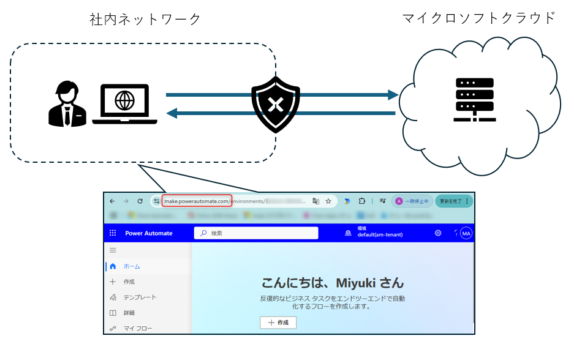
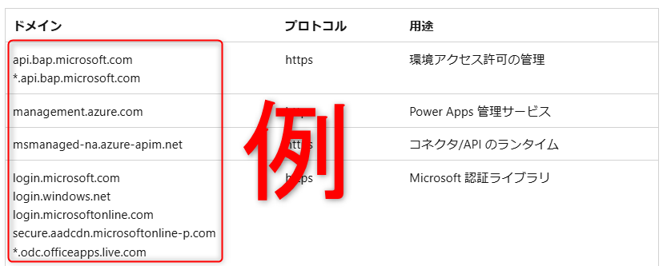
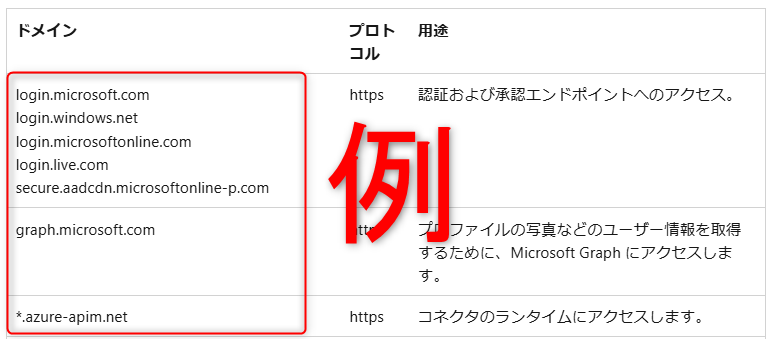
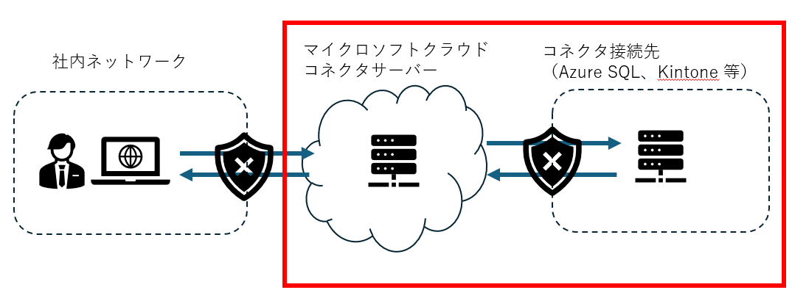
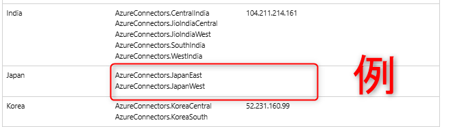
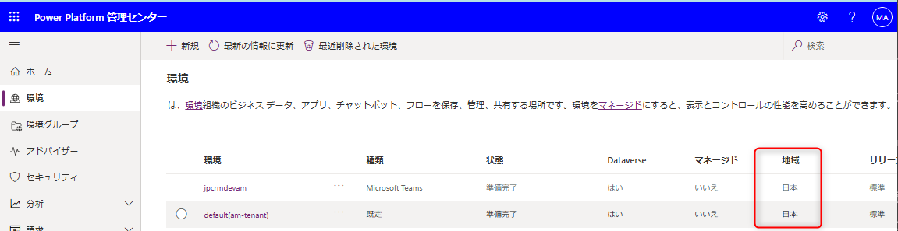

# キャンバスアプリ / Power Automate  利用時の通信要件

こんにちは、Power Platform サポートチームの網野です。  
今回は キャンバスアプリ / Power Automate  利用時の通信要件についてご案内します。 
Microsoft 365 や Azure などの製品とは別に、Power Platform 独自で通信要件を定義しており、別途対応が必要となりますのでご留意ください。

> [!IMPORTANT]
> 通信に利用するドメインや IP アドレスは定期的に変更されるため 
> 必ず [最新の公開情報](https://learn.microsoft.com/ja-jp/power-platform/admin/online-requirements) を参照し設定を行ってください。

<!-- more -->

## 通信要件とは

キャンバスアプリ / Power Automate  はクラウド上に展開されたサービスであり、クラウドサービスへアクセスする、またはクラウドサービスからアクセスされる際に、特定のドメインや IP アドレスへ片方向または双方向の通信が発生します。Power Platform では通信に必要な要件を定義し、通信要件として Power Platform の公開情報に記載しています。 

例えば、会社に出社し、社内のネットワークから Power Automate ポータルにアクセスする場合、社内ネットワークから、"https://make.powerautomate.com/" へリクエストが投げられ、Power Automate ポータルから応答を受け取ります。 

 

このときに、社内ネットワークのセキュリティソフト等（盾マーク）にて通信が遮断されると、エラー等が発生し、製品利用に問題が生じる場合があります。 
そのため、利用する IP アドレスやドメインに制限をかけている場合は、それぞれの製品に必要な IP アドレスやドメインを許可する必要があります。 

以下に製品ごとに許可が必要なドメイン、IP アドレスを記載します。 

### キャンバスアプリ

1. キャンバスアプリにアクセスするネットワークに対して、[必要なサービス](https://learn.microsoft.com/ja-jp/power-apps/limits-and-config#required-services)に記載されているすべてのドメインを許可してください。 
  

1. コネクタ接続先に対して、[コネクタ](#anchor-connector) に必要な通信を許可してください。

### Power Automate
1. Power Automate にアクセスするネットワークに対して、[IP アドレスの構成](https://learn.microsoft.com/ja-jp/power-automate/ip-address-configuration)ページに記載されているドメインを許可してください。 
   モバイルアプリやデスクトップフローなど利用するサービスに応じて設定してください。 
   

1. コネクタ接続先に対して、[コネクタ](#anchor-connector) に必要な通信を許可してくださ

### コネクタ
コネクタと Azure SQL や Kinton などのコネクタ接続先との通信は、下図のようにマイクロソフトクラウドサーバーとコネクタ接続先で直接行われます。 
コネクタ接続先でネットワークを制限している場合はコネクタからの通信に対して許可を行ってください。
  

1. [コネクターの送信 IP アドレス](https://learn.microsoft.com/ja-jp/connectors/common/outbound-ip-addresses)に記載されているすべての IP アドレス、またはサービスタグを許可してください。 
   ほとんどのコネクタはこちらの IP アドレスから通信を行います。
   * Azure Logic Apps 
   * Power Platform
   

1. [ファイアウォールの構成:IP アドレスとサービス タグ](https://learn.microsoft.com/ja-jp/azure/logic-apps/logic-apps-limits-and-config?tabs=consumption#firewall-configuration-ip-addresses-and-service-tags)に記載されている IP アドレスまたはサービスタグを許可してください。
   HTTP コネクタや HTTP + OpenAPI コネクタ等一部のコネクタは Azure Logic Apps サービスと通信を行うため、LogicApps の IP アドレスを利用します。

   * マルチテナント - 受信 IP アドレス / サービスタグ <b>LogicAppsManagement</b> （コネクタ接続先　→　コネクタサーバー）
   * マルチテナント - 送信 IP アドレス / サービスタグ <b>LogicApps</b>  
   （コネクタ接続先　←　コネクタサーバー）
   

## まとめ

| サービス | 公開情報 | サービスタグ | 受信 / 送信
| :- | :- | :- | :- |
| キャンバスアプリ | [ドメイン](https://learn.microsoft.com/ja-jp/power-apps/limits-and-config#required-services)  | - | 両方
|^| [IP アドレス/サービスタグ](https://learn.microsoft.com/ja-jp/power-platform/admin/online-requirements#ip-addresses-required)  | AzureCloud | 両方
|^| + コネクタの IP アドレス |< | 
| Power Automate| [ドメイン](https://learn.microsoft.com/ja-jp/power-automate/ip-address-configuration)  | - | 両方
|^| + コネクタの IP アドレス |< | 
| コネクタ | [IP アドレス/サービスタグ](https://learn.microsoft.com/ja-jp/connectors/common/outbound-ip-addresses) | AzureConnectors | 両方
| ^| [IP アドレス/サービス タグ](https://learn.microsoft.com/ja-jp/azure/logic-apps/logic-apps-limits-and-config?tabs=consumption#firewall-configuration-ip-addresses-and-service-tags)  | 受信 IP：LogicAppsManagement  送信 IP：LogicApps | 受信 IP：受信  送信 IP：送信

## よくある質問

### どの地域を選べばいいですか
フローやアプリを作成している Power Platform 環境の地域を選んでください。 
  

### Microsoft 365 や Azure とは別に IP アドレスやドメインを指定する必要がありますか
はい、別で指定する必要があります。 
公開情報も分かれていますので、Power Platform を利用する場合は Power Platform の公開情報を元に設定を行ってください。

### 社内のネットワークとコネクタの接続先の通信を許可する必要はありますか。
コネクタを利用する場合は、マイクロソフトのクラウドサーバーを経由して通信するため、社内ネットワークとコネクタ接続先の許可する必要はありません。

### 利用するコネクタが限られているため、特定のコネクタが利用する通信だけ許可することはできますか。
恐れ入りますが、現時点では特定のコネクタの通信のみ許可する方法はございません。 
利用すると記載のある IP アドレスすべてを許可してください。

### IP アドレスやドメインの変更はメッセージセンター等で通知されますか
影響範囲の大きい変更がある場合は通知されることもありますが、基本的には通知されませんのでお客様にて定期的な監視をお願いしています。 
IP アドレスについてはサービスタグや[パブリック IP アドレス](https://learn.microsoft.com/ja-jp/power-platform/admin/online-requirements#ip-addresses-required) ファイルを提供していますので、こちらをご利用ください。ドメインについてはお手数ですが定期的に公開情報にてアドレスの増減がないか確認をお願いいたします。今後、pac ファイルの提供等を行い、確認作業の簡易化について取り組んでいく予定です。

### どれくらいの頻度で確認したほうがいいですか
最低でも月に 1 度はご確認をお願いいたします。 

### IP アドレスやドメインをホワイトリストに追加しない状態で使うことができていますが、追加しなくてもいいですか。
いいえ、ホワイトリストに追加し、接続できるようにしてください。 
未利用の機能で使われているため新しく機能を使うときにエラーが出る可能性があります。 
また、機能変更で新しい接続先を使うようになり、急にエラーとなる可能性があります。

---
