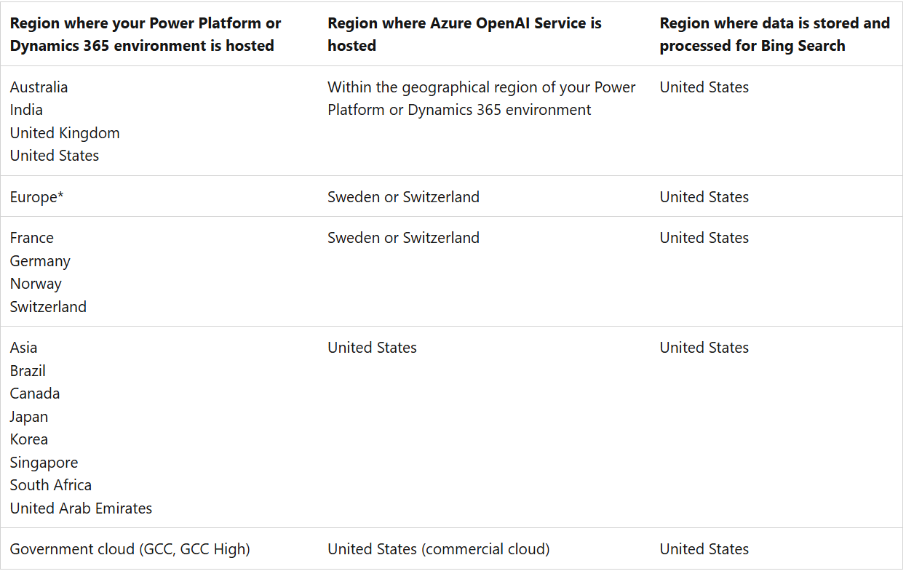
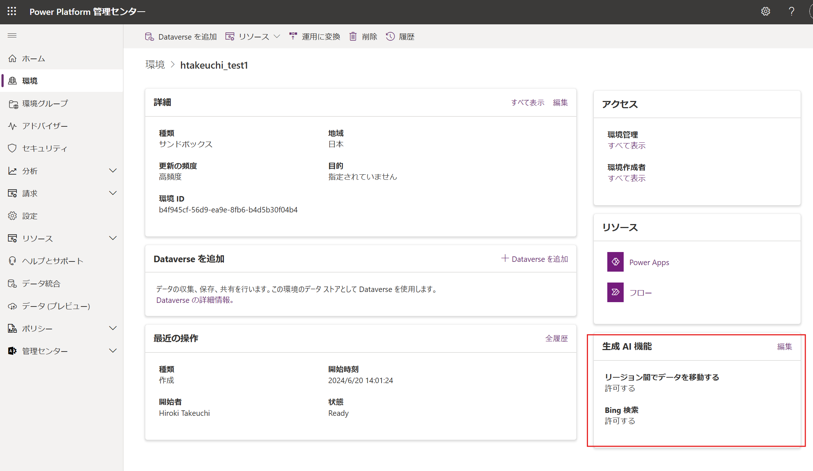
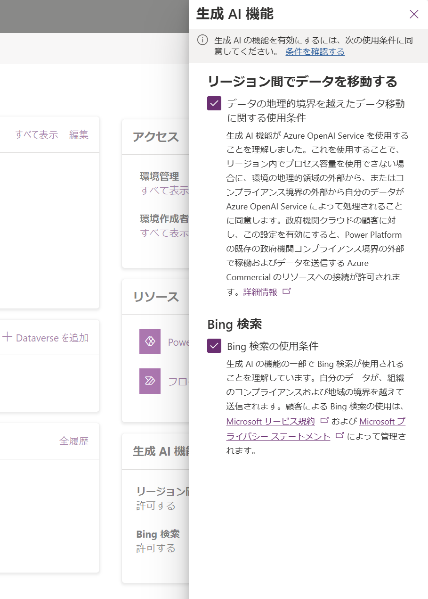
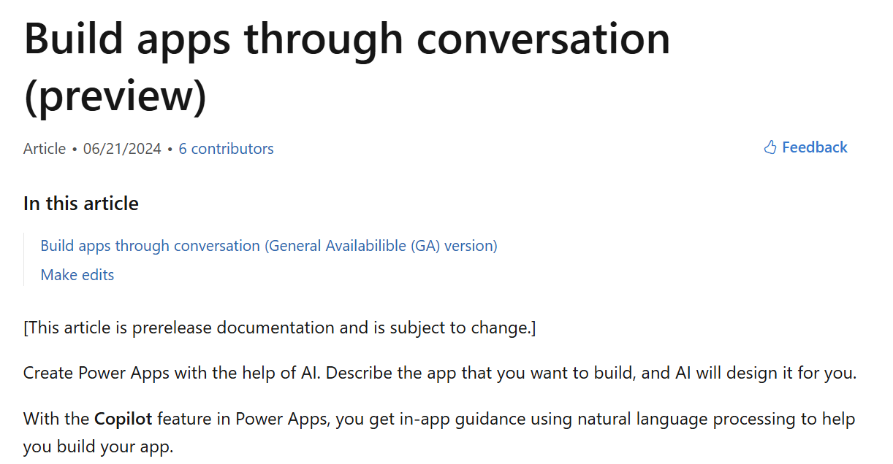
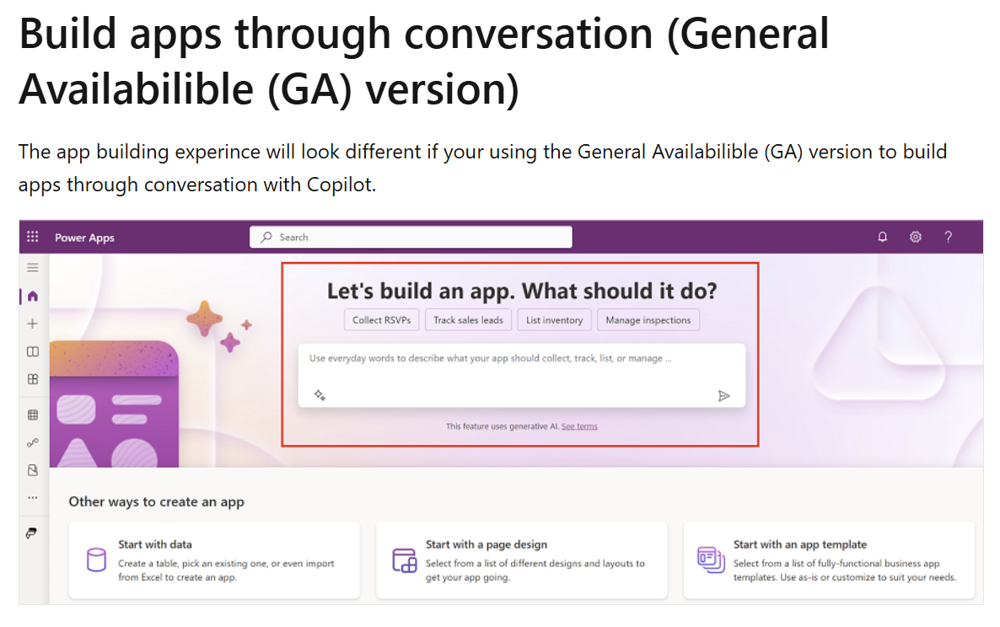
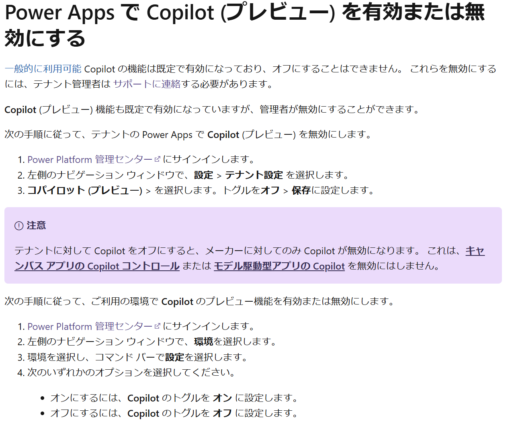
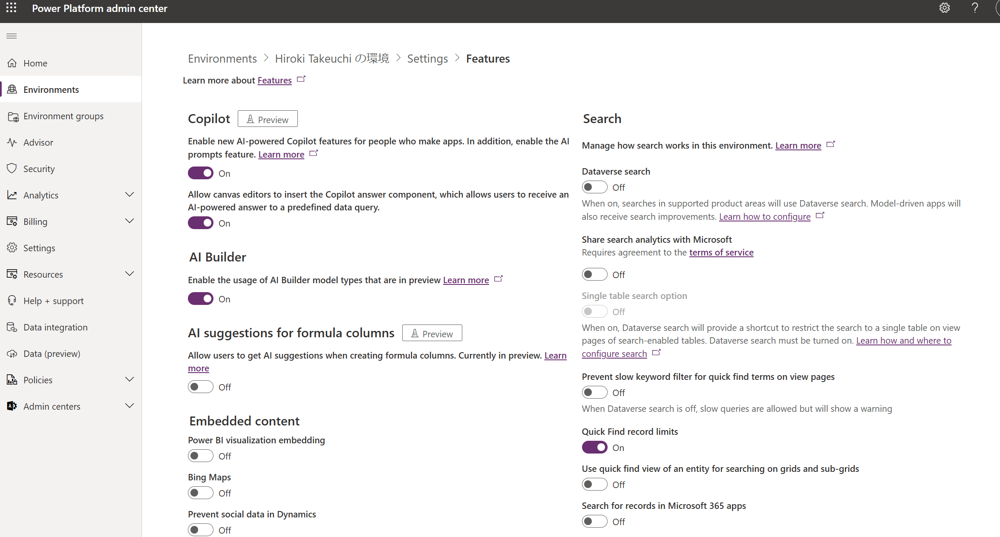

# Power Platform における Copilot の無効化方法

こんにちは、Power Platform サポートチームの竹内です。  
Microsoft の提供する生成 AI の Copilot は Power Platform の随所で使用することができます。  
今回は、それらの機能の一部、あるいは全部を無効化、制御する方法についてご案内いたします。  

<!-- more -->
# 目次

1. [Power Platform 環境設定で環境レベルで Copilot 機能を無効化する](#disable-in-power-platform)
2. [Power Automate における Copilot の無効化](#disable-in-power-automate)
3. [Power Apps における Copilot の無効化](#disable-in-power-apps)
4. [Copilot Connector や AI Builder の無効化](#disable-connector-aibuilder)

## Power Platform 環境設定で環境レベルで Copilot 機能を無効化する
### Power Platform における Copilot 機能無効化の概要

データをホストしているリージョンと Copilot 出力を得ることができるリージョンが異なるため、リージョン間データ移動をオフにすると、リージョンを跨いだデータ移動を要する Copilot 機能を使用することができなくなります。 

なお、日本で Copilot を使用している場合、Power Platform または Dynamics 365 環境がホストされる地域は日本となり、Azure OpenAI Service および Bing 検索のデータをホストしているリージョンはアメリカとなります。
(2024年8月15日時点)  

最新情報については下記の公開情報をご参照ください。  
[コパイロットと生成 AI 機能をオンにする](https://learn.microsoft.com/ja-jp/power-platform/admin/geographical-availability-copilot#regions-involved-with-copilots-and-generative-ai-features)

<!-- 

 
-->

設定方法や、Power Platform 各製品で無効化できる機能等、更なる詳細についてはこちらの公開文書（[Turn on copilots and generative AI features - Power Platform | Microsoft Learn](https://learn.microsoft.com/ja-jp/power-platform/admin/geographical-availability-copilot#enable-data-movement-across-regions)）をご参照ください。  
なお、PowerShellコマンド実行から管理する方法もございます。それに関しては、下記の公開文書をご参照ください。（[Set-PowerPlatformGenerativeAiSettings (Microsoft.PowerApps.Administration.PowerShell) | Microsoft Learn](https://learn.microsoft.com/ja-jp/powershell/module/microsoft.powerapps.administration.powershell/set-powerplatformgenerativeaisettings?view=pa-ps-latest)）  

 

また、Copilot に関する機能は現在多くの変更がされておりますので、最新情報についてはこちらのリリースプランのページ（[Release Planner Availability Reports  · Microsoft Release Planner](https://releaseplans.microsoft.com/ja-jp/availability-reports/?report=copilotproductreport)）も合わせてご参照ください。
こちらのページでは、Power Platform および Dynamics 各製品/地域/言語/リリースバージョンによる Copilot 利用可能機能についての最新情報がレポートとしてまとめられております。

 

### Power Platform における Copilot 機能無効化の手順
リージョン間のデータ移動をオフにすることで、Power Platform 全体で Copilot の一部機能を無効化することができます。 
無効化できる機能の詳細については下記の公開文書をご参照ください。  
[コパイロットと生成 AI 機能は、地域をまたいだデータ移動を可能にした場合に利用できます](https://learn.microsoft.com/ja-jp/power-platform/admin/geographical-availability-copilot#copilots-and-generative-ai-features-that-are-available-when-you-enable-data-movement-across-regions)

具体的な手順は下記のとおりです。  
[Power Platform 管理センター (Power Platform Admin Center)](https://admin.powerplatform.microsoft.com/) で特定の環境を選択し、環境の「生成AI機能」カードを編集します。  
「リージョン間データ移動 (the Move data across regions)」のチェックボックスをオフにします。  
 

 

 
 

Power Platform 全体での Copilot の制御、無効化方法については以上となります。  
**以降では、Power Automate と Power Apps それぞれについて、テナントレベル、環境レベルでの Copilot 機能の管理、無効化方法についてご案内いたします。**

## Power Automate における Copilot の無効化

### Power Automate における Copilot 機能の概要
Power Automate 中では、こちらの公開文書（[Copilot in Power Automate - Power Automate | Microsoft Learn](https://learn.microsoft.com/ja-jp/power-automate/copilot-overview)）に表されているような、多くの Copilot 機能が提供されております。

### Power Automate における Copilot 機能の無効化
Copilotを無効化するには以下の手順の操作を実行してください。
1. リージョンを確認する  
   リージョンの確認方法などについてはこちらの公開文書（[Choose the region when setting up an environment - Power Platform | Microsoft Learn](https://learn.microsoft.com/ja-jp/power-platform/admin/regions-overview)）をご参照ください。  
   リージョンがGPUを保有しているか否か、具体的には以下のリストに含まれるかどうかにより以降の手順が異なります。
  - UK
  - Australia
  - US
  - India

2. 無効化する
   - リージョンが上記である場合：
     - テナントレベル：管理者がサポートに連絡する
     - 環境レベル：設定不可
   - リージョンが上記でない場合：
     - テナントレベル：管理者が Power Platform 管理センター等からリージョン間データ移行を無効化する
     - 環境レベル：管理者が Power Platform 管理センター等からリージョン間データ移行を無効化する

### Power Automate における Copilot 機能の無効化の確認
こちらの公開文書（[プログラム可能性と拡張性 - Power Platform API - 2020-10-01 - テナント設定の一覧表示 (プレビュー) - Power Platform | Microsoft Learn](https://learn.microsoft.com/ja-jp/power-platform/admin/list-tenantsettings)）に記載のある HTTP 要求をして、下記のプロパティ値を参照することにより、無効化されているかを確認することができます。
> powerPlatform.powerAutomate.disableCopilot   
> powerPlatform.powerAutomate.disableCopilotWithBing   

## Power Apps における Copilot の無効化

### Power Apps における Copilot 機能の概要
キャンバスアプリやモデル駆動型アプリなど、それぞれの項目で利用可能な Copilot の情報がまとめられておりますので、こちらの公開文書をご参照ください。（[Copilot in Power Apps overview - Power Apps | Microsoft Learn](https://learn.microsoft.com/ja-jp/power-apps/maker/canvas-apps/ai-overview)）

### Power Apps における Copilot features の分類と無効化
Power Apps における Copilot 機能の無効化についてはこちらの公開文書も合わせてご参照ください（
[Enable or disable Copilot (preview) in Power Apps](https://learn.microsoft.com/ja-jp/power-apps/maker/canvas-apps/ai-overview#enable-or-disable-copilot-preview-in-power-apps) ）。

- Power Apps における Copilot の機能には **General available (GA) features** と **Preview features** がございます。
- General available Copilot features のリリース情報などは[こちらのリリースプラン](https://learn.microsoft.com/ja-jp/dynamics365/release-plans/)をご参照ください。
- あるいは、各機能の公開文書ページにどちらの機能であるかの記載がございます（英語版でのみ表示される場合などございますので、必要に応じて設定を切り替える等していただくようお願いいたします。）。  
  例：[Build apps through conversation - Power Apps | Microsoft Learn](https://learn.microsoft.com/en-us/power-apps/maker/canvas-apps/ai-conversations-create-app)

<!--
 

 

-->

 
 

無効化方法：
- General available Copilot features はデフォルトで有効化されており、お客様の操作によって無効化することはできません。
  - これらを無効化するためには、テナント管理者がMSサポートに連絡する必要がございます。
  - なお、無効化ができるのはテナント単位のみであり、環境単位では無効化することができません。

- Copilot preview features はデフォルトで有効化されているが、これは管理者によって無効化することができます。
  - テナント単位での設定と環境単位での設定方法がございます。
  - それぞれの具体的な設定方法についてはこちらの公開文書をご参照ください（[Enable or disable Copilot (preview) in Power Apps](https://learn.microsoft.com/ja-jp/power-apps/maker/canvas-apps/ai-overview#enable-or-disable-copilot-preview-in-power-apps) ）。
  
  <!-- -->

## Copilot Connector や AI Builder の無効化
Connector や AI Builder 等の機能は上記の設定では無効化できません。具体的には、Power Automate 中の Copilot のコネクタや Power Apps 中の「GPTでテキスト生成する」などの機能です。  
これらは環境単位で Power Platform 管理センターから無効化することができます。
下記の設定画面から、無効化する機能のトグルボタンを「Off」にしてください。

 

また、Power Apps のキャンバス中に Copilot コンポーネントを埋め込む機能を無効化するのもここからできます。 

 

 

---
# おわりに

生成 AI である Copilot を Power Platform 内部で無効化する方法についてご紹介いたしました。

この記事が皆さまと Copilot との適切な付き合いの一助になりましたら幸いです。