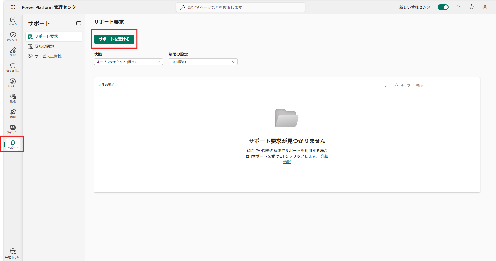

# Power Platform 管理センター からサポート リクエスト起票するために必要な権限について

こんにちは、Power Platform サポート チームの三田です。
本記事では、Power Platform 管理センター（PPAC）からサポート リクエストを起票するために必要な権限についてご紹介いたします。

### 【この記事からわかること】
- PPAC における サポート リクエスト 起票が可能なロールについて
- PPAC から サポート リクエスト を起票する方法

## 目次
- [Power Platform 管理センター からサポート リクエスト起票するために必要な権限について](#power-platform-管理センター-からサポート-リクエスト起票するために必要な権限について)
    - [【この記事からわかること】](#この記事からわかること)
  - [目次](#目次)
  - [PPAC から サポート リクエスト の起票が可能なロール](#ppac-から-サポート-リクエスト-の起票が可能なロール)
  - [PPAC から サポート リクエスト を起票する方法](#ppac-から-サポート-リクエスト-を起票する方法)
  - [まとめ](#まとめ)
  - [注意事項（情報の更新可能性）](#注意事項情報の更新可能性)

## PPAC から サポート リクエスト の起票が可能なロール
Power Platform 管理センター（PPAC）では、サポート リクエストを作成するために、以下のサポート作成が有効化されたロールのいずれかを保持している必要がございます。

＜Microsoft Entra ロール＞
> - Microsoft Entra ロール管理者
> - 会社管理者 (グローバル管理者)
> - 課金管理者
> - サービス管理者
> - セキュリティ管理者
> - コンプライアンス管理者
> - ヘルプデスク管理者
> - パートナー代理管理者
> - SharePoint 管理者
> - チーム管理者 (Microsoft Teams 管理者)
> - Exchange 管理者
> - Power BI 管理者
> - Power Platform 管理者
> - CRM サービス管理者
> - Power Apps Full 管理者

＜セキュリティ ロール＞
> - 環境管理者 (または Dataverse のシステム管理者ロール)
> - CRM 組織の管理者 (Dataverse のシステム管理者ロール)
> - Power Apps 環境管理者
> - LCS ユーザー

また、技術的サポートを受けるためには、ご契約のサポート プラン（Subscription／ProDirect／Unified など）が要件を満たしている必要がございますのでご留意ください。

＜参考資料＞
- [サポートを受ける](https://learn.microsoft.com/ja-jp/power-platform/admin/get-help-support)

- [サポートの概要](https://learn.microsoft.com/ja-jp/power-platform/admin/support-overview#using-support)

## PPAC から サポート リクエスト を起票する方法
事前に、[上記の起票に使用するアカウントの権限](#PPACからサポートリクエストの起票が可能なロール)と、ご契約のサポート プランの要件をご確認ください。最小権限での実施を推奨いたします。

1) Power Platform 管理センター https://admin.powerplatform.microsoft.com/ にアクセスし、対象テナントのアカウントでサインイン

2)  左側ナビゲーションから「サポート」を選択し、「サポートを受ける」ボタンをクリック
  

3) 項目に従って、以下の情報を入力
  - 製品/サービス: 例）Power Apps / Power Automate / Power Pages / Dataverse など
  - 環境: 影響している環境（開発/本番など）
  - 問題の種類/カテゴリ: 最も近い項目を選択
  - 重大度（影響度）: 影響範囲・業務影響に応じて選択

起票の際に「どんな動作を期待するか」など、詳細な情報をいただけますとより的確で迅速なご案内が可能でございます。ご協力よろしくお願いいたします。

(補足)
プレビュー機能で、[ステップ2](#左側ナビゲーションから「サポート」を選択し、「サポートを受ける」ボタンをクリック)の後に、サポートエージェントが起動します。サポートエージェントとのチャットボットを利用することで早期解決につなげることが可能でございますので、ぜひご活用ください。

＜参考資料＞
[サポート エージェントを使用してソリューションを表示するか、サポート要求を作成する (プレビュー)](#https://learn.microsoft.com/ja-jp/power-platform/admin/get-help-support#view-solutions-or-create-a-support-request-using-the-support-agent-preview)

## まとめ
本記事では、Power Platform 管理センター（PPAC）でサポート リクエスト（SR）を起票するために必要な権限についてご紹介いたしました。Power Platform について少しでもお困りごとがございましたら、私どもサポート チームが全力でご支援いたします。どうぞ本記事を参考に、気兼ねなく SR を起票くださいますようお願い申し上げます。

## 注意事項（情報の更新可能性）
本記事の内容は執筆日時点の情報に基づいております。製品の仕様や UI、ロールの名称・権限、制限事項、およびリンク先の内容は将来的に変更される可能性がございます。最新情報は公式ドキュメントをご確認くださいますようお願い申し上げます。
